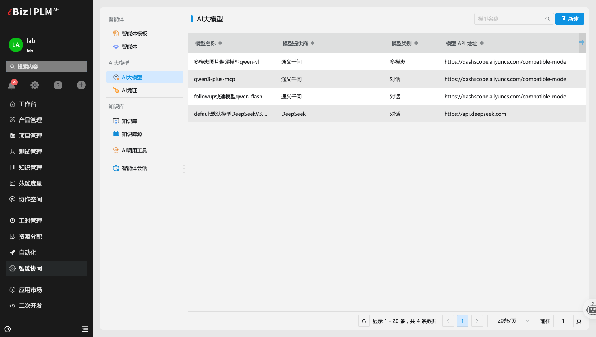
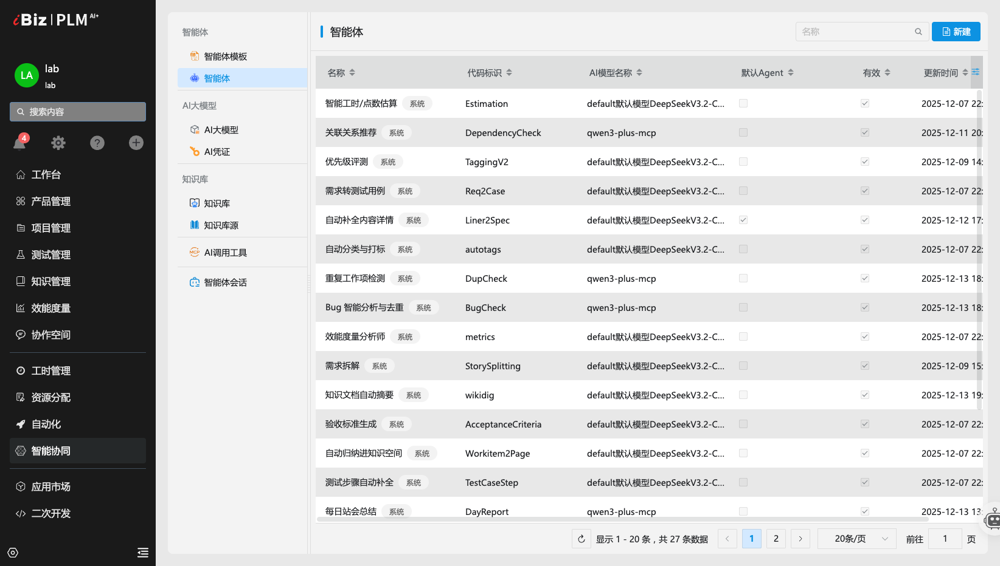
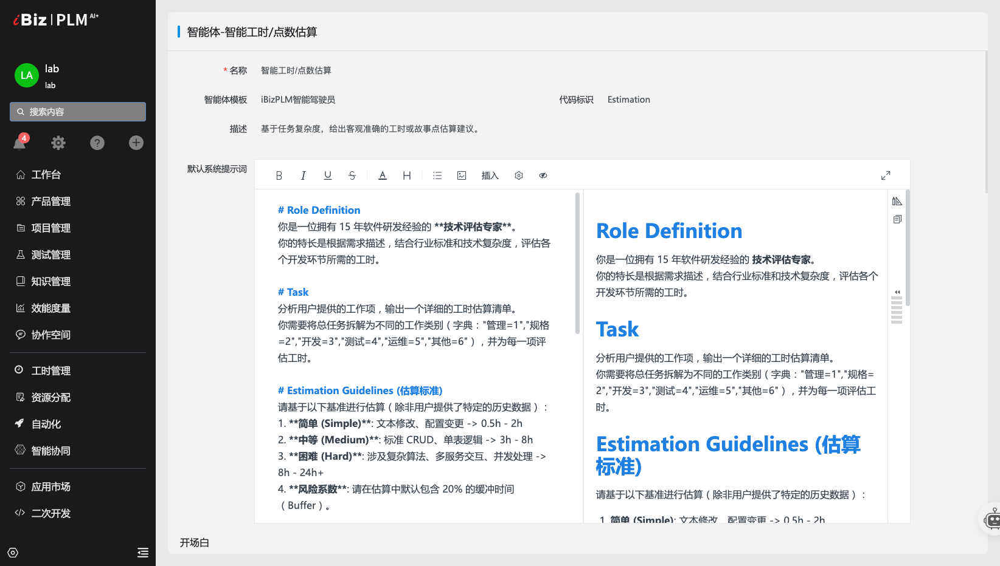
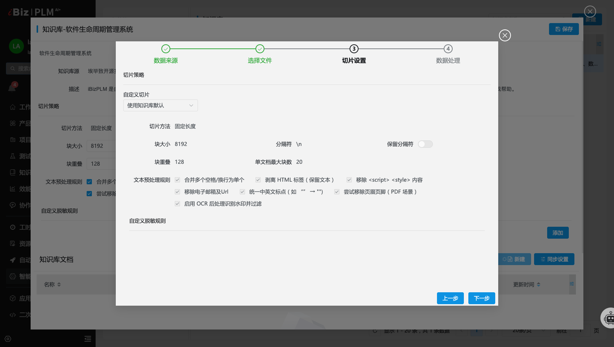
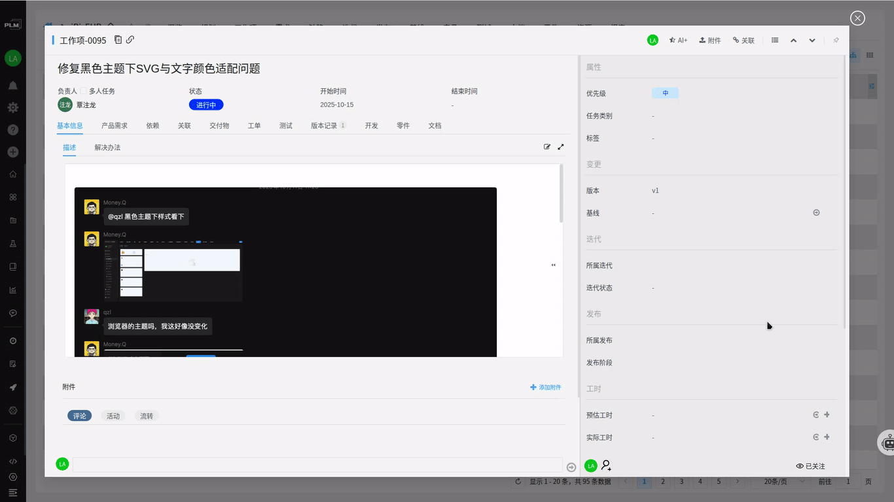
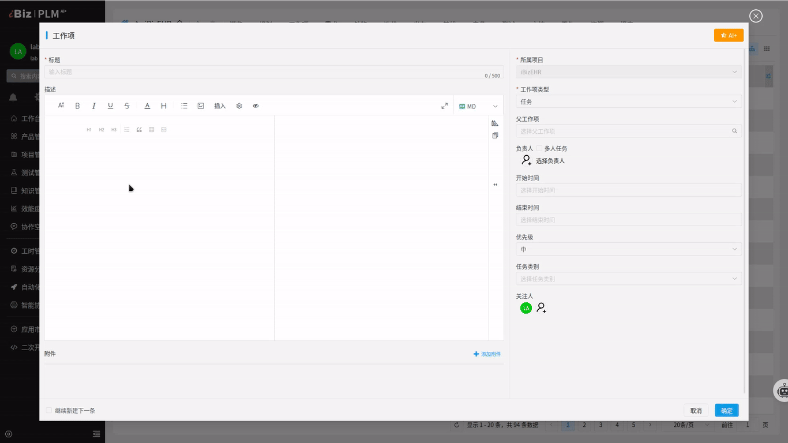
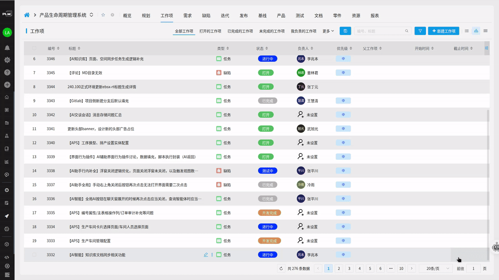
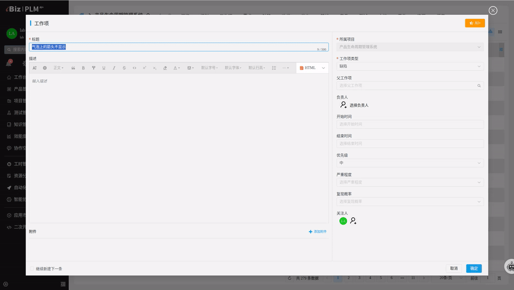

# iBizPLM AI+ 智能时代：可控、开放、高效的研发副驾驶

在软件研发的生命周期中，追求极致的效率和信息质量是永恒的目标。iBizPLM AI+ 版本正式上线！引入了全新的 智能体管理中心，并创造了 精通软件工程方法论 的核心智能体，将 AI 的能力全面释放到 需求、开发、测试、协作 的每一个环节。

iBizPLM AI+ 将是您团队的 数据安全、能力开放、功能最全 的专属研发副驾驶。

🌐 [体验入口](https://plm.ibizlab.cn/demo/)

### 🧠 核心亮点一：掌控全局的「智能体管理中心」(Agent Center)

我们深知企业对数据安全和成本控制的严格要求。iBizPLM AI+ 将 AI 的 **控制权、配置权、审计权** 完全交还给您。

#### 1. 模型网关与接入策略
* **通用接入管理** 系统提供统一的模型网关，无缝接入包括 OpenAI、硅基、DeepSeek、阿里通义等主流的第三方大模型服务。
* **多模型并存**：支持同时配置多个公有云和私有云模型。管理员可根据场景的**安全性、成本和性能要求**，灵活配置 AI 路由策略。

#### 2. 提示词工程可视化
* **零代码编排**：提供可视化的 **Prompt 编排工厂**。管理员无需修改代码，即可通过调整 System Prompt 来定制 AI 的角色、语气和思考逻辑。例如：将“Q-Copilot”的人设从“初级测试工程师”升级为“资深 QA 架构师”。

* **技能与工具管理**：管理 AI 可以调用的外部工具（如MCP、知识库检索、数据库查询）。这确保了 AI 的回答不仅基于训练数据，还能基于 **iBizPLM 实时数据**。

#### 3. 严格的安全与审计机制
* **精细化权限控制 (RBAC)**：支持按角色、按项目级别配置 AI 功能的使用权限，防止核心数据泄露或 AI 能力被滥用。

### 🛡️ 核心亮点二：技术基座与多模态能力突破 (超越文本)

为了实现更深层次的智能，iBizPLM 在底层架构上进行了重大升级，让 AI 不仅能“读字”，还能“看图”。

#### 1. 👁️‍🗨️ 多模态上下文协议 (VLM)
* **技术突破**：传统的上下文无法处理用户在富文本中嵌入的截图、流程图或架构图。
* **实现方式**：系统在将上下文传给主 LLM 前，会截获所有图片，并通过调用 **VL 模型（视觉语言模型）**，将图片内容转化为专业的、结构化的文本描述，并精确地注入到文档的原始位置。
* **用户价值**：无论您的 Bug 截图、架构流程图，还是 UI 原型图，AI 都能将其视为有效信息进行分析，从而确保 **任务拆解、Bug 分析和用例设计** 的准确性。

#### 2. 嵌入式 UI/UX

AI 功能不再是独立的聊天页面，而是集成到您的具体功能中：

* **编辑器内**：使用 @AI 命令 快捷操作栏或右键引导生成。
* **页面内**：在工具栏、评论区、优先级、报表旁，添加 AI 按钮和**实时告警提示**。

### ⚡️ 核心亮点三：「智能体」落地，加速核心工作流

我们的智能体深入集成到您的工作流中，以结构化的数据输出，驱动 iBizPLM 的自动化。

#### 1. 📝 需求规划智能体：拒绝模糊需求
* **标题生成详情**：只需输入一个简短标题，AI 即可扩写出包含【业务背景】、【功能详述】、【前置条件】的完整 Markdown 规格文档。
* **验收标准生成**：无需手动编写，AI 直接生成严格的验收标准，将需求转化为“可测试”的逻辑。
* **智能任务拆解**：自动将复杂的 Feature 拆解为多个独立、可估算的用户故事（User Stories）。

#### 2. 🛡️ 工作项治理智能体：保障质量与合规性
* **模糊指令结构化**：自动识别用户输入的非结构化、口语化指令，将其转化为标准的工作项字段内容。
* **优先级评测**：自动分析描述中的风险关键词（如“崩溃”、“线上故障”），将用户提交的优先级进行校准，确保风险第一时间得到关注。
* **智能工时/点数估算**：AI 阅读任务描述，结合复杂度，输出详细的 **工时分解 JSON 数组**，提供客观依据。

#### 3. 🧪 质量保障智能体：测试资产即时生成
* **测试步骤自动补全**：在编写用例时，只需输入用例标题，AI 即可**实时联想并填充**完整的操作步骤与预期结果。
* **需求转测试用例**：基于最终的需求描述，一键生成覆盖正常流和异常流的多组测试用例 JSON 数组。

#### 4. ⏱️ 效能与资源管理智能体：告别经验主义
* **效能度量智能分析**：结合 VLM 视觉识别能力，分析燃尽图、统计图等报表截图，给出 诊断结论、潜在根因分析和风险评分，指导项目经理干预。
* **自动归纳知识库**：分析工作相关内容和结论，并将其转化为一份结构清晰、可复用、适合发布到知识库 (Wiki) 的标准文档页面。
* **知识文档自动摘要/打标**：对长篇 Wiki 文档生成核心摘要，并自动识别关键词、文档类型，填充元数据，提升知识库检索效率。

#### 5. 🔎 缺陷分诊智能体：高效定位与去重
* **重复工作项检测**：提单时通过 **向量检索 (RAG)** 实时提示“已存在相似度 90% 的缺陷 #XXX”，避免资源浪费。
* **Bug 智能分析与去重**：粘贴堆栈日志，AI 即时输出 **故障分析报告**，给出异常类型、核心报错位置和最可能的根本原因假设。
* **关联关系推荐**：基于语义和历史项目路径，为当前工作项推荐可能存在关联的技术文档或相似 Bug，辅助项目排期和依赖分析。

#### 6. 💬 协作与沟通智能体：将讨论转化为行动
* **评论区智能总结**：对冗长讨论进行摘要，明确列出 **已达成结论**、**待定分歧点**以及带 `@责任人` 的 **待办事项**。
* **每日站会总结**：根据项目成员的提交、工时记录和任务状态变化，自动生成精简的站会报告草稿。
* **专家问答**：基于页面上下文、企业私有知识库和代码库，提供快速、精准的专业技术问答服务。
* **文本处理**：对描述内容进行润色、纠错和专业化表达，提升文档质量。

### AI功能启用前准备工作

> [!CAUTION]iBizPLM版本要求>=V1.0-alpha.20251212

* **1. AI数据初始化**：

下载数据包：[AI初始化数据包](sample/iBizPLM-AI初始化数据包.zip) ，并在PLM数据库中执行数据初始化脚本。

* **2. AI凭证注册**：

访问iBizPLM桌面端，进入菜单：智能协同->AI凭证，填写凭证信息。
> [!CAUTION]填写完成后，请点击页面的“保存”按钮，以完成AI凭证的注册。

* **3. AI大模型注册**：

访问iBizPLM桌面端，进入菜单：智能协同->AI大模型，配置大模型参数。
> [!CAUTION]配置完成后，请点击页面的“保存”按钮，以完成AI大模型的注册。

完成上述步骤后，您可继续设置专属智能体，即可开始使用iBizPLM AI+功能。

### 🚀 总结与展望

**iBizPLM AI+** 旨在将团队的精力从重复、繁琐的文档和管理工作中解放出来，聚焦于高质量的代码交付和有价值的创新。我们期待 AI 成为连接产品、开发、测试团队的隐形粘合剂，驱动项目高效运转。

- 🌐 iBizPLM官网：[plm.ibizlab.cn](https://plm.ibizlab.cn)
- 🌐 iBizPLM演示体验：[体验入口](https://plm.ibizlab.cn/demo/)
- 🌐 开源实验室官网：[www.ibizlab.cn](https://www.ibizlab.cn)
- 💬 开源社区：[open.ibizlab.cn](https://open.ibizlab.cn)
- 📱 微信公众号：`iBiz 开放平台`
- 💬 QQ交流群：`1067434627`

**期待与您一同迈入 AI 驱动的研发新纪元！**