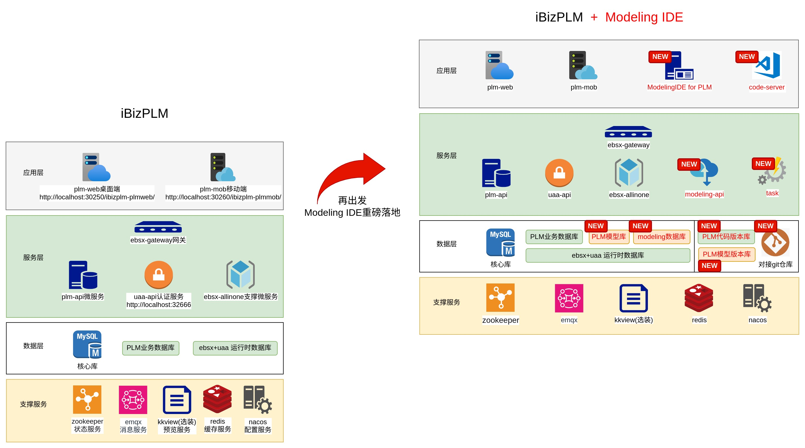
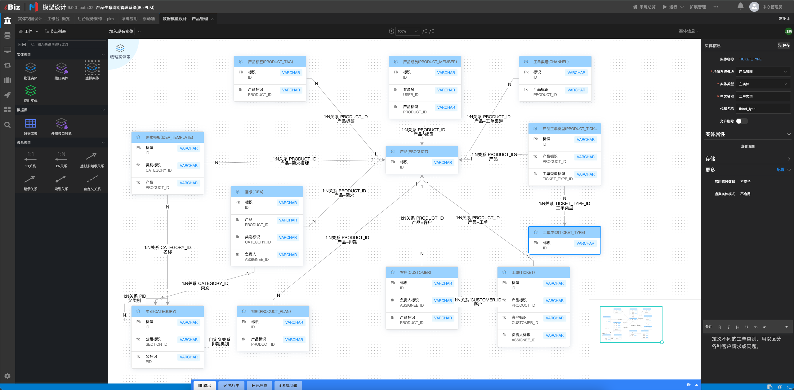
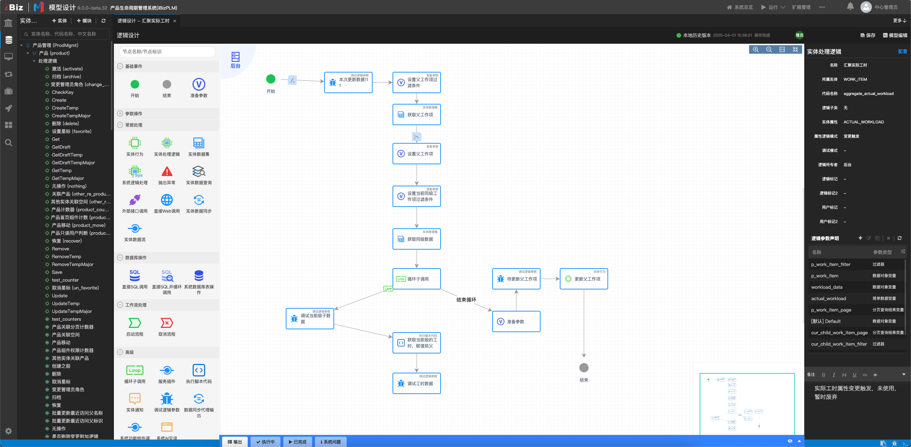
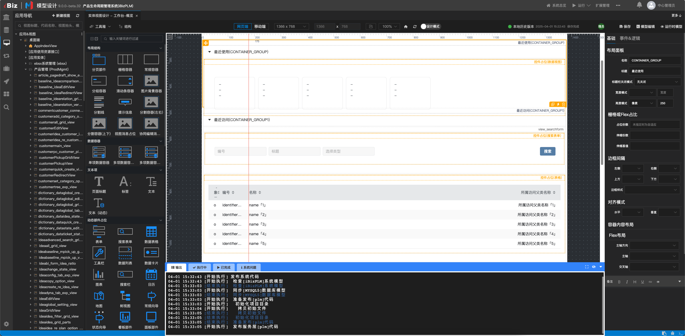
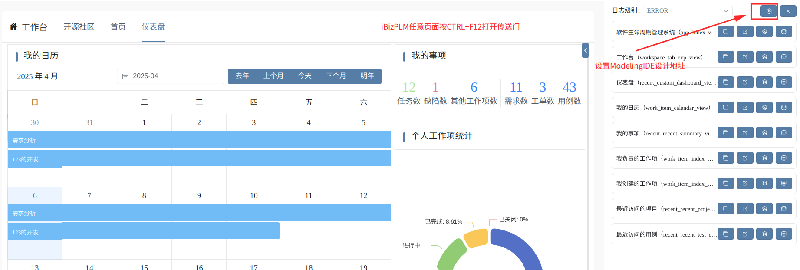
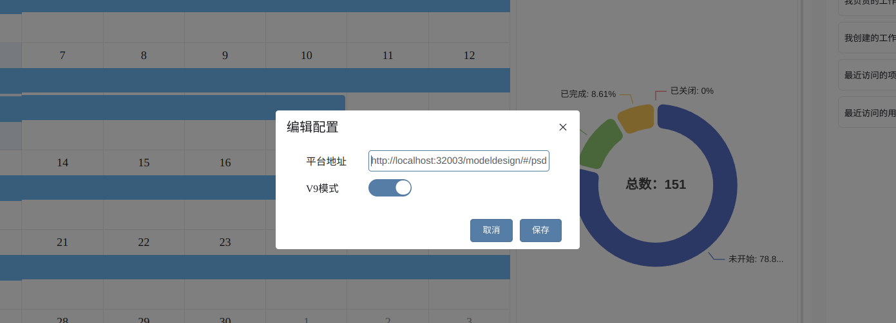
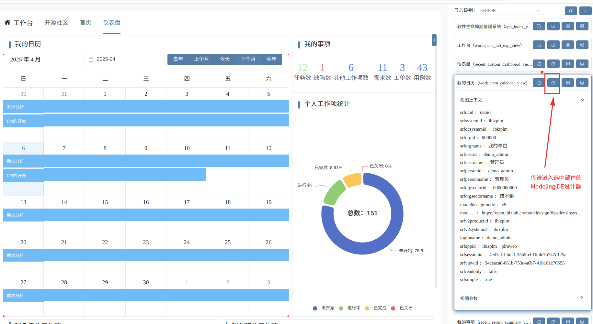
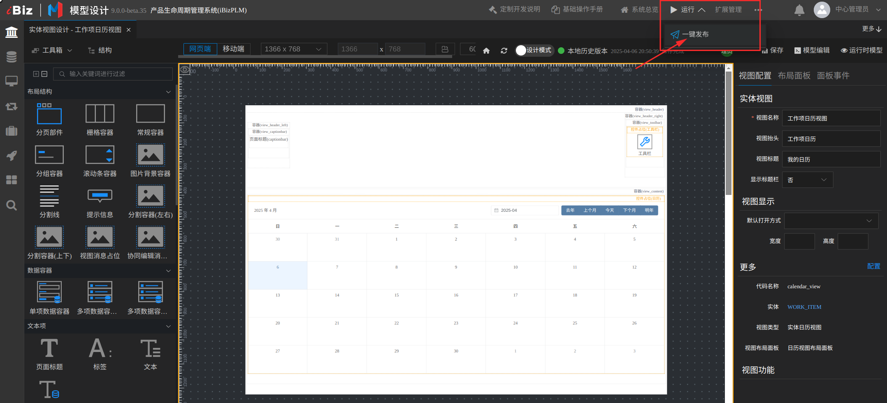

### **iBizPLM+ModelingIDE架构升级公告：本地开发工具链全面开放**
**——响应社区需求，赋能开发者自主定制**

自2025年1月iBizPLM开放社区上线以来，我们持续收到开发者对本地化开发工具的强烈需求。经过两个多月的社区反馈与技术筹备，现正式发布**iBizPLM+ModelingIDE一体化架构**，全面开放本地建模工具链，助力开发者更灵活地定制PLM系统。

### **升级背景：从社区需求到技术落地**
自iBizPLM正式开源以来，完整的系统功能和全免费使用的开源原则招揽来大量活跃开源用户群体，开放平台社区发布后，装机量节节攀升，尽管在线ModelingIDE环境满足了尝鲜和快速体验的需求，但许多用户提出：  
• **企业数据安全顾虑**：部分行业用户需完全离线开发，保障核心数据私有化。  
• **深度定制需求**：开发者希望直接操控建模工具，实现业务逻辑、界面、流程的自主调整。  
• **开发流程整合**：需将建模工具与企业现有DevOps工具链（如GitLab、Gitee）无缝对接。

基于此，我们决定将**ModelingIDE开发工具链**从在线环境迁移至本地，并提供完整部署介质。
<p align=“center” style="width:100%"></p>

### **升级内容：开发-运行一体化架构**
#### **1. 原架构（纯运行环境）**
• **核心能力**：提供iBizPLM系统的部署与使用，支持需求管理、协作开发、测试管理等全生命周期功能。  
• **局限性**：用户无法直接修改底层业务模型或开发扩展功能，二次开发依赖代码重写或支配有限的表单逻辑定制入口。

#### **2. 新架构（开发自由化）**
• **核心新增能力**：  
• **ModelingIDE本地版**：提供可视化建模工具，支持业务模型、流程规则、界面组件的拖拽式设计与代码生成。  
• **code-server辅助调试**：基于VS Code的编码环境，供开发者调试复杂逻辑或插件。  
• **企业级工具链集成**：支持对接私有Git仓库适配企业开发规范。  
• **部署灵活性**：  
• 支持离线环境部署，无网络依赖。  
• 基于Docker提供Windows/Linux/macOS全平台安装包。

<p align=“center” style="width:100%"></p>

<p align=“center” style="width:100%"></p>

<p align=“center” style="width:100%"></p>

<p align=“center” style="width:100%"></p>

<p align=“center” style="width:100%"></p>

### **本次升级的核心价值**
#### **1. 开发自主权**
• **自由定制**：通过ModelingIDE直接修改系统业务逻辑，例如调整工单管理模块字段、重构审批流程规则。  
• **透明可控**：所有模型设计均可追溯，避免“黑盒”风险。

#### **2. 企业级适用性**
• **数据合规**：模型与业务数据存储于本地服务器，满足金融、医疗、政务等行业的数据安全要求。  
• **效率提升**：可视化建模降低90%基础开发工作量，复杂场景可通过code-server补充编码实现。

#### **3. 生态扩展性**
• **插件共享**：开发者可将本地开发的插件提交至开放平台，供社区复用。  
• **行业解决方案**：企业可基于iBizPLM内核快速构建垂直领域PLM系统（如电子制造PLM）。

### **安装说明**
####  前提条件

- CPU >= 4 核
- RAM >= 16 GB
- Disk >= 50 GB
- Docker >= 24.0.0 & Docker Compose >= v2.26.1
  > 如果你并没有在本机安装 Docker（Windows、Mac，或者 Linux）, 可以参考文档 [Install Docker Engine](https://docs.docker.com/engine/install/) 自行安装。

#### 启动PLM服务
1. 克隆仓库：

   ```bash
   $ git clone https://gitee.com/ibizlab/plm.git
   ```

3. 进入 **compose** 文件夹，利用提前编译好的 Docker 镜像启动服务器：

> [!CAUTION]
> 请注意，目前官方提供的所有 Docker 镜像均基于 x86 架构构建，并不提供基于 ARM64 的 Docker 镜像。

   ```bash
   $ cd plm/deploy/compose
   $ docker compose -f docker-compose-dev.yml --env-file .dev up -d

   # 使用开发模式，根据变量注释提示调整**.dev**文件内对应参数,将启动包含ModelingIDE和code-server的构型
   ```

4. 服务器启动成功后再次确认服务器状态：

   ```bash
   $ docker logs -f plmservice
   ```

   _出现以下界面提示说明服务器启动成功：_

   ```bash
	[DEBUG] n.i.central.cloud.core.ServiceHubBase    : 系统[ibizplm]已经注册
	[DEBUG] n.i.central.cloud.core.ServiceHubBase    : Heap Memory Usage:
	[DEBUG] n.i.central.cloud.core.ServiceHubBase    : Init: 786432000
	[DEBUG] n.i.central.cloud.core.ServiceHubBase    : Used: 1489565680
	[DEBUG] n.i.central.cloud.core.ServiceHubBase    : Committed: 4904714240
	[DEBUG] n.i.central.cloud.core.ServiceHubBase    : Max: 11169955840
	[DEBUG] n.i.central.cloud.core.ServiceHubBase    : Non-Heap Memory Usage:
	[DEBUG] n.i.central.cloud.core.ServiceHubBase    : Init: 2555904
	[DEBUG] n.i.central.cloud.core.ServiceHubBase    : Used: 222739928
	[DEBUG] n.i.central.cloud.core.ServiceHubBase    : Committed: 231342080
	[DEBUG] n.i.central.cloud.core.ServiceHubBase    : Max: -1
   ```

5. 访问地址，假定本机使用localhost访问，如果跨机器访问请将localhost更换为服务器ip地址或域名：

**iBizPLM桌面端**：http://localhost:30250/ibizplm-plmweb/

**iBizPLM移动端**：http://localhost:30260/ibizplm-plmmob/

**UAA系统管理**：http://localhost:32666

**CodeServer开发调试工具**: http://localhost:8080

**ModelingIDE**：http://localhost:32003/modeldesign/#/psdevslnsys=28F7326A-7C72-4C2D-A497-A16372ABBADC/modelingindex/psdevslnsys=28F7326A-7C72-4C2D-A497-A16372ABBADC/pssystemindexview/srfnav=info/pssystemdashboardview/-

### **设计传送门**
📢 在iBizPLM任意页面上按CTRL+F12快速直通ModelingIDE
<p align=“center” style="width:100%"></p>

📢 设置ModelingIDE配置平台地址+V9设计模式

- 本地已安装可设置为：http://localhost:32003/modeldesign/#/psdevslnsys=28F7326A-7C72-4C2D-A497-A16372ABBADC/modelingindex/

- 本地未安装可设置为开源社区ModelingIDE尝鲜地址：https://open.ibizlab.cn/modeldesign/#/psdevslnsys=28F7326A-7C72-4C2D-A497-A16372ABBADC/modelingindex/

<p align=“center” style="width:100%"></p>

📢 选中页面或部件点击编辑传送
<p align=“center” style="width:100%"></p>

📢 ModelingIDE中修改设计一键发布，iBizPLM系统刷新，变更立即生效。
<p align=“center” style="width:100%"></p>

### **致谢与期待**
此次升级源于社区开发者的真实需求，我们感谢每一位提出建议的用户。未来，我们将继续以技术开放为原则，与开发者共同推动iBizPLM生态的成长。

立即下载ModelingIDE，开启您的PLM定制之旅。

