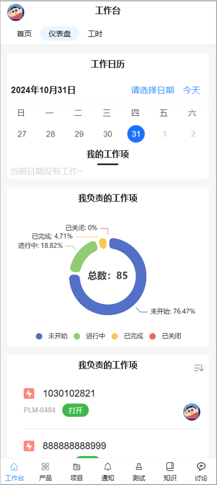

#  iBiz产品生命周期管理（iBizPLM）

## 介绍

iBiz产品生命周期管理（iBiz Product Lifecycle Management，简称iBizPLM）作为新一代的研发管理平台，其设计宗旨在于通过简化操作界面，实现研发管理流程的自动化、数字化及智能化，以此帮助企业加快研发进度。该平台充分汲取[pingcode项目管理软件](https://pingcode.com/)的核心思想，覆盖了软件生产过程中的产品、项目、文档、测试等领域。

基于强大的iBiz平台，iBizPLM经过精心开发，采用了前沿的软件技术架构，基于Spring Boot/Cloud的后端技术支持以及Vue实现的前后端分离。iBizPLM还根据MIT开源许可证发布，这意味着用户可以免费获取、修改软件，并且有机会通过多种方式，定制满足自己团队特定需求的规则和管理模式。

作为开源项目，iBizPLM鼓励技术共享和社区合作的精神，激励用户投身于软件的持续优化和创新之中。这不仅确保了解决方案能够应对研发管理需求的快速变化，还促进了用户间的知识交流和协作，共同推进研发管理行业的发展。

## 特性

- **全生命周期管理**：从产品规划到发布，iBizPLM涵盖了研发的每一个阶段，包括需求分析、设计、开发、测试和部署，确保了研发活动的全方位管理。
- **简洁易用**：iBizPLM强调用户友好的界面和操作流程，使得研发团队能够快速上手，无缝地进行研发活动的规划、执行和监控。
- **个性化业务扩展**：iBizPLM特别注重满足不同团队独特的业务需求，提供了高度个性化的配置能力。团队能够通过一个直观的用户界面自主定制项目、看板、工作项等关键元素，以确保产品能够灵活适应各种业务场景。
- **流程自动化**：该平台自动化了研发管理的多个环节，包括任务分配、进度追踪和状态更新等，减少了手工操作的需求，提高了工作效率和准确性。
- **数据化管理**：iBizPLM通过数据收集和分析，为团队提供关于项目进展、资源使用和成本控制的实时见解，支持基于数据的决策制定。
- **智能化管理**：iBizPLM将引入人工智能(AI)技术以辅助决策过程，增强研发效率和质量，并且实现了与[iBiz建模平台](./GLOSSARY.md)的深度集成，为企业提供了一个全面、高效和智能的产品生命周期管理解决方案，帮助企业在激烈的市场竞争中保持领先。
- **高度定制**：用户能够高度定制属于自己的PLM，至此iBiz提供了一个完全开放和可自定义的开源开发平台，可获取iBiz开源团队完全同等开发能力—[完整PLM项目开发](#完整plm项目开发)。

## 业务描述

iBizPLM划分为7大模块：

- **产品管理**：产品管理是iBizPLM中负责产品及需求管理的子产品，通过收集来自于产品规划、客户反馈、内部需求等不同渠道的需求形成对应工单，并根据业务规划进行需求评审，最终对需求形成优先级列表和排期。
- **项目管理**：项目管理是iBizPLM中负责管理项目的子产品，支持标准的敏捷开发模型Scrum和Kanban，以及瀑布开发模型，方便团队按照自己的开发模型选择项目类型进行项目管理。
- **测试管理**：测试管理是iBizPLM中负责测试管理的子产品，通过测试用例的维护管理、测试用例评审，制定测试计划及执行测试计划，自动生成测试报告。
- **知识管理**：知识管理是iBizPLM中负责管理知识体系的子产品，提供结构化空间来记载信息和知识，便于团队沉淀经验、共享资源，支持多人同时在线编辑，文档版本回溯等。
- **效能度量**：效能度量是iBizPLM中负责分析研发效能的子产品，把研发管理过程中使用的过程数据，通过自动化的方式收集、加工、清洗，最终以可视化的效能仪表盘形式展现，进行效能分析与洞察。
- **协作空间**：协作空间是iBizPLM中负责管理协作交流子产品，通过邀请成员参与话题，并围绕话题开展讨论，让信息传播更快捷，让活动征集更高效，让成员发言更积极。支持话题面向组织或团队，构建自由灵活的讨论环境；支持丰富的讨论内容，让信息传播更直观高效；支持邀请成员参与话题和讨论，在交流中征集信息与资源。
- **自 动 化**：自动化是iBizPLM中用于规划业务流程自动化的子产品，旨在优化业务流程，通过实施自动化规则，显著减少团队成员的手动工作量。使得原本繁琐且重复的任务能够自动完成，从而提高效率和精准度。通过配置特定的规则，它能够实现流程的自动化管理，有效降低人力成本和错误率。


### 功能清单

- [功能清单文档](./sample/pingcode-iBizPLM对照表.xlsx)

### 在线体验

- PC端-演示Demo地址：[http://plm.ibizlab.cn/ibizplm-plmweb/](http://plm.ibizlab.cn/ibizplm-plmweb/)
- 移动端-演示Demo地址（待定）：[http://plm.ibizlab.cn/ibizplm-plmmob/](http://plm.ibizlab.cn/ibizplm-plmmob/)
- 演示管理员账号/密码：demo_admin/123456
- 演示普通用户账号/密码：demo_user/123456
- 欢迎加入iBizPLM交流QQ群：1067434627
- 系统详细设计文档：[http://plmdoc.ibizlab.cn](http://plmdoc.ibizlab.cn) 特别鸣谢：[doc-generator](https://github.com/iBizLab/doc-generator) 提供模型发布"系统详细设计文档"扩展
- 基于 Spring Boot 和 Vue 的轻量级应用程序源码[plm-code](https://github.com/iBizLab/plm-code)

### 安装部署

##### 克隆此存储库：

```
git clone https://github.com/ibizlab/plm.git
```

##### 切换到此目录：

```
cd iBizPLM/deploy/compose
```

##### 复制示例`.env.example`文件并编辑要更改的任何值：

```
cp .env.example .env
vim .env
```

##### 启动容器：

```
docker-compose --env-file=.env up -d
```

等待启动完成访问http://localhost:30250/ibizplm-plmweb/

了解更多请参考[deploy/compose/README.md](deploy/compose/README.md)

### 技术架构

iBizPLM使用了现代化软件架构，前端技术使用Vue，后端技术使用Spring Boot/Cloud。


### 后端技术

- 核心框架：Spring Boot
- 持久层框架: Mybatis-plus
- 服务发现：Nacos
- 日志管理：Logback
- 项目管理框架: Maven

### 前端技术

- 核心框架：vue3
- 路由: vue-router
- 状态管理：pinia
- 数据交互：axios
- UI框架：element-plus

### 演示图

#### 工作台

- 工作台-首页


- 工作台-仪表盘


#### 产品管理一览

- 产品-首页


- 产品-需求


- 产品-需求详情


#### 项目管理一览

- 项目-首页


- 项目-主页


- 项目-工作流定制


- 项目-工作项


- 项目-工作项业务化界面定制


- 项目-工作项详情


#### 测试管理一览

- 测试-首页


- 测试-用例


- 测试-用例详情


#### 知识管理一览

- 知识-首页


- 知识-页面


#### 效能度量一览

- 效能度量-仪表盘


- 效能度量-报表


#### 协作空间一览

- 协作-首页


#### 工时管理

- 工时管理-首页


#### 资源分配

- 资源分配-首页


#### 自动化

- 自动化-首页


- 自动化-概览


- 自动化-配置


#### 移动端
- 工作台


### PLM业务扩展

iBizPLM在设计时充分考虑了不同团队在业务流程和工作方式等维度的多样性。为了使iBizPLM更加贴合各种业务场景，系统提供了灵活的自定义配置选项，允许用户通过直观的界面操作来定制项目、看板和工作项。例如，用户可以自定义「任务」这一工作项类型的状态，创建新的任务状态并定义状态之间的转换逻辑。


iBizPLM旨在减轻用户的重复性和复杂的手动工作负担，引入了自动化引擎来处理这些任务。通过设定触发器和逻辑，用户可以灵活地创建自定义的自动化工作流程，这一系列的功能旨在让用户将更多的精力投入到创造性的工作中。比如在创建新的「任务」工作项时自动设置其优先级为普通。

此外，上述描述内容属于应用内部扩展，我们也提供了应用外部扩展方式。应用外部扩展方式指的是在主应用之外开发并集成一系列独立但协作的小型应用程序或微应用，通过聚合完成整体业务的组装以增强主应用的功能或提供额外服务。这种模式可以带来灵活性和可扩展性，同时减少对主应用的干扰。

PLM业务扩展的核心目标是将iBizPLM转化为不仅仅是一个标准的项目管理平台，而是一个能够深入融合并支持具体业务流程与工作模式的定制化解决方案，进而帮助企业达到更高效、智能化的运营水平。为了实现这一目标，iBizPLM团队提供了一套完整的定制开发工具和方法，使用户能够高度个性化地管理和优化自己团队的业务流程。这种定制化开发的方法论和工具集旨在赋予用户更大的灵活性和控制权，使他们能够构建一个真正符合自己团队特色的PLM系统。更多关于[完整PLM项目开发](#完整plm项目开发)，可以参考我们提供的详细指南和资源。

### 里程碑

| No.  | 日期          | 事件与版本         | 备注说明                                             |
| ---- | ------------- | ------------------ | ---------------------------------------------------- |
| 1    | 2023-12-05    | 选型预研           | 国内外项目管理软件整理和对比                         |
| 2    | 2023-12-10    | 业务分析、技术预研 | 业务分析、场景分析                                   |
| 3    | 2023-12-15    | 项目启动           | 项目正式启动                                         |
| 4    | 2023-12-15    | 业务模型与界面整理 | 梳理管理业务数据模型以及模型关系，界面表现和组件模型 |
| 5    | 2023-12-18    | pingcodeAPI整理    | 梳理pingcodeAPI，抽象共通性                          |
| 6    | 2024-01-15    | V1.0.20240115      | 新增：测试管理模块                                   |
| 7    | 2024-02-08    | V1.0.20240208      | 新增：产品管理模块、项目管理模块                     |
| 8    | 2024-02-29    | V1.0.20240229      | 新增：知识管理模块                                   |
| 9    | 2024-03-31    | V1.0.20240331      | 新增：工时管理功能、统计分析；增强：知识管理模块     |
| 10   | 2024-04-30    | V1.0.20240430      | 增强：测试管理模块、自动化应用等                     |
| 11   | 2024-05-06    | V1.0.20240506      | 新增：基线管理、版本管理功能等                     |
| 12   | 2024-06-11    | V1.0.20240611      | 新增：协作管理模块、后台管理模块等；增强：工时管理、资源分配                     |
| 13   | 2024-07-26    | V1.0.20240726      | 新增：效能度量模块、业务化界面定制能力等                     |
| 14   | 2024-08-28    | V1.0.20240828      | 新增：产品、测试、知识提供筛选器；增强：效能度量模块                     |
| 15   | 2024-09-30    | V1.0.20240930      | 增强：效能度量模块、用例评审功能等                   |
| 16   | 2024-10-31    | V1.0.20241031      | 新增：移动端；增强：产品需求、工单、测试用例业务化界面定制等                   |

### 开源计划

#### 已完成

- 工 作 台：首页、仪表盘
- 产品管理：产品、需求、排期、工单、客户、关联空间、基线
- 项目管理：项目集、项目、Scrum开发、Kanban开发、瀑布开发、工作项、迭代、发布、关联测试、关联空间、基线、报表、业务化界面定制
- 测试管理：测试库、测试用例、测试评审、测试计划、执行用例、测试报告、基线、报表
- 知识管理：空间、页面管理、页面模板、基线
- 效能度量：效能仪表盘、效能报表
- 协作空间：话题、讨论
- 工时管理：工时管理、个人工时
- 资源分配：资源分配、项目集资源、项目资源
- 自 动 化：自动化应用
- 后台管理：后台管理
- 移 动 端：移动端（Demo版）

#### 计划完成

- 后续计划

  1、全文检索、AI辅助等
  
  2、OpenProject数据迁移文档、PingCode数据迁移文档、Jira数据迁移文档

### 了解更多

- 对于iBizPLM学习、开发参与、插件开发有兴趣的小伙伴们，欢迎加入iBizPLM交流QQ群：1067434627

## 附录

### 更新日志

- 每个版本的详细更改都记录在[发行说明](./CHANGELOG.md)中.

#### 二开插件

二开插件是指在现有软件、平台或系统的基础上，通过定制化开发来扩展其功能或性能的插件。这种做法使得原有系统能够更灵活地适应特定的业务需求，特别是当标准功能不能完全满足用户特定需求时。通过插件扩展，企业可以在不改变原有系统架构的前提下，增加新的特性或优化现有功能，以达成业务目标，了解更多请参考[pfplugin/README.md](pfplugin/README.md)。

### 完整PLM项目开发

iBiz团队为了让用户能够根据自己的需求高度定制化自己的PLM（产品生命周期管理）系统，推出了一系列的工具和平台，包括IBizCentral、iBizModeling Studio和业务应用运行基座。下面我将用简单的话语来描述这些工具和平台的作用：

- **IBizCentral（企业中台构建解决方案）**：想象一下你有一个大工厂，需要不同的机器来完成各种任务。IBizCentral就像是工厂的管理中心，它允许你根据需要选择和配置这些机器（即插件），来满足你生产的需求。它能帮你从创建、开发到管理整个生产过程，自动生成所需的代码或程序，并且通过DevOps实现一键式发布和部署。

- **iBizModeling Studio（模型开发工具）**：这个工具就像是设计蓝图的工作室，让你能够通过画图的方式来设计你的业务流程和应用架构。基于模型驱动开发（MDD）理念，它涵盖了从需求设计到业务开发、测试的整个开发周期。无论是简单的应用还是复杂的企业级系统，都可以在这个平台上被设计出来。它为不同的用户提供了多种视角，比如管理视角、领域模型视角等，以满足不同的设计需求。

- **业务应用运行基座**：有了设计蓝图后，你还需要业务应用运行基座支撑这些设计好的应用。业务应用运行基座提供了通用服务能力，如用户认证、工作流程管理、任务调度等，以及应用运行基础设施，如：服务网关、服务注册与发现、服务配置、缓存、作业调度等，让你的应用能够顺畅运行。

简单来说，iBiz为用户提供了一整套工具和平台，从设计到运行，都可以让用户根据自己的需求来打造属于自己的PLM系统，就像是提供了一整套乐高积木，用户可以自由组合，打造出心中理想的“建筑”。

### 团队想说的话

#### 为什么选择pingcode作为学习对象

在选择学习对象时，pingcode界面设计和交互细腻程度给我们留下了深刻的印象。这不仅提高了用户体验，还展现了对用户需求的深刻理解和关注。同时业务完整流畅让我们感到钦佩。一个业务完整且流畅的产品通常意味着对业务流程的深入了解和精心设计，这为用户提供了更好的服务体验。产品化可定制和可扩展性也是我们选择的重要考量因素。这意味着用户可以根据自身需求进行定制化和扩展，从而更好地适应不同的业务场景和需求变化。

同时，软件生产管理软件对于我们构建基于平台化模型的快速生产体系有着非常积极的意义，工业化稳定可靠的快速生产从来离不开有效可靠的管理，因此冲击软件生产管理对于我们团队来说是不仅是必然的，而且是必要的。如何让管理实际落实渗透入我们一直倡导模型化的软件生产建模中也是一个值得探索与投入领域，后续我们将会持续创新，引入AI辅助以及与[iBiz建模平台](./GLOSSARY.md)深度集成，走出属于自己的道路，打造软件生产管理一体化方案，与社区的各位分享高效可靠的生产模式。

我们团队对于pingcode项目管理软件项目团队表示深刻的尊重，并且我们坚定地致力于开源理念。在构建自己的生产方式和工具时，我们秉承着开放、透明的原则，并借鉴了原软件的精华。通过模仿、创新和开源，我们旨在向社区展示我们团队的生产能力和技术实力，并与他人共享我们的成果，促进整个开源社区的共同进步。这也是我们对原软件开发者的一种敬意和回馈，我们愿意与他们共同致力于开源软件的发展与繁荣。

#### **我们的生产方式**


我们团队在开发过程中采用了自身搭建的模型驱动开发体系以及可视化开发工具，通过模型驱动开发，我们将抽象的业务逻辑和数据模型转化为可执行的代码，极大地提高了开发效率和质量。我们的模型驱动开发体系不仅使得代码的生成更加自动化，同时也使得系统的设计更加清晰、可维护性更高。

配合可视化开发工具，我们的开发过程变得更加直观、灵活。开发人员可以通过图形化界面快速搭建系统框架、设计界面布局，并实时预览效果。这种可视化工具不仅减少了开发人员的编码工作量，还提升了跨团队之间的沟通效率，使得开发过程更加高效、协作更加顺畅。

我们的团队协作模式是高度协调和分工合作的体现，涵盖了平台工具团队、项目研发团队、技术模板团队、测试团队以及运行团队等各个方面。每个团队都发挥着自己的专长，共同为项目的成功交付努力。从去年2023年年底开始筹备开发，共10人团队花费3个月时间推出第一版面向开源社区。

平台工具团队为整个团队提供了可视化建模的标准工具支持。技术模板团队则负责为项目研发团队提供底层架构级的前后端应用框架支撑。这种支持不仅节省了研发团队的时间和精力，同时也确保了项目的稳定性和可维护性。在项目研发团队方面，基于可视化建模与模板团队快速生成项目，并对应平台未抽象部分模型或个性化的需求进行插件化定制开发。这种快速开发和定制化的能力使得团队能够更加灵活地应对不同项目的需求。最后，测试团队和运行团队则负责保证项目的质量和稳定性，他们与其他团队紧密合作，共同推动项目的进展和优化。

工具团队与技术模板团队在项目开发过程中扮演了关键的角色，不仅提供了标准化的工具和模板支持，还不断吸纳可抽象的业务构成模型，进行工具的改造与模板的升级。这一举措的目的是逐步将需要项目负担的投入大量开发的成本转化为稳定的模式化的建模成本，从而进一步降低项目构建过程中的人员成本，使项目过程得以沉淀。

通过持续改造工具和升级模板，团队能够更好地适应不断变化的业务需求，并且实现了在项目开发中的模式化和标准化。这不仅提高了开发效率，还降低了项目的风险，并且使得团队能够更快速地响应市场的变化。

同时，这种沉淀的模式也为团队提供了更多的机会去专注于创新和提升核心竞争力。通过将重复性工作转化为稳定的模式化的建模成本，团队可以将更多的精力投入到前瞻性的技术研究和业务创新中，从而进一步提升团队的竞争力和持续发展能力。

#### 模型化贯穿项目生产运行周期

模型是我们生产体系中的重中之重，他是业务的可持续承载的核心，软件技术日新月异，我们希望业务的发展独立与软件技术进行自身的迭代与繁衍，结合模型构建成果借助技术模板更迭来适应最新的技术特性与能力。同时我们将模型体系标准化，贯穿软件的从开发到生产阶段，让模型设计扩展能力下放到软件运行过程中，标准化模型体系带来一个不容忽视的优势，那就是模型变更可以回归于软件设计开发环节，完成闭环。

### 感谢

最后对以下参与的小伙伴发出衷心的感谢。

iBiz平台工具团队、iBiz PLM项目研发团队、iBiz技术模板团队、iBiz测试团队、iBiz运行团队
