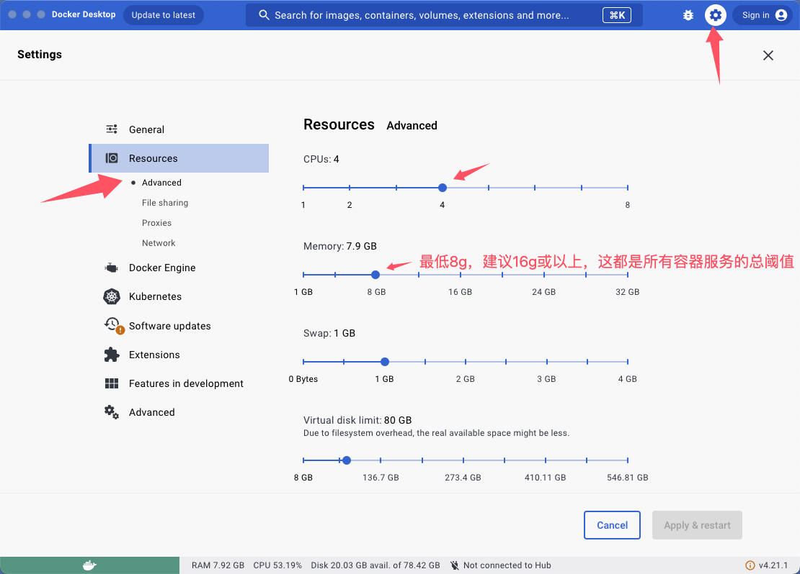
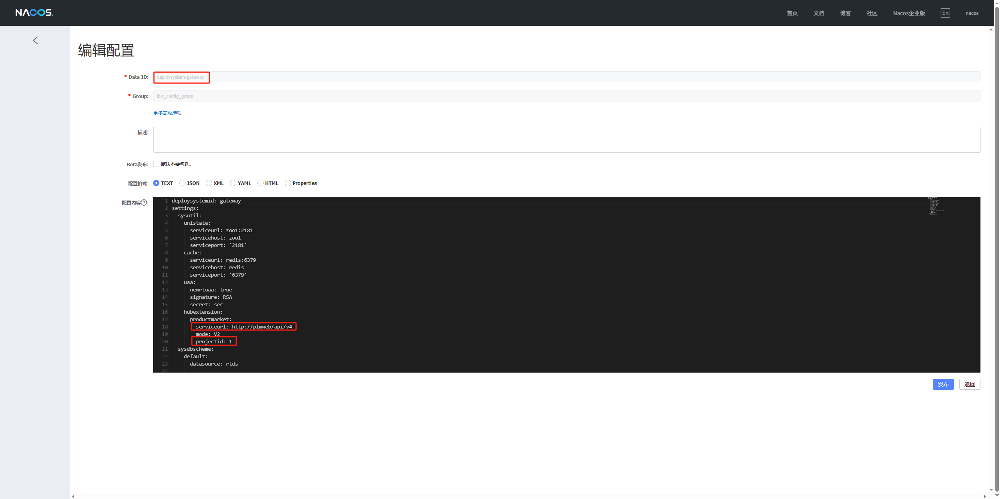

### **安装说明**
####  前提条件

- CPU >= 4 核
- RAM >= 16 GB
- Disk >= 50 GB
- Docker >= 24.0.0 & Docker Compose >= v2.26.1
> 如果你并没有在本机安装 Docker（Windows、Mac，或者 Linux）, 可以参考文档 [Install Docker Engine](https://docs.docker.com/engine/install/) 自行安装。

> [!CAUTION]
> 新安装脚本使用docker volumes 管理持久化卷，之前青云镜像用相对路径做卷的用户谨慎升级！！具体可参见[旧版升级说明](#问题3旧版青云镜像安装环境想升级)


#### 启动PLM服务
1. 克隆仓库：

```bash
$ git clone https://gitee.com/ibizlab/plm.git
```

3. 进入 **compose** 文件夹，利用提前编译好的 Docker 镜像启动服务器：

> [!CAUTION]
> 请注意，目前官方提供的所有 Docker 镜像均基于 x86 架构构建，并不提供基于 ARM64 的 Docker 镜像。
> 2025.04.11 目前官方已经提供基于 ARM64 的 Docker 镜像。

```bash
$ cd plm/deploy/compose
$ docker compose -f docker-compose.yml --env-file .env up -d

# ARM64架构启动:
# docker-compose -f docker-compose-arm64.yml --env-file=.env up -d

# 如果使用开发模式，根据变量注释提示调整**.dev**文件内对应参数,将启动包含ModelingIDE和code-server的构型:
# docker compose -f docker-compose-dev.yml --env-file .dev up -d
```

> [!TIP]
> 如果你遇到 Docker 镜像拉不下来的问题，可以在 **deploy/compose/.env** 文件内根据变量 `IMAGE_URL` 的注释提示选择青云（需登录）或者阿里云的相应镜像。
>
> - 青云镜像名：`dockerhub.qingcloud.com/ibizlab/`
> - 阿里云镜像名：`registry.cn-shanghai.aliyuncs.com/1024find/`
> 
> 如果你想修改MySQL、ZooKeeper、Redis、Nacos、EMQX服务为本地服务（开发模式不支持），可以在 **deploy/compose/.env** 文件内根据变量注释提示调整对应参数；调整MySQL服务为本地服务需要预先导入deploy/compose/init.sql。

4. 服务器启动成功后再次确认服务器状态：

```bash
$ docker logs -f plmservice
```

   _出现以下界面提示说明服务器启动成功：_

```bash
[DEBUG] n.i.central.cloud.core.ServiceHubBase    : 系统[ibizplm]已经注册
[DEBUG] n.i.central.cloud.core.ServiceHubBase    : Heap Memory Usage:
[DEBUG] n.i.central.cloud.core.ServiceHubBase    : Init: 786432000
[DEBUG] n.i.central.cloud.core.ServiceHubBase    : Used: 1489565680
[DEBUG] n.i.central.cloud.core.ServiceHubBase    : Committed: 4904714240
[DEBUG] n.i.central.cloud.core.ServiceHubBase    : Max: 11169955840
[DEBUG] n.i.central.cloud.core.ServiceHubBase    : Non-Heap Memory Usage:
[DEBUG] n.i.central.cloud.core.ServiceHubBase    : Init: 2555904
[DEBUG] n.i.central.cloud.core.ServiceHubBase    : Used: 222739928
[DEBUG] n.i.central.cloud.core.ServiceHubBase    : Committed: 231342080
[DEBUG] n.i.central.cloud.core.ServiceHubBase    : Max: -1
```

等待启动完成访问

假定本机使用localhost访问，如果跨机器访问请将localhost更换为服务器ip地址或域名：


**iBizPLM桌面端**：http://localhost:30250/ibizplm-plmweb/

**iBizPLM移动端**：http://localhost:30260/ibizplm-plmmob/

**UAA系统管理**：http://localhost:32666

使用dev开发启动的还可以访问到

**CodeServer开发调试工具**: http://localhost:8080

**ModelingIDE**：http://localhost:32003/modeldesign/#/psdevslnsys=28F7326A-7C72-4C2D-A497-A16372ABBADC/modelingindex/psdevslnsys=28F7326A-7C72-4C2D-A497-A16372ABBADC/pssystemindexview/srfnav=info/pssystemdashboardview/-


#### 数据卷
> [!CAUTION]
> 请注意，本次更新替换文件映射为Docker数据卷，升级前请做好数据备份。

- mysql_data：MySQL数据库的数据卷

- allinone_data：ibiz-ebsx-allinone服务存放文件的数据卷，例如：图片，附件等

- task_data：task服务存放文件的数据卷：发布文件、模型文件


### 常见错误
##### 问题1、资源不足

本系统部署模式走微服务和前后分离，启动需要有多个独立服务，流畅运行建议16G或以上，如果启动后看到有容器未能启动成功或者启动成功又自行退出，许多人反映是mysql和nacos服务，这种情况下基本都是资源不足。

另外虽然主机资源充足，但是Windows或MacOS上使用了DockerDesktop，docker虚拟机的资源阈值分配不够，也烦请提高分配额。




##### 问题2、首次部署初始化数据时中断

这种情况下，就是持久化数据文件不完整了，很难救活了，需要重置部署下，进入安装目录先停止所有服务，删除持久化目录，最后重新启动，请按照以下命令重置。
> [!CAUTION]
> 此操作会清空所有之前的持久化数据

```shell
$ cd plm/deploy/compose 
$ docker-compose -f docker-compose-qingcloud.yaml down  #清空旧版青云安装环境，如果有启动   
$ docker volume rm compose_mysql_data compose_allinone_data compose_task_data  #删除三个持久化卷
$ docker-compose down  #清空默认安装环境
$ docker-compose -f docker-compose-dev.yml down  #清空dev安装环境，如果有启动
$ docker-compose up -d    #重新启动，重新初始持久化数据
```

##### 问题3、旧版青云镜像安装环境想升级

新旧环境的持久化卷组织方式不同，请做好数据备份，进入安装目录先停止所有服务，最后重新启动，将数据库恢复到新环境中。

**需要备份的数据库表数据**

- 维护过组织机构和用户的需要备份`a_lab01_3f9ebc219`库的 SYS_DEPARTMENT、SYS_PERSON、SYS_ORGANIZATIONAL_ROLE、SYS_MEMBER、SYS_ROLE_MEMBER、OPEN_ACCESS 表数据
- 备份整个`plm`数据库的表数据

```shell
 $ cd plm/deploy/compose #进入安装主目录，视自己之前安装情况而定，如 cd plm-home
 $ docker-compose exec mysql sh -c "mkdir -p /var/lib/mysql/backup/ && mysqldump -u root -p'Mysql@2022' --databases a_lab01_3f9ebc219 --tables SYS_DEPARTMENT SYS_PERSON SYS_ORGANIZATIONAL_ROLE SYS_MEMBER SYS_ROLE_MEMBER OPEN_ACCESS --no-create-info --complete-insert > /var/lib/mysql/backup/a_lab01_tables_$(date +%F).sql && mysqldump -u root -p'Mysql@2022' --databases plm --no-create-info --complete-insert > /var/lib/mysql/backup/plm_$(date +%F).sql"
```
备份完成会在安装主目录 如：`plm/deploy/compose/` 中的mysql_data/backup持久化目录中得到两个备份文件

```shell
$ cd mysql_data/backup
$ ls -lh
```

```
总用量 55M
-rw-r--r-- 1 root root 15K 4月   6 17:04 a_lab01_tables_2025-04-06.sql
-rw-r--r-- 1 root root 55M 4月   6 17:04 plm_2025-04-06.sql
```

停止旧版服务，启动新服务


```shell
$ cd plm/deploy/compose 
$ docker-compose -f docker-compose-qingcloud.yaml down  #停止旧版青云安装环境
$ docker-compose up -d    #重新启动，重新初始持久化数据
```

将备份文件导入到新服务的数据库服务中。

##### 问题4、离线环境使用插件市场

插件市场通过公网获取，离线使用需要以下步骤，操作前备份好nacos配置信息和数据库。

- 替换plmweb镜像，如ibiz-cloud-web-runner:9.0.7.41-alpha.16.plm.250801改为ibiz-cloud-web-runner:9.0.7.41-alpha.16.plm.chart.250801，就是在默认镜像基础上plm后面加上.chart，后续发版镜像都是按照这种格式来。

  ```shell
  $ cd plm/deploy/compose 
  $ sed -i "s#ibiz-cloud-web-runner:9.0.7.41-alpha.16.plm.250801#ibiz-cloud-web-runner:9.0.7.41-alpha.16.plm.chart.250801#g" docker-compose.yml
  ```

- 访问nacos界面：http://localhost:8848 修改nacos配置deploysystem-gateway，将serviceurl改为http://plmweb/api/v4 ，projectid改为1或者任一数字然后发布。

  

- 修改rt数据库中system表数据MARKET_URL为http://plmweb/api/v4

  ```sql
  UPDATE `a_lab01_3f9ebc219`.`system` SET `MARKET_URL` = 'http://plmweb/api/v4';
  ```

- 重启allinone、gateway、uaa、plmweb、plmservice服务

  ```shell
  $ cd plm/deploy/compose
  $ docker-compose down
  $ docker-compose up -d
  ```
