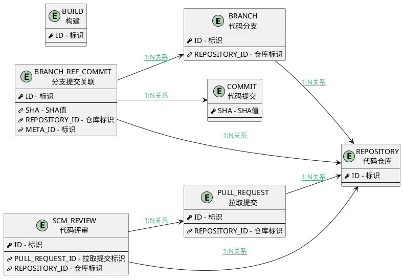

# DevOps数据集成 <!-- {docsify-ignore-all} -->

```plantuml
@startuml
skinparam svgLinkTarget _blank
<style>
root {
  HyperlinkColor #42b983
}
</style>
left to right direction

entity "BRANCH\n代码分支" as BRANCH [[$../module/DevOps/branch {代码分支}]] {
        <&key> ID - 标识
        --
        <&link-intact> REPOSITORY_ID - 仓库标识
}
entity "BRANCH_REF_COMMIT\n分支提交关联" as BRANCH_REF_COMMIT [[$../module/DevOps/branch_ref_commit {分支提交关联}]] {
        <&key> ID - 标识
        --
        <&link-intact> SHA - SHA值
        <&link-intact> REPOSITORY_ID - 仓库标识
        <&link-intact> META_ID - 标识
}
entity "BUILD\n构建" as BUILD [[$../module/DevOps/build {构建}]] {
        <&key> ID - 标识
        --
}
entity "COMMIT\n代码提交" as COMMIT [[$../module/DevOps/commit {代码提交}]] {
        <&key> SHA - SHA值
        --
}
entity "PULL_REQUEST\n拉取提交" as PULL_REQUEST [[$../module/DevOps/pull_request {拉取提交}]] {
        <&key> ID - 标识
        --
        <&link-intact> REPOSITORY_ID - 仓库标识
}
entity "REPOSITORY\n代码仓库" as REPOSITORY [[$../module/DevOps/repository {代码仓库}]] {
        <&key> ID - 标识
        --
}
entity "SCM_REVIEW\n代码评审" as SCM_REVIEW [[$../module/DevOps/scm_review {代码评审}]] {
        <&key> ID - 标识
        --
        <&link-intact> PULL_REQUEST_ID - 拉取提交标识
        <&link-intact> REPOSITORY_ID - 仓库标识
}

BRANCH_REF_COMMIT--> BRANCH : [[$../der/DER1N_BRANCH_REF_COMMIT_BRANCH_META_ID{DER1N_BRANCH_REF_COMMIT_BRANCH_META_ID} 1:N关系]]
BRANCH_REF_COMMIT--> COMMIT : [[$../der/DER1N_BRANCH_REF_COMMIT_COMMIT_SHA{DER1N_BRANCH_REF_COMMIT_COMMIT_SHA} 1:N关系]]
SCM_REVIEW--> PULL_REQUEST : [[$../der/DER1N_SCM_REVIEW_PULL_REQUEST_PULL_REQUEST_ID{DER1N_SCM_REVIEW_PULL_REQUEST_PULL_REQUEST_ID} 1:N关系]]
BRANCH_REF_COMMIT--> REPOSITORY : [[$../der/DER1N_BRANCH_REF_COMMIT_REPOSITORY_REPOSITORY_ID{DER1N_BRANCH_REF_COMMIT_REPOSITORY_REPOSITORY_ID} 1:N关系]]
BRANCH--> REPOSITORY : [[$../der/DER1N_BRANCH_REPOSITORY_REPOSITORY_ID{DER1N_BRANCH_REPOSITORY_REPOSITORY_ID} 1:N关系]]
PULL_REQUEST--> REPOSITORY : [[$../der/DER1N_PULL_REQUEST_REPOSITORY_REPOSITORY_ID{DER1N_PULL_REQUEST_REPOSITORY_REPOSITORY_ID} 1:N关系]]
SCM_REVIEW--> REPOSITORY : [[$../der/DER1N_SCM_REVIEW_REPOSITORY_REPOSITORY_ID{DER1N_SCM_REVIEW_REPOSITORY_REPOSITORY_ID} 1:N关系]]


hide methods
@enduml
```
