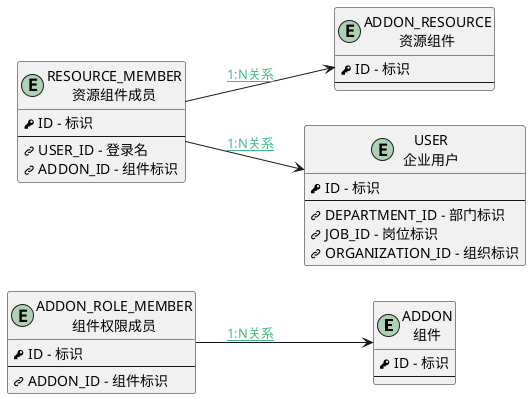

# 组件管理 <!-- {docsify-ignore-all} -->

```plantuml
@startuml
skinparam svgLinkTarget _blank
<style>
root {
  HyperlinkColor #42b983
}
</style>
left to right direction

entity "ADDON\n组件" as ADDON [[$../module/Base/addon {组件}]] {
        <&key> ID - 标识
        --
}
entity "ADDON_RESOURCE\n资源组件" as ADDON_RESOURCE [[$../module/Base/addon_resource {资源组件}]] {
        <&key> ID - 标识
        --
}
entity "ADDON_ROLE_MEMBER\n组件权限成员" as ADDON_ROLE_MEMBER [[$../module/Base/addon_role_member {组件权限成员}]] {
        <&key> ID - 标识
        --
        <&link-intact> ADDON_ID - 组件标识
}
entity "RESOURCE_MEMBER\n资源组件成员" as RESOURCE_MEMBER [[$../module/Base/resource_member {资源组件成员}]] {
        <&key> ID - 标识
        --
        <&link-intact> USER_ID - 登录名
        <&link-intact> ADDON_ID - 组件标识
}
entity "USER\n企业用户" as USER [[$../module/Base/user {企业用户}]] {
        <&key> ID - 标识
        --
        <&link-intact> DEPARTMENT_ID - 部门标识
        <&link-intact> JOB_ID - 岗位标识
        <&link-intact> ORGANIZATION_ID - 组织标识
}

ADDON_ROLE_MEMBER--> ADDON : [[$../der/DER1N_ADDON_ROLE_MEMBER_ADDON_ADDON_ID{DER1N_ADDON_ROLE_MEMBER_ADDON_ADDON_ID} 1:N关系]]
RESOURCE_MEMBER--> ADDON_RESOURCE : [[$../der/DER1N_RESOURCE_MEMBER_ADDON_RESOURCE_ADDON_ID{DER1N_RESOURCE_MEMBER_ADDON_RESOURCE_ADDON_ID} 1:N关系]]
RESOURCE_MEMBER--> USER : [[$../der/DER1N_RESOURCE_MEMBER_USER_USER_ID{DER1N_RESOURCE_MEMBER_USER_USER_ID} 1:N关系]]


hide methods
@enduml
```
