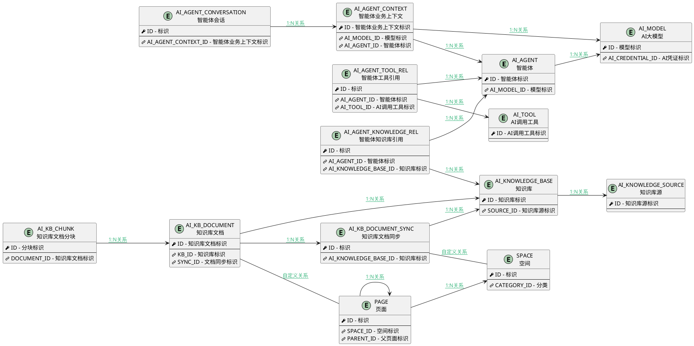

# AI模型看板 <!-- {docsify-ignore-all} -->

```plantuml
@startuml
skinparam svgLinkTarget _blank
<style>
root {
  HyperlinkColor #42b983
}
</style>
left to right direction

entity "AI_AGENT\n智能体" as AI_AGENT [[$../module/ai/ai_agent {智能体}]] {
        <&key> ID - 智能体标识
        --
        <&link-intact> AI_MODEL_ID - 模型标识
}
entity "AI_AGENT_CONTEXT\n智能体业务上下文" as AI_AGENT_CONTEXT [[$../module/ai/ai_agent_context {智能体业务上下文}]] {
        <&key> ID - 智能体业务上下文标识
        --
        <&link-intact> AI_MODEL_ID - 模型标识
        <&link-intact> AI_AGENT_ID - 智能体标识
}
entity "AI_AGENT_CONVERSATION\n智能体会话" as AI_AGENT_CONVERSATION [[$../module/ai/ai_agent_conversation {智能体会话}]] {
        <&key> ID - 标识
        --
        <&link-intact> AI_AGENT_CONTEXT_ID - 智能体业务上下文标识
}
entity "AI_AGENT_KNOWLEDGE_REL\n智能体知识库引用" as AI_AGENT_KNOWLEDGE_REL [[$../module/ai/ai_agent_knowledge_rel {智能体知识库引用}]] {
        <&key> ID - 标识
        --
        <&link-intact> AI_AGENT_ID - 智能体标识
        <&link-intact> AI_KNOWLEDGE_BASE_ID - 知识库标识
}
entity "AI_AGENT_TOOL_REL\n智能体工具引用" as AI_AGENT_TOOL_REL [[$../module/ai/ai_agent_tool_rel {智能体工具引用}]] {
        <&key> ID - 标识
        --
        <&link-intact> AI_AGENT_ID - 智能体标识
        <&link-intact> AI_TOOL_ID - AI调用工具标识
}
entity "AI_KB_CHUNK\n知识库文档分块" as AI_KB_CHUNK [[$../module/ai/ai_kb_chunk {知识库文档分块}]] {
        <&key> ID - 分块标识
        --
        <&link-intact> DOCUMENT_ID - 知识库文档标识
}
entity "AI_KB_DOCUMENT\n知识库文档" as AI_KB_DOCUMENT [[$../module/ai/ai_kb_document {知识库文档}]] {
        <&key> ID - 知识库文档标识
        --
        <&link-intact> KB_ID - 知识库标识
        <&link-intact> SYNC_ID - 文档同步标识
}
entity "AI_KB_DOCUMENT_SYNC\n知识库文档同步" as AI_KB_DOCUMENT_SYNC [[$../module/ai/ai_kb_document_sync {知识库文档同步}]] {
        <&key> ID - 标识
        --
        <&link-intact> AI_KNOWLEDGE_BASE_ID - 知识库标识
}
entity "AI_KNOWLEDGE_BASE\n知识库" as AI_KNOWLEDGE_BASE [[$../module/ai/ai_knowledge_base {知识库}]] {
        <&key> ID - 知识库标识
        --
        <&link-intact> SOURCE_ID - 知识库源标识
}
entity "AI_KNOWLEDGE_SOURCE\n知识库源" as AI_KNOWLEDGE_SOURCE [[$../module/ai/ai_knowledge_source {知识库源}]] {
        <&key> ID - 知识库源标识
        --
}
entity "AI_MODEL\nAI大模型" as AI_MODEL [[$../module/ai/ai_model {AI大模型}]] {
        <&key> ID - 模型标识
        --
        <&link-intact> AI_CREDENTIAL_ID - AI凭证标识
}
entity "AI_TOOL\nAI调用工具" as AI_TOOL [[$../module/ai/ai_tool {AI调用工具}]] {
        <&key> ID - AI调用工具标识
        --
}
entity "PAGE\n页面" as PAGE [[$../module/Wiki/article_page {页面}]] {
        <&key> ID - 标识
        --
        <&link-intact> SPACE_ID - 空间标识
        <&link-intact> PARENT_ID - 父页面标识
}
entity "SPACE\n空间" as SPACE [[$../module/Wiki/space {空间}]] {
        <&key> ID - 标识
        --
        <&link-intact> CATEGORY_ID - 分类
}

AI_AGENT_CONTEXT--> AI_AGENT : [[$../der/DER1N_AI_AGENT_CONTEXT_AI_AGENT_AI_AGENT_ID{DER1N_AI_AGENT_CONTEXT_AI_AGENT_AI_AGENT_ID} 1:N关系]]
AI_AGENT_KNOWLEDGE_REL--> AI_AGENT : [[$../der/DER1N_AI_AGENT_KNOWLEDGE_REL_AI_AGENT_AI_AGENT_ID{DER1N_AI_AGENT_KNOWLEDGE_REL_AI_AGENT_AI_AGENT_ID} 1:N关系]]
AI_AGENT_TOOL_REL--> AI_AGENT : [[$../der/DER1N_AI_AGENT_TOOL_REL_AI_AGENT_AI_AGENT_ID{DER1N_AI_AGENT_TOOL_REL_AI_AGENT_AI_AGENT_ID} 1:N关系]]
AI_AGENT_CONVERSATION--> AI_AGENT_CONTEXT : [[$../der/DER1N_AI_AGENT_CONVERSATION_AI_AGENT_CONTEXT_AI_AGENT_CONTEXT_ID{DER1N_AI_AGENT_CONVERSATION_AI_AGENT_CONTEXT_AI_AGENT_CONTEXT_ID} 1:N关系]]
AI_KB_CHUNK--> AI_KB_DOCUMENT : [[$../der/DER1N_AI_KB_CHUNK_AI_KB_DOCUMENT_DOCUMENT_ID{DER1N_AI_KB_CHUNK_AI_KB_DOCUMENT_DOCUMENT_ID} 1:N关系]]
AI_KB_DOCUMENT--> AI_KB_DOCUMENT_SYNC : [[$../der/DER1N_AI_KB_DOCUMENT_AI_KB_DOCUMENT_SYNC_SYNC_ID{DER1N_AI_KB_DOCUMENT_AI_KB_DOCUMENT_SYNC_SYNC_ID} 1:N关系]]
AI_AGENT_KNOWLEDGE_REL--> AI_KNOWLEDGE_BASE : [[$../der/DER1N_AI_AGENT_KNOWLEDGE_REL_AI_KNOWLEDGE_BASE_AI_KNOWLEDGE_BASE_ID{DER1N_AI_AGENT_KNOWLEDGE_REL_AI_KNOWLEDGE_BASE_AI_KNOWLEDGE_BASE_ID} 1:N关系]]
AI_KB_DOCUMENT--> AI_KNOWLEDGE_BASE : [[$../der/DER1N_AI_KB_DOCUMENT_AI_KNOWLEDGE_BASE_KB_ID{DER1N_AI_KB_DOCUMENT_AI_KNOWLEDGE_BASE_KB_ID} 1:N关系]]
AI_KB_DOCUMENT_SYNC--> AI_KNOWLEDGE_BASE : [[$../der/DER1N_AI_KB_DOCUMENT_SYNC_AI_KNOWLEDGE_BASE_AI_KNOWLEDGE_BASE_ID{DER1N_AI_KB_DOCUMENT_SYNC_AI_KNOWLEDGE_BASE_AI_KNOWLEDGE_BASE_ID} 1:N关系]]
AI_KNOWLEDGE_BASE--> AI_KNOWLEDGE_SOURCE : [[$../der/DER1N_AI_KNOWLEDGE_BASE_AI_KNOWLEDGE_SOURCE_SOURCE_ID{DER1N_AI_KNOWLEDGE_BASE_AI_KNOWLEDGE_SOURCE_SOURCE_ID} 1:N关系]]
AI_AGENT--> AI_MODEL : [[$../der/DER1N_AI_AGENT_AI_MODEL_AI_MODEL_ID{DER1N_AI_AGENT_AI_MODEL_AI_MODEL_ID} 1:N关系]]
AI_AGENT_CONTEXT--> AI_MODEL : [[$../der/DER1N_AI_AGENT_CONTEXT_AI_MODEL_AI_MODEL_ID{DER1N_AI_AGENT_CONTEXT_AI_MODEL_AI_MODEL_ID} 1:N关系]]
AI_AGENT_TOOL_REL--> AI_TOOL : [[$../der/DER1N_AI_AGENT_TOOL_REL_AI_TOOL_AI_TOOL_ID{DER1N_AI_AGENT_TOOL_REL_AI_TOOL_AI_TOOL_ID} 1:N关系]]
PAGE--> PAGE : [[$../der/DER1N_PAGE_PAGE_PARENT_ID{DER1N_PAGE_PAGE_PARENT_ID} 1:N关系]]
AI_KB_DOCUMENT-- PAGE : [[$../der/DERCUSTOM_AI_KB_DOCUMENT_PAGE{DERCUSTOM_AI_KB_DOCUMENT_PAGE} 自定义关系]]
PAGE--> SPACE : [[$../der/DER1N_PAGE_SPACE_SPACE_ID{DER1N_PAGE_SPACE_SPACE_ID} 1:N关系]]
AI_KB_DOCUMENT_SYNC-- SPACE : [[$../der/DERCUSTOM_AI_KB_DOCUMENT_SYNC_SPACE{DERCUSTOM_AI_KB_DOCUMENT_SYNC_SPACE} 自定义关系]]


hide methods
@enduml
```
