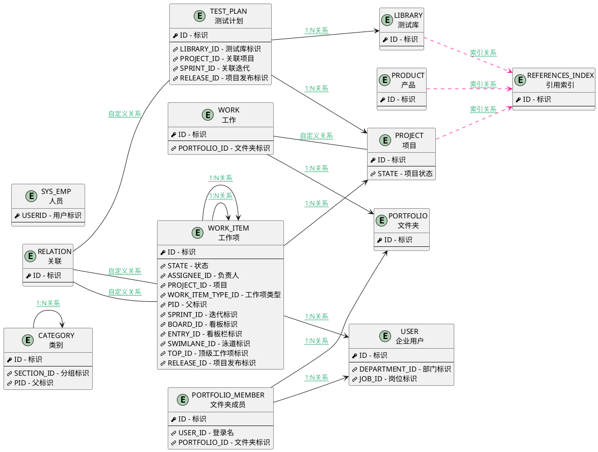

# 通用-关联\索引 <!-- {docsify-ignore-all} -->

```plantuml
@startuml
<style>
root {
  HyperlinkColor #42b983
}
</style>
left to right direction

entity "CATEGORY\n类别" as CATEGORY [[$../module/Base/category {类别}]] {
        <&key> ID - 标识
        --
        <&link-intact> SECTION_ID - 分组标识
        <&link-intact> PID - 父标识
}
entity "LIBRARY\n测试库" as LIBRARY [[$../module/TestMgmt/library {测试库}]] {
        <&key> ID - 标识
        --
}
entity "PORTFOLIO\n文件夹" as PORTFOLIO [[$../module/Base/portfolio {文件夹}]] {
        <&key> ID - 标识
        --
}
entity "PORTFOLIO_MEMBER\n文件夹成员" as PORTFOLIO_MEMBER [[$../module/Base/portfolio_member {文件夹成员}]] {
        <&key> ID - 标识
        --
        <&link-intact> USER_ID - 登录名
        <&link-intact> PORTFOLIO_ID - 文件夹标识
}
entity "PRODUCT\n产品" as PRODUCT [[$../module/ProdMgmt/product {产品}]] {
        <&key> ID - 标识
        --
}
entity "PROJECT\n项目" as PROJECT [[$../module/ProjMgmt/project {项目}]] {
        <&key> ID - 标识
        --
        <&link-intact> STATE - 项目状态
}
entity "REFERENCES_INDEX\n引用索引" as REFERENCES_INDEX [[$../module/Base/references_index {引用索引}]] {
        <&key> ID - 标识
        --
}
entity "RELATION\n关联" as RELATION [[$../module/Base/relation {关联}]] {
        <&key> ID - 标识
        --
}
entity "SYS_EMP\n人员" as SYS_EMP [[$../module/ebsx/SysEmployee {人员}]] {
        <&key> USERID - 用户标识
        --
}
entity "TEST_PLAN\n测试计划" as TEST_PLAN [[$../module/TestMgmt/test_plan {测试计划}]] {
        <&key> ID - 标识
        --
        <&link-intact> LIBRARY_ID - 测试库标识
        <&link-intact> PROJECT_ID - 关联项目
        <&link-intact> SPRINT_ID - 关联迭代
        <&link-intact> RELEASE_ID - 项目发布标识
}
entity "USER\n企业用户" as USER [[$../module/Base/user {企业用户}]] {
        <&key> ID - 标识
        --
        <&link-intact> DEPARTMENT_ID - 部门标识
        <&link-intact> JOB_ID - 岗位标识
}
entity "WORK\n工作" as WORK [[$../module/Base/work {工作}]] {
        <&key> ID - 标识
        --
        <&link-intact> PORTFOLIO_ID - 文件夹标识
}
entity "WORK_ITEM\n工作项" as WORK_ITEM [[$../module/ProjMgmt/work_item {工作项}]] {
        <&key> ID - 标识
        --
        <&link-intact> STATE - 状态
        <&link-intact> ASSIGNEE_ID - 负责人
        <&link-intact> PROJECT_ID - 项目
        <&link-intact> WORK_ITEM_TYPE_ID - 工作项类型
        <&link-intact> PID - 父标识
        <&link-intact> SPRINT_ID - 迭代标识
        <&link-intact> BOARD_ID - 看板标识
        <&link-intact> ENTRY_ID - 看板栏标识
        <&link-intact> SWIMLANE_ID - 泳道标识
        <&link-intact> TOP_ID - 顶级工作项标识
        <&link-intact> RELEASE_ID - 项目发布标识
}

CATEGORY--> CATEGORY : [[$../der/DER1N_CATEGORY_CATEGORY_PID{DER1N_CATEGORY_CATEGORY_PID} 1:N关系]]
TEST_PLAN--> LIBRARY : [[$../der/DER1N_TEST_PLAN_LIBRARY_LIBRARY_ID{DER1N_TEST_PLAN_LIBRARY_LIBRARY_ID} 1:N关系]]
PORTFOLIO_MEMBER--> PORTFOLIO : [[$../der/DER1N_PORTFOLIO_MEMBER_PORTFOLIO_PORTFOLIO_ID{DER1N_PORTFOLIO_MEMBER_PORTFOLIO_PORTFOLIO_ID} 1:N关系]]
WORK--> PORTFOLIO : [[$../der/DER1N_WORK_PORTFOLIO_PORTFOLIO_ID{DER1N_WORK_PORTFOLIO_PORTFOLIO_ID} 1:N关系]]
TEST_PLAN--> PROJECT : [[$../der/DER1N_TEST_PLAN_PROJECT_PROJECT_ID{DER1N_TEST_PLAN_PROJECT_PROJECT_ID} 1:N关系]]
WORK_ITEM--> PROJECT : [[$../der/DER1N_WORK_ITEM_PROJECT_PROJECT_ID{DER1N_WORK_ITEM_PROJECT_PROJECT_ID} 1:N关系]]
WORK-- PROJECT : [[$../der/DERCUSTOM_WORK_PROJECT_PILOT_ID{DERCUSTOM_WORK_PROJECT_PILOT_ID} 自定义关系]]
LIBRARY.[#deeppink].> REFERENCES_INDEX : [[$../der/DERINDEX_LIBRARY_REFERENCES_INDEX{DERINDEX_LIBRARY_REFERENCES_INDEX} 索引关系]]
PRODUCT.[#deeppink].> REFERENCES_INDEX : [[$../der/DERINDEX_PRODUCT_REFERENCES_INDEX{DERINDEX_PRODUCT_REFERENCES_INDEX} 索引关系]]
PROJECT.[#deeppink].> REFERENCES_INDEX : [[$../der/DERINDEX_PROJECT_REFERENCES_INDEX{DERINDEX_PROJECT_REFERENCES_INDEX} 索引关系]]
RELATION-- TEST_PLAN : [[$../der/DERCUSTOM_RELATION_TEST_PLAN{DERCUSTOM_RELATION_TEST_PLAN} 自定义关系]]
PORTFOLIO_MEMBER--> USER : [[$../der/DER1N_PORTFOLIO_MEMBER_USER_USER_ID{DER1N_PORTFOLIO_MEMBER_USER_USER_ID} 1:N关系]]
WORK_ITEM--> USER : [[$../der/DER1N_WORK_ITEM_USER_ASSIGNEE_ID{DER1N_WORK_ITEM_USER_ASSIGNEE_ID} 1:N关系]]
WORK_ITEM--> WORK_ITEM : [[$../der/DER1N_WORK_ITEM_WORK_ITEM_PID{DER1N_WORK_ITEM_WORK_ITEM_PID} 1:N关系]]
WORK_ITEM--> WORK_ITEM : [[$../der/DER1N_WORK_ITEM_WORK_ITEM_TOP_ID{DER1N_WORK_ITEM_WORK_ITEM_TOP_ID} 1:N关系]]
RELATION-- WORK_ITEM : [[$../der/DERCUSTOM_RELATION_TARGET_WORK_ITEM{DERCUSTOM_RELATION_TARGET_WORK_ITEM} 自定义关系]]
RELATION-- WORK_ITEM : [[$../der/DERCUSTOM_RELATION_WORK_ITEM{DERCUSTOM_RELATION_WORK_ITEM} 自定义关系]]


hide methods
@enduml
```
