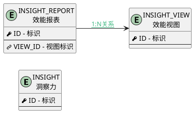

# 效能度量 <!-- {docsify-ignore-all} -->

```plantuml
@startuml
skinparam svgLinkTarget _blank
<style>
root {
  HyperlinkColor #42b983
}
</style>
left to right direction

entity "INSIGHT\n洞察力" as INSIGHT [[$../module/Base/insight {洞察力}]] {
        <&key> ID - 标识
        --
}
entity "INSIGHT_REPORT\n效能报表" as INSIGHT_REPORT [[$../module/Insight/insight_report {效能报表}]] {
        <&key> ID - 标识
        --
        <&link-intact> VIEW_ID - 视图标识
}
entity "INSIGHT_VIEW\n效能视图" as INSIGHT_VIEW [[$../module/Insight/insight_view {效能视图}]] {
        <&key> ID - 标识
        --
}

INSIGHT_REPORT--> INSIGHT_VIEW : [[$../der/DER1N_INSIGHT_REPORT_INSIGHT_VIEW_VIEW_ID{DER1N_INSIGHT_REPORT_INSIGHT_VIEW_VIEW_ID} 1:N关系]]


hide methods
@enduml
```
