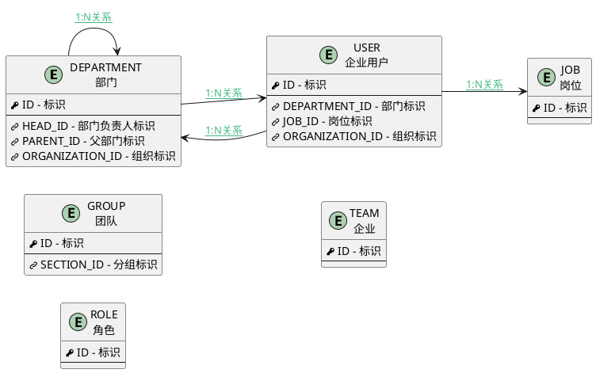

# 组织管理 <!-- {docsify-ignore-all} -->

```plantuml
@startuml
skinparam svgLinkTarget _blank
<style>
root {
  HyperlinkColor #42b983
}
</style>
left to right direction

entity "DEPARTMENT\n部门" as DEPARTMENT [[$../module/Base/department {部门}]] {
        <&key> ID - 标识
        --
        <&link-intact> HEAD_ID - 部门负责人标识
        <&link-intact> PARENT_ID - 父部门标识
        <&link-intact> ORGANIZATION_ID - 组织标识
}
entity "GROUP\n团队" as GROUP [[$../module/Base/group {团队}]] {
        <&key> ID - 标识
        --
        <&link-intact> SECTION_ID - 分组标识
}
entity "JOB\n岗位" as JOB [[$../module/Base/job {岗位}]] {
        <&key> ID - 标识
        --
}
entity "ROLE\n角色" as ROLE [[$../module/Base/role {角色}]] {
        <&key> ID - 标识
        --
}
entity "TEAM\n企业" as TEAM [[$../module/Base/team {企业}]] {
        <&key> ID - 标识
        --
}
entity "USER\n企业用户" as USER [[$../module/Base/user {企业用户}]] {
        <&key> ID - 标识
        --
        <&link-intact> DEPARTMENT_ID - 部门标识
        <&link-intact> JOB_ID - 岗位标识
        <&link-intact> ORGANIZATION_ID - 组织标识
}

DEPARTMENT--> DEPARTMENT : [[$../der/DER1N_DEPARTMENT_DEPARTMENT_PARENT_ID{DER1N_DEPARTMENT_DEPARTMENT_PARENT_ID} 1:N关系]]
USER--> DEPARTMENT : [[$../der/DER1N_USER_DEPARTMENT_DEPARTMENT_ID{DER1N_USER_DEPARTMENT_DEPARTMENT_ID} 1:N关系]]
USER--> JOB : [[$../der/DER1N_USER_JOB_JOB_ID{DER1N_USER_JOB_JOB_ID} 1:N关系]]
DEPARTMENT--> USER : [[$../der/DER1N_DEPARTMENT_USER_HEAD_ID{DER1N_DEPARTMENT_USER_HEAD_ID} 1:N关系]]


hide methods
@enduml
```
