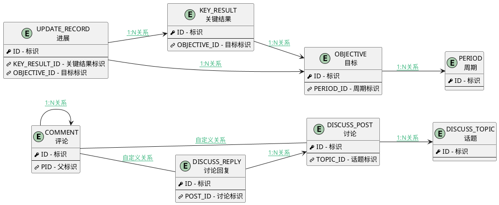

# 协作空间 <!-- {docsify-ignore-all} -->

```plantuml
@startuml
skinparam svgLinkTarget _blank
<style>
root {
  HyperlinkColor #42b983
}
</style>
left to right direction

entity "COMMENT\n评论" as COMMENT [[$../module/Base/comment {评论}]] {
        <&key> ID - 标识
        --
        <&link-intact> PID - 父标识
}
entity "DISCUSS_POST\n讨论" as DISCUSS_POST [[$../module/Team/discuss_post {讨论}]] {
        <&key> ID - 标识
        --
        <&link-intact> TOPIC_ID - 话题标识
}
entity "DISCUSS_REPLY\n讨论回复" as DISCUSS_REPLY [[$../module/Team/discuss_reply {讨论回复}]] {
        <&key> ID - 标识
        --
        <&link-intact> POST_ID - 讨论标识
}
entity "DISCUSS_TOPIC\n话题" as DISCUSS_TOPIC [[$../module/Team/discuss_topic {话题}]] {
        <&key> ID - 标识
        --
}
entity "KEY_RESULT\n关键结果" as KEY_RESULT [[$../module/Team/key_result {关键结果}]] {
        <&key> ID - 标识
        --
        <&link-intact> OBJECTIVE_ID - 目标标识
}
entity "OBJECTIVE\n目标" as OBJECTIVE [[$../module/Team/objective {目标}]] {
        <&key> ID - 标识
        --
        <&link-intact> PERIOD_ID - 周期标识
}
entity "PERIOD\n周期" as PERIOD [[$../module/Team/period {周期}]] {
        <&key> ID - 标识
        --
}
entity "UPDATE_RECORD\n进展" as UPDATE_RECORD [[$../module/Team/update_record {进展}]] {
        <&key> ID - 标识
        --
        <&link-intact> KEY_RESULT_ID - 关键结果标识
        <&link-intact> OBJECTIVE_ID - 目标标识
}

COMMENT--> COMMENT : [[$../der/DER1N_COMMENT_COMMENT_PID{DER1N_COMMENT_COMMENT_PID} 1:N关系]]
DISCUSS_REPLY--> DISCUSS_POST : [[$../der/DER1N_DISCUSS_REPLY_DISCUSS_POST_POST_ID{DER1N_DISCUSS_REPLY_DISCUSS_POST_POST_ID} 1:N关系]]
COMMENT-- DISCUSS_POST : [[$../der/DERCUSTOM_COMMENT_DISCUSS_POST{DERCUSTOM_COMMENT_DISCUSS_POST} 自定义关系]]
COMMENT-- DISCUSS_REPLY : [[$../der/DERCUSTOM_COMMENT_DISCUSS_REPLY{DERCUSTOM_COMMENT_DISCUSS_REPLY} 自定义关系]]
DISCUSS_POST--> DISCUSS_TOPIC : [[$../der/DER1N_DISCUSS_POST_DISCUSS_TOPIC_TOPIC_ID{DER1N_DISCUSS_POST_DISCUSS_TOPIC_TOPIC_ID} 1:N关系]]
UPDATE_RECORD--> KEY_RESULT : [[$../der/DER1N_UPDATE_RECORD_KEY_RESULT_KEY_RESULT_ID{DER1N_UPDATE_RECORD_KEY_RESULT_KEY_RESULT_ID} 1:N关系]]
KEY_RESULT--> OBJECTIVE : [[$../der/DER1N_KEY_RESULT_OBJECTIVE_OBJECTIVE_ID{DER1N_KEY_RESULT_OBJECTIVE_OBJECTIVE_ID} 1:N关系]]
UPDATE_RECORD--> OBJECTIVE : [[$../der/DER1N_UPDATE_RECORD_OBJECTIVE_OBJECTIVE_ID{DER1N_UPDATE_RECORD_OBJECTIVE_OBJECTIVE_ID} 1:N关系]]
OBJECTIVE--> PERIOD : [[$../der/DER1N_OBJECTIVE_PERIOD_PERIOD_ID{DER1N_OBJECTIVE_PERIOD_PERIOD_ID} 1:N关系]]


hide methods
@enduml
```
