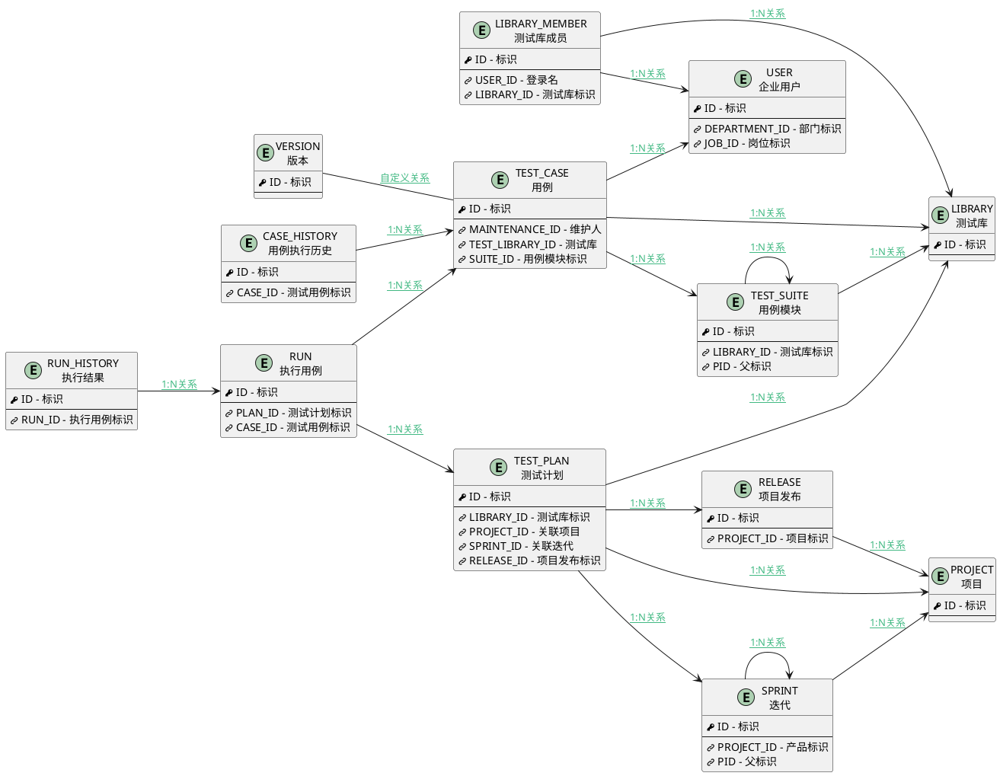

# 测试管理 <!-- {docsify-ignore-all} -->

```plantuml
@startuml
<style>
root {
  HyperlinkColor #42b983
}
</style>
left to right direction

entity "CASE_HISTORY\n用例执行历史" as CASE_HISTORY [[$../module/TestMgmt/case_history {用例执行历史}]] {
        <&key> ID - 标识
        --
        <&link-intact> CASE_ID - 测试用例标识
}
entity "LIBRARY\n测试库" as LIBRARY [[$../module/TestMgmt/library {测试库}]] {
        <&key> ID - 标识
        --
}
entity "LIBRARY_MEMBER\n测试库成员" as LIBRARY_MEMBER [[$../module/TestMgmt/library_member {测试库成员}]] {
        <&key> ID - 标识
        --
        <&link-intact> USER_ID - 登录名
        <&link-intact> LIBRARY_ID - 测试库标识
}
entity "PROJECT\n项目" as PROJECT [[$../module/ProjMgmt/project {项目}]] {
        <&key> ID - 标识
        --
}
entity "RELEASE\n项目发布" as RELEASE [[$../module/ProjMgmt/release {项目发布}]] {
        <&key> ID - 标识
        --
        <&link-intact> PROJECT_ID - 项目标识
}
entity "RUN\n执行用例" as RUN [[$../module/TestMgmt/run {执行用例}]] {
        <&key> ID - 标识
        --
        <&link-intact> PLAN_ID - 测试计划标识
        <&link-intact> CASE_ID - 测试用例标识
}
entity "RUN_HISTORY\n执行结果" as RUN_HISTORY [[$../module/TestMgmt/run_history {执行结果}]] {
        <&key> ID - 标识
        --
        <&link-intact> RUN_ID - 执行用例标识
}
entity "SPRINT\n迭代" as SPRINT [[$../module/ProjMgmt/sprint {迭代}]] {
        <&key> ID - 标识
        --
        <&link-intact> PROJECT_ID - 产品标识
        <&link-intact> PID - 父标识
}
entity "TEST_CASE\n用例" as TEST_CASE [[$../module/TestMgmt/test_case {用例}]] {
        <&key> ID - 标识
        --
        <&link-intact> MAINTENANCE_ID - 维护人
        <&link-intact> TEST_LIBRARY_ID - 测试库
        <&link-intact> SUITE_ID - 用例模块标识
}
entity "TEST_PLAN\n测试计划" as TEST_PLAN [[$../module/TestMgmt/test_plan {测试计划}]] {
        <&key> ID - 标识
        --
        <&link-intact> LIBRARY_ID - 测试库标识
        <&link-intact> PROJECT_ID - 关联项目
        <&link-intact> SPRINT_ID - 关联迭代
        <&link-intact> RELEASE_ID - 项目发布标识
}
entity "TEST_SUITE\n用例模块" as TEST_SUITE [[$../module/TestMgmt/test_suite {用例模块}]] {
        <&key> ID - 标识
        --
        <&link-intact> LIBRARY_ID - 测试库标识
        <&link-intact> PID - 父标识
}
entity "USER\n企业用户" as USER [[$../module/Base/user {企业用户}]] {
        <&key> ID - 标识
        --
        <&link-intact> DEPARTMENT_ID - 部门标识
        <&link-intact> JOB_ID - 岗位标识
}
entity "VERSION\n版本" as VERSION [[$../module/Base/version {版本}]] {
        <&key> ID - 标识
        --
}

LIBRARY_MEMBER--> LIBRARY : [[$../der/DER1N_LIBRARY_MEMBER_LIBRARY_LIBRARY_ID{DER1N_LIBRARY_MEMBER_LIBRARY_LIBRARY_ID} 1:N关系]]
TEST_CASE--> LIBRARY : [[$../der/DER1N_TEST_CASE_LIBRARY_TEST_LIBRARY_ID{DER1N_TEST_CASE_LIBRARY_TEST_LIBRARY_ID} 1:N关系]]
TEST_PLAN--> LIBRARY : [[$../der/DER1N_TEST_PLAN_LIBRARY_LIBRARY_ID{DER1N_TEST_PLAN_LIBRARY_LIBRARY_ID} 1:N关系]]
TEST_SUITE--> LIBRARY : [[$../der/DER1N_TEST_SUITE_LIBRARY_LIBRARY_ID{DER1N_TEST_SUITE_LIBRARY_LIBRARY_ID} 1:N关系]]
RELEASE--> PROJECT : [[$../der/DER1N_RELEASE_PROJECT_PROJECT_ID{DER1N_RELEASE_PROJECT_PROJECT_ID} 1:N关系]]
SPRINT--> PROJECT : [[$../der/DER1N_SPRINT_PROJECT_PROJECT_ID{DER1N_SPRINT_PROJECT_PROJECT_ID} 1:N关系]]
TEST_PLAN--> PROJECT : [[$../der/DER1N_TEST_PLAN_PROJECT_PROJECT_ID{DER1N_TEST_PLAN_PROJECT_PROJECT_ID} 1:N关系]]
TEST_PLAN--> RELEASE : [[$../der/DER1N_TEST_PLAN_RELEASE_RELEASE_ID{DER1N_TEST_PLAN_RELEASE_RELEASE_ID} 1:N关系]]
RUN_HISTORY--> RUN : [[$../der/DER1N_RUN_HISTORY_RUN_RUN_ID{DER1N_RUN_HISTORY_RUN_RUN_ID} 1:N关系]]
SPRINT--> SPRINT : [[$../der/DER1N_SPRINT_SPRINT_PID{DER1N_SPRINT_SPRINT_PID} 1:N关系]]
TEST_PLAN--> SPRINT : [[$../der/DER1N_TEST_PLAN_SPRINT_SPRINT_ID{DER1N_TEST_PLAN_SPRINT_SPRINT_ID} 1:N关系]]
CASE_HISTORY--> TEST_CASE : [[$../der/DER1N_CASE_HISTORY_TEST_CASE_CASE_ID{DER1N_CASE_HISTORY_TEST_CASE_CASE_ID} 1:N关系]]
RUN--> TEST_CASE : [[$../der/DER1N_RUN_TEST_CASE_CASE_ID{DER1N_RUN_TEST_CASE_CASE_ID} 1:N关系]]
VERSION-- TEST_CASE : [[$../der/DERCUSTOM_VERSION_TEST_CASE{DERCUSTOM_VERSION_TEST_CASE} 自定义关系]]
RUN--> TEST_PLAN : [[$../der/DER1N_RUN_TEST_PLAN_PLAN_ID{DER1N_RUN_TEST_PLAN_PLAN_ID} 1:N关系]]
TEST_CASE--> TEST_SUITE : [[$../der/DER1N_TEST_CASE_TEST_SUITE_SUITE_ID{DER1N_TEST_CASE_TEST_SUITE_SUITE_ID} 1:N关系]]
TEST_SUITE--> TEST_SUITE : [[$../der/DER1N_TEST_SUITE_TEST_SUITE_PID{DER1N_TEST_SUITE_TEST_SUITE_PID} 1:N关系]]
LIBRARY_MEMBER--> USER : [[$../der/DER1N_LIBRARY_MEMBER_USER_USER_ID{DER1N_LIBRARY_MEMBER_USER_USER_ID} 1:N关系]]
TEST_CASE--> USER : [[$../der/DER1N_TEST_CASE_USER_MAINTENANCE_ID{DER1N_TEST_CASE_USER_MAINTENANCE_ID} 1:N关系]]


hide methods
@enduml
```
