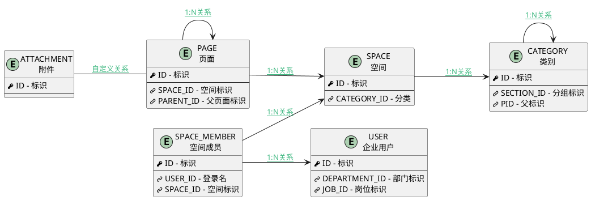

# 知识管理-wiki <!-- {docsify-ignore-all} -->

```plantuml
@startuml
<style>
root {
  HyperlinkColor #42b983
}
</style>
left to right direction

entity "ATTACHMENT\n附件" as ATTACHMENT [[$../module/Base/attachment {附件}]] {
        <&key> ID - 标识
        --
}
entity "CATEGORY\n类别" as CATEGORY [[$../module/Base/category {类别}]] {
        <&key> ID - 标识
        --
        <&link-intact> SECTION_ID - 分组标识
        <&link-intact> PID - 父标识
}
entity "PAGE\n页面" as PAGE [[$../module/Wiki/article_page {页面}]] {
        <&key> ID - 标识
        --
        <&link-intact> SPACE_ID - 空间标识
        <&link-intact> PARENT_ID - 父页面标识
}
entity "SPACE\n空间" as SPACE [[$../module/Wiki/space {空间}]] {
        <&key> ID - 标识
        --
        <&link-intact> CATEGORY_ID - 分类
}
entity "SPACE_MEMBER\n空间成员" as SPACE_MEMBER [[$../module/Wiki/space_member {空间成员}]] {
        <&key> ID - 标识
        --
        <&link-intact> USER_ID - 登录名
        <&link-intact> SPACE_ID - 空间标识
}
entity "USER\n企业用户" as USER [[$../module/Base/user {企业用户}]] {
        <&key> ID - 标识
        --
        <&link-intact> DEPARTMENT_ID - 部门标识
        <&link-intact> JOB_ID - 岗位标识
}

CATEGORY--> CATEGORY : [[$../der/DER1N_CATEGORY_CATEGORY_PID{DER1N_CATEGORY_CATEGORY_PID} 1:N关系]]
SPACE--> CATEGORY : [[$../der/DER1N_SPACE_CATEGORY_CATEGORY_ID{DER1N_SPACE_CATEGORY_CATEGORY_ID} 1:N关系]]
PAGE--> PAGE : [[$../der/DER1N_PAGE_PAGE_PARENT_ID{DER1N_PAGE_PAGE_PARENT_ID} 1:N关系]]
ATTACHMENT-- PAGE : [[$../der/DERCUSTOM_PAGE_ATTACHMENT{DERCUSTOM_PAGE_ATTACHMENT} 自定义关系]]
PAGE--> SPACE : [[$../der/DER1N_PAGE_SPACE_SPACE_ID{DER1N_PAGE_SPACE_SPACE_ID} 1:N关系]]
SPACE_MEMBER--> SPACE : [[$../der/DER1N_SPACE_MEMBER_SPACE_SPACE_ID{DER1N_SPACE_MEMBER_SPACE_SPACE_ID} 1:N关系]]
SPACE_MEMBER--> USER : [[$../der/DER1N_SPACE_MEMBER_USER_USER_ID{DER1N_SPACE_MEMBER_USER_USER_ID} 1:N关系]]


hide methods
@enduml
```
