## 附件删除（表格） <!-- {docsify-ignore-all} -->

   

### 处理过程

```plantuml
@startuml
hide footbox
<style>
root {
  HyperlinkColor #42b983
}
</style>

hide empty description
state "开始" as Begin <<start>> [[$./remove_attachment_grid#begin {开始}]]
state "结束" as END1 <<end>> [[$./remove_attachment_grid#end1 {结束}]]
state "表格行删除" as VIEWCTRLINVOKE1  [[$./remove_attachment_grid#viewctrlinvoke1 {表格行删除}]]
state "获取表格部件" as PREPAREJSPARAM1  [[$./remove_attachment_grid#preparejsparam1 {获取表格部件}]]
state "设置附件数据" as RAWJSCODE1  [[$./remove_attachment_grid#rawjscode1 {设置附件数据}]]


Begin --> PREPAREJSPARAM1
PREPAREJSPARAM1 --> RAWJSCODE1
RAWJSCODE1 --> VIEWCTRLINVOKE1
VIEWCTRLINVOKE1 --> END1


@enduml
```




### 处理步骤说明

#### 开始 :id=Begin


#### 结束 :id=END1


#### 表格行删除 :id=VIEWCTRLINVOKE1


调用`grid(表格)`的方法`remove`，参数为`attach(附件数据)`
#### 获取表格部件 :id=PREPAREJSPARAM1


1. 将`view(当前视图对象).getController('grid')` 设置给  `grid(表格)`

#### 设置附件数据 :id=RAWJSCODE1


<p class="panel-title"><b>执行代码</b></p>

```javascript
uiLogic.attach = { data: data, silent: true };
```


### 实体逻辑参数

|    中文名   |    代码名    |  数据类型      |备注 |
| --------| --------| --------  | --------   |
|传入变量(<i class="fa fa-check"/></i>)|Default|数据对象||
|附件数据|attach|数据对象||
|当前视图对象|view|当前视图对象||
|表格|grid|部件对象||
