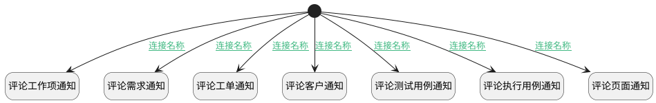

## 新建评论后通知 <!-- {docsify-ignore-all} -->

   

### 处理过程

### 处理步骤说明

#### 开始 :id=Begin [开始]

*- N/A*
#### 评论工作项通知 :id=DENOTIFY1 [实体通知]

调用实体 [评论(COMMENT)](module/Base/Comment.md) 通知 [评论工作项通知(work_item_notify)](module/Base/Comment/notify/work_item_notify) ，参数为`Default(传入变量)`
#### 评论需求通知 :id=DENOTIFY2 [实体通知]

调用实体 [评论(COMMENT)](module/Base/Comment.md) 通知 [评论需求通知(idea_notify)](module/Base/Comment/notify/idea_notify) ，参数为`Default(传入变量)`
#### 评论工单通知 :id=DENOTIFY3 [实体通知]

调用实体 [评论(COMMENT)](module/Base/Comment.md) 通知 [评论工单通知(ticket_notify)](module/Base/Comment/notify/ticket_notify) ，参数为`Default(传入变量)`
#### 评论客户通知 :id=DENOTIFY4 [实体通知]

调用实体 [评论(COMMENT)](module/Base/Comment.md) 通知 [评论客户通知(customer_notify)](module/Base/Comment/notify/customer_notify) ，参数为`Default(传入变量)`
#### 评论测试用例通知 :id=DENOTIFY5 [实体通知]

调用实体 [评论(COMMENT)](module/Base/Comment.md) 通知 [评论测试用例通知(test_case_notify)](module/Base/Comment/notify/test_case_notify) ，参数为`Default(传入变量)`
#### 评论执行用例通知 :id=DENOTIFY6 [实体通知]

调用实体 [评论(COMMENT)](module/Base/Comment.md) 通知 [评论执行用例通知(run_notify)](module/Base/Comment/notify/run_notify) ，参数为`Default(传入变量)`
#### 评论页面通知 :id=DENOTIFY7 [实体通知]

调用实体 [评论(COMMENT)](module/Base/Comment.md) 通知 [评论页面通知(page_notify)](module/Base/Comment/notify/page_notify) ，参数为`Default(传入变量)`

### 连接条件说明
#### 连接名称 :id=Begin-DENOTIFY1

`Default(传入变量).PRINCIPAL_TYPE(评论主体类型)` EQ `WORK_ITEM`
#### 连接名称 :id=Begin-DENOTIFY2

`Default(传入变量).PRINCIPAL_TYPE(评论主体类型)` EQ `TEST_CASE`
#### 连接名称 :id=Begin-DENOTIFY3

`Default(传入变量).PRINCIPAL_TYPE(评论主体类型)` EQ `TICKET`
#### 连接名称 :id=Begin-DENOTIFY4

`Default(传入变量).PRINCIPAL_TYPE(评论主体类型)` EQ `CUSTOMER`
#### 连接名称 :id=Begin-DENOTIFY5

`Default(传入变量).PRINCIPAL_TYPE(评论主体类型)` EQ `TEST_CASE`
#### 连接名称 :id=Begin-DENOTIFY6

`Default(传入变量).PRINCIPAL_TYPE(评论主体类型)` EQ `RUN`
#### 连接名称 :id=Begin-DENOTIFY7

`Default(传入变量).PRINCIPAL_TYPE(评论主体类型)` EQ `PAGE`

### 实体逻辑参数

|    中文名   |    代码名    |  数据类型    |  实体   |备注 |
| --------| --------| -------- | -------- | --------   |
|传入变量(<i class="fa fa-check"/></i>)|Default|数据对象|[评论(COMMENT)](module/Base/Comment.md)||
