## 控制评论按钮显示 <!-- {docsify-ignore-all} -->

   

### 处理过程

```plantuml
@startuml
hide footbox
<style>
root {
  HyperlinkColor #42b983
}
</style>

hide empty description
state "开始" as Begin <<start>> [[$./comment_icon_show#begin {开始}]]
state "按钮显示逻辑" as DEBUGPARAM1  [[$./comment_icon_show#debugparam1 {按钮显示逻辑}]]
state "准备参数" as PREPAREJSPARAM1  [[$./comment_icon_show#preparejsparam1 {准备参数}]]
state "准备参数" as PREPAREJSPARAM2  [[$./comment_icon_show#preparejsparam2 {准备参数}]]


Begin --> DEBUGPARAM1
DEBUGPARAM1 --> PREPAREJSPARAM1
PREPAREJSPARAM1 --> PREPAREJSPARAM2


@enduml
```

### 处理步骤说明

#### 开始 :id=Begin

#### 按钮显示逻辑 :id=DEBUGPARAM1

> [!NOTE|label:调试信息|icon:fa fa-bug]
> 调试输出参数`视图`的详细信息

#### 准备参数 :id=PREPAREJSPARAM1

1. 将`view(视图).layoutPanel.panelItems.comment_send.state` 设置给  `send(评论)`
2. 将`view(视图).layoutPanel.panelItems.comment_cancel.state` 设置给  `reset(清空)`
3. 将`view(视图).layoutPanel.panelItems.comment_icon.state` 设置给  `icon(图标)`

#### 准备参数 :id=PREPAREJSPARAM2

1. 将`true` 设置给  `send(评论).visible`
2. 将`true` 设置给  `reset(清空).visible`
3. 将`false` 设置给  `icon(图标).visible`

### 实体逻辑参数

|    中文名   |    代码名    |  数据类型      |备注 |
| --------| --------| --------  | --------   |
|评论|send|数据对象||
|视图|view|当前视图对象||
|传入变量(<i class="fa fa-check"/></i>)|Default|数据对象||
|图标|icon|数据对象||
|清空|reset|数据对象||
