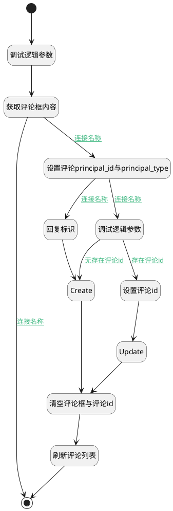

## 发送评论(知识库) <!-- {docsify-ignore-all} -->

   

### 处理过程




### 处理步骤说明

#### 开始 :id=Begin


#### 调试逻辑参数 :id=DEBUGPARAM2


> [!NOTE|label:调试信息|icon:fa fa-bug]
> 调试输出参数`当前视图对象`的详细信息

#### 结束 :id=END1


#### Create :id=DEACTION2


调用实体 [评论(COMMENT)](module/Base/Comment.md) 行为 [Create](module/Base/Comment#行为) ，行为参数为`comment(评论对象)`

#### 设置评论id :id=PREPAREJSPARAM3


1. 将`view(当前视图对象).edit_comment_id` 设置给  `comment(评论对象).id`
2. 将`view(当前视图对象).edit_comment_id` 设置给  `ctx(应用上下文变量).comment`

#### 设置评论principal_id与principal_type :id=PREPAREJSPARAM1


1. 将`ctx(应用上下文变量).principal_id` 设置给  `comment(评论对象).principal_id`
2. 将`ctx(应用上下文变量).principal_type` 设置给  `comment(评论对象).principal_type`
3. 将`view(当前视图对象).layoutPanel.panelItems.field_textbox.editor` 设置给  `editor(编辑器)`
4. 将`ctx(应用上下文变量).principal_type` 设置给  `comment(评论对象).owner_type`

#### 刷新评论列表 :id=RAWJSCODE3


<p class="panel-title"><b>执行代码</b></p>

```javascript
ibiz.mc.command.send({ srfdecodename: 'Comment' }, 'OBJECTUPDATED');
```

#### 清空评论框与评论id :id=RAWJSCODE2


<p class="panel-title"><b>执行代码</b></p>

```javascript
uiLogic.view.layoutPanel.panelItems.field_textbox.value = '';
uiLogic.view.layoutPanel.panelItems.field_textbox.data.field_textbox = '';
uiLogic.view.edit_comment_id = null;
uiLogic.view.reply_comment_id = null;
uiLogic.editor.reply.value = null;
```

#### 回复标识 :id=PREPAREJSPARAM2


1. 将`view(当前视图对象).reply_comment_id` 设置给  `comment(评论对象).pid`

#### 调试逻辑参数 :id=DEBUGPARAM1


> [!NOTE|label:调试信息|icon:fa fa-bug]
> 调试输出参数`当前视图对象`的详细信息

#### Update :id=DEACTION3


调用实体 [评论(COMMENT)](module/Base/Comment.md) 行为 [Update](module/Base/Comment#行为) ，行为参数为`comment(评论对象)`

#### 获取评论框内容 :id=RAWJSCODE1


<p class="panel-title"><b>执行代码</b></p>

```javascript
uiLogic.comment.content = uiLogic.view.layoutPanel.panelItems.field_textbox.value;
```

### 连接条件说明
#### 连接名称 :id=RAWJSCODE1-PREPAREJSPARAM1

```comment(评论对象).content``` ISNOTNULL
#### 连接名称 :id=PREPAREJSPARAM1-DEBUGPARAM1

```editor(编辑器).reply.value``` ISNULL
#### 无存在评论id :id=DEBUGPARAM1-DEACTION2

```view(当前视图对象).edit_comment_id``` ISNULL
#### 存在评论id :id=DEBUGPARAM1-PREPAREJSPARAM3

```view(当前视图对象).edit_comment_id``` ISNOTNULL
#### 连接名称 :id=PREPAREJSPARAM1-PREPAREJSPARAM2

```editor(编辑器).reply.value``` ISNOTNULL
#### 连接名称 :id=RAWJSCODE1-END1

```comment(评论对象).content``` ISNULL


### 实体逻辑参数

|    中文名   |    代码名    |  数据类型      |备注 |
| --------| --------| --------  | --------   |
|传入变量(<i class="fa fa-check"/></i>)|Default|数据对象||
|当前视图对象|view|当前视图对象||
|编辑器|editor|数据对象||
|应用上下文变量|ctx|导航视图参数绑定参数||
|评论对象|comment|数据对象||
