## 评论主体名称(PRINCIPAL_NAME) <!-- {docsify-ignore-all} -->

   

### 默认规则 :id=Default

```plantuml
@startuml
hide empty description
<style>
root {
  HyperlinkColor #42b983
}
</style>

state "start" as start  <<start>>
state "end" as end <<end>>
state "默认字符串长度" as 4f4f8a954e4dbe71e0c614e411e5e159 [[$./Principal_name#a4f4f8a954e4dbe71e0c614e411e5e159 {"默认字符串长度"}]]


start --> 4f4f8a954e4dbe71e0c614e411e5e159 
4f4f8a954e4dbe71e0c614e411e5e159 --> end 


@enduml
```

#### 条件说明

##### 默认字符串长度 :id=a4f4f8a954e4dbe71e0c614e411e5e159

*关键条件*

`PRINCIPAL_NAME(评论主体名称)` 属性长度在区间 `(0 , 100]` 内

> [!ATTENTION|label:规则信息|icon:fa fa-warning]
> 内容长度必须小于等于[100]

