## 提交 <!-- {docsify-ignore-all} -->

   瀑布项目主视图 → 交付物分页表格 → 表格行操作

### 处理过程

```plantuml
@startuml
hide footbox
<style>
root {
  HyperlinkColor #42b983
}
</style>

hide empty description
state "开始" as Begin <<start>> [[$./submit#begin {开始}]]
state "获取文件名称" as RAWJSCODE1  [[$./submit#rawjscode1 {获取文件名称}]]
state "上传" as DEUIACTION1  [[$./submit#deuiaction1 {上传}]]
state "准备参数" as PREPAREJSPARAM1  [[$./submit#preparejsparam1 {准备参数}]]
state "执行更新" as DEACTION1  [[$./submit#deaction1 {执行更新}]]


Begin --> DEUIACTION1
DEUIACTION1 --> RAWJSCODE1
RAWJSCODE1 --> PREPAREJSPARAM1
PREPAREJSPARAM1 --> DEACTION1


@enduml
```




### 处理步骤说明

#### 开始 :id=Begin


#### 获取文件名称 :id=RAWJSCODE1


<p class="panel-title"><b>执行代码</b></p>

```javascript
uiLogic.default.name = uiLogic.files[0].name;
uiLogic.default.file_id = uiLogic.files[0].id;
```

#### 上传 :id=DEUIACTION1


调用实体 [交付物(DELIVERABLE)](module/Base/Deliverable.md) 界面行为 [上传附件](module/Base/Deliverable#界面行为) ，行为参数为`files(上传文件)`

#### 准备参数 :id=PREPAREJSPARAM1


1. 将`Default(传入变量).id` 设置给  `context(上下文).deliverable`

#### 执行更新 :id=DEACTION1


调用实体 [交付物(DELIVERABLE)](module/Base/Deliverable.md) 行为 [Update](module/Base/Deliverable#行为) ，行为参数为`Default(传入变量)`


### 实体逻辑参数

|    中文名   |    代码名    |  数据类型      |备注 |
| --------| --------| --------  | --------   |
|当前视图对象|view|当前视图对象||
|传入变量(<i class="fa fa-check"/></i>)|Default|数据对象||
|上下文|context|导航视图参数绑定参数||
|上传文件|files|数据对象列表||
