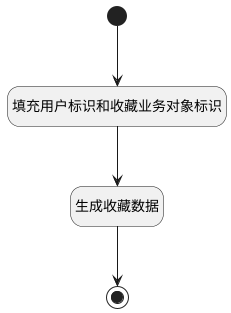

## 设置星标 <!-- {docsify-ignore-all} -->

   

### 处理过程

### 处理步骤说明

#### 开始 :id=Begin [开始]

*- N/A*
#### 填充用户标识和收藏业务对象标识 :id=PREPAREPARAM1 [准备参数]

1. 将`用户全局对象.srfuserid` 设置给  `favorite(收藏对象).CREATE_MAN(建立人)`
2. 将`project_portfolio` 设置给  `favorite(收藏对象).OWNER_TYPE(所属数据对象)`
3. 将`Default(传入变量).owner_id` 设置给  `favorite(收藏对象).OWNER_ID(所属数据标识)`

#### 生成收藏数据 :id=DEACTION1 [实体行为]

调用实体 [收藏(FAVORITE)](module/Base/Favorite.md) 行为 [Save](module/Base/Favorite#行为) ，行为参数为`favorite(收藏对象)`

#### 结束 :id=END1 [结束]

*- N/A*

### 实体逻辑参数

|    中文名   |    代码名    |  数据类型    |  实体   |备注 |
| --------| --------| -------- | -------- | --------   |
|传入变量(<i class="fa fa-check"/></i>)|Default|数据对象|[文件夹(PORTFOLIO)](module/Base/Portfolio.md)||
|ctx|ctx||||
|收藏对象|favorite|数据对象|[收藏(FAVORITE)](module/Base/Favorite.md)||
