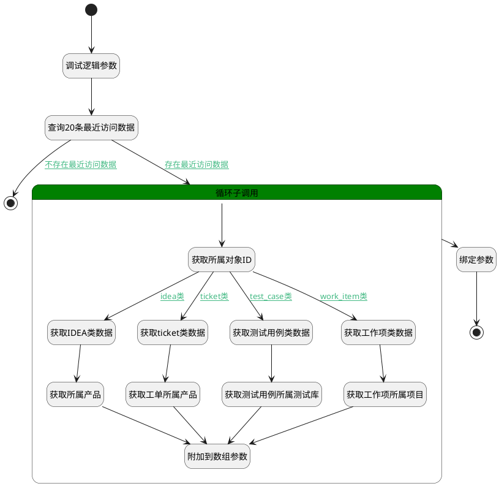

## 最近访问 <!-- {docsify-ignore-all} -->

   

### 处理过程

### 处理步骤说明

#### 开始 :id=Begin [开始]

*- N/A*
#### 调试逻辑参数 :id=DEBUGPARAM1 [调试逻辑参数]

> [!NOTE|label:调试信息|icon:fa fa-bug]
> 调试输出参数`Default(传入变量)`的详细信息

#### 查询20条最近访问数据 :id=DEDATASET1 [实体数据集]

调用实体 [最近访问(RECENT)](module/Base/Recent.md) 数据集合 [最近访问(recent_access)](module/Base/Recent#数据集合) ，查询参数为`Default(传入变量)`

将执行结果返回给参数`sq_access_page(最近访问分页数据)`

#### 循环子调用 :id=LOOPSUBCALL1 [循环子调用]

循环参数`sq_access_page(最近访问分页数据)`，子循环参数使用`temp_access_data(最近访问临时对象)`
#### 获取所属对象ID :id=PREPAREPARAM1 [准备参数]

1. 将`temp_access_data(最近访问临时对象).OWNER_ID(所属数据标识)` 绑定给  `owner_id(所属对象ID)`

#### 绑定参数 :id=BINDPARAM1 [绑定参数]

绑定参数`recent_access(最近访问数据列表)` 到 `sq_access_page(最近访问分页数据)`
#### 获取IDEA类数据 :id=DEACTION1 [实体行为]

调用实体 [需求(IDEA)](module/ProdMgmt/Idea.md) 行为 [Get](module/ProdMgmt/Idea#行为) ，行为参数为`owner_id(所属对象ID)`

将执行结果返回给参数`return_data(返回参数存储)`

#### 获取ticket类数据 :id=DEACTION2 [实体行为]

调用实体 [工单(TICKET)](module/ProdMgmt/Ticket.md) 行为 [Get](module/ProdMgmt/Ticket#行为) ，行为参数为`owner_id(所属对象ID)`

将执行结果返回给参数`return_data(返回参数存储)`

#### 获取测试用例类数据 :id=DEACTION3 [实体行为]

调用实体 [用例(TEST_CASE)](module/TestMgmt/Test_case.md) 行为 [Get](module/TestMgmt/Test_case#行为) ，行为参数为`owner_id(所属对象ID)`

将执行结果返回给参数`return_data(返回参数存储)`

#### 获取工作项类数据 :id=DEACTION4 [实体行为]

调用实体 [工作项(WORK_ITEM)](module/ProjMgmt/Work_item.md) 行为 [Get](module/ProjMgmt/Work_item#行为) ，行为参数为`owner_id(所属对象ID)`

将执行结果返回给参数`return_data(返回参数存储)`

#### 获取所属产品 :id=PREPAREPARAM2 [准备参数]

1. 将`return_data(返回参数存储).product_id` 设置给  `temp_access_data(最近访问临时对象).RECENT_PARENT(访问父类)`
2. 将`return_data(返回参数存储).product_name` 设置给  `temp_access_data(最近访问临时对象).RECENT_PARENT_NAME(访问父类名称)`

#### 获取工单所属产品 :id=PREPAREPARAM3 [准备参数]

1. 将`return_data(返回参数存储).product_id` 设置给  `temp_access_data(最近访问临时对象).RECENT_PARENT(访问父类)`
2. 将`return_data(返回参数存储).product_name` 设置给  `temp_access_data(最近访问临时对象).RECENT_PARENT_NAME(访问父类名称)`

#### 获取测试用例所属测试库 :id=PREPAREPARAM4 [准备参数]

1. 将`return_data(返回参数存储).test_library_id` 设置给  `temp_access_data(最近访问临时对象).RECENT_PARENT(访问父类)`
2. 将`return_data(返回参数存储).test_library_name` 设置给  `temp_access_data(最近访问临时对象).RECENT_PARENT_NAME(访问父类名称)`

#### 获取工作项所属项目 :id=PREPAREPARAM5 [准备参数]

1. 将`return_data(返回参数存储).project_id` 设置给  `temp_access_data(最近访问临时对象).RECENT_PARENT(访问父类)`
2. 将`return_data(返回参数存储).project_name` 设置给  `temp_access_data(最近访问临时对象).RECENT_PARENT_NAME(访问父类名称)`

#### 结束 :id=END2 [结束]

返回 `sq_access_page(最近访问分页数据)`

#### 结束 :id=END1 [结束]

*- N/A*

#### 附加到数组参数 :id=APPENDPARAM1 [附加到数组参数]

将参数`temp_access_data(最近访问临时对象)` 添加到数组参数`recent_access(最近访问数据列表)` 的 `0` 位置

### 连接条件说明
#### 不存在最近访问数据 :id=DEDATASET1-END1

`sq_access_page(最近访问分页数据)` ISNULL
#### 存在最近访问数据 :id=DEDATASET1-LOOPSUBCALL1

`sq_access_page(最近访问分页数据)` ISNOTNULL
#### idea类 :id=PREPAREPARAM1-DEACTION1

`temp_access_data(最近访问临时对象).OWNER_SUBTYPE(所属对象子类型)` EQ `idea`
#### ticket类 :id=PREPAREPARAM1-DEACTION2

`temp_access_data(最近访问临时对象).OWNER_SUBTYPE(所属对象子类型)` EQ `ticket`
#### test_case类 :id=PREPAREPARAM1-DEACTION3

`temp_access_data(最近访问临时对象).OWNER_SUBTYPE(所属对象子类型)` EQ `test_case`
#### work_item类 :id=PREPAREPARAM1-DEACTION4

`temp_access_data(最近访问临时对象).OWNER_SUBTYPE(所属对象子类型)` EQ `work_item`

### 实体逻辑参数

|    中文名   |    代码名    |  数据类型    |  实体   |备注 |
| --------| --------| -------- | -------- | --------   |
|传入变量(<i class="fa fa-check"/></i>)|Default|过滤器|||
|所属对象ID|owner_id|简单数据|||
|最近访问数据列表|recent_access|数据对象列表|[最近访问(RECENT)](module/Base/Recent.md)||
|返回参数存储|return_data|数据对象|||
|最近访问分页数据|sq_access_page|分页查询|||
|最近访问临时对象|temp_access_data|数据对象|[最近访问(RECENT)](module/Base/Recent.md)||
|临时需求数据|temp_idea_data|数据对象|[需求(IDEA)](module/ProdMgmt/Idea.md)||
|临时工单数据|temp_ticket_data|数据对象|[工单(TICKET)](module/ProdMgmt/Ticket.md)||
