## 最近访问跳转其他视图 <!-- {docsify-ignore-all} -->

   

### 处理过程

```plantuml
@startuml
hide empty description
<style>
root {
  HyperlinkColor #42b983
}
</style>

hide empty description
state "开始" as Begin <<start>> [[$./recent_jump_other_view#begin {"开始"}]]
state "结束" as END1 <<end>> [[$./recent_jump_other_view#end1 {"结束"}]]
state "调试逻辑参数" as DEBUGPARAM1  [[$./recent_jump_other_view#debugparam1 {"调试逻辑参数"}]]


Begin --> DEBUGPARAM1
DEBUGPARAM1 --> END1


@enduml
```

### 处理步骤说明

#### 开始 :id=Begin [开始]

*- N/A*
#### 结束 :id=END1 [结束]

*- N/A*

#### 调试逻辑参数 :id=DEBUGPARAM1 [调试逻辑参数]

> [!NOTE|label:调试信息|icon:fa fa-bug]
> 调试输出参数`Default(传入变量)`的详细信息

### 实体逻辑参数

|    中文名   |    代码名    |  数据类型    |  实体   |备注 |
| --------| --------| -------- | -------- | --------   |
|传入变量(<i class="fa fa-check"/></i>)|Default|数据对象|[最近访问(RECENT)](module/Base/Recent.md)||
