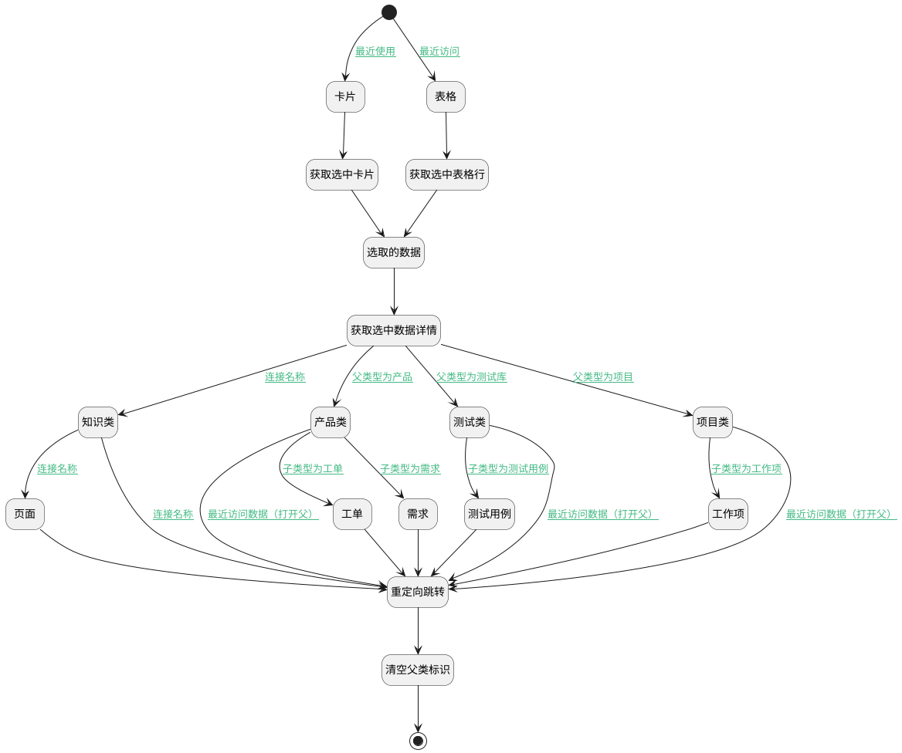

## 最近访问跳转其他视图 <!-- {docsify-ignore-all} -->

   首页最近访问点击后跳转其他视图

### 处理过程




### 处理步骤说明

#### 开始 :id=Begin


#### 卡片 :id=DEBUGPARAM4


> [!NOTE|label:调试信息|icon:fa fa-bug]
> 调试输出参数`卡片参数`的详细信息

#### 页面 :id=PREPAREJSPARAM12


1. 将`selectobj(选中数据).owner_id` 设置给  `ctx(上下文参数).article_page`

#### 知识类 :id=PREPAREJSPARAM11


1. 将`selectobj(选中数据).recent_parent` 设置给  `ctx(上下文参数).space`
2. 将`selectobj(选中数据).owner_subtype` 设置给  `ctx(上下文参数).owner_subtype`

#### 测试用例 :id=PREPAREJSPARAM9


1. 将`selectobj(选中数据).owner_id` 设置给  `ctx(上下文参数).test_case`

#### 工作项 :id=PREPAREJSPARAM7


1. 将`selectobj(选中数据).owner_id` 设置给  `ctx(上下文参数).work_item`

#### 产品类 :id=PREPAREJSPARAM3


1. 将`selectobj(选中数据).recent_parent` 设置给  `ctx(上下文参数).product`
2. 将`selectobj(选中数据).owner_subtype` 设置给  `ctx(上下文参数).owner_subtype`

#### 重定向跳转 :id=DEUIACTION1


调用实体 [最近访问(RECENT)](module/Base/Recent.md) 界面行为 [通过重定向视图跳转](module/Base/Recent#界面行为) ，行为参数为`selectedData(选中数据（数组）)`

#### 获取选中数据详情 :id=RAWJSCODE1

用脚本处理，获取第一条数据（因为只有会一条数据）

<p class="panel-title"><b>执行代码</b></p>

```javascript
let selecteddata=uiLogic.selecteddata;
if (selecteddata.length > 0) {
    uiLogic.selectobj = selecteddata[0];
}
```

#### 选取的数据 :id=DEBUGPARAM2


> [!NOTE|label:调试信息|icon:fa fa-bug]
> 调试输出参数`选中数据（数组）`的详细信息

#### 表格 :id=DEBUGPARAM5


> [!NOTE|label:调试信息|icon:fa fa-bug]
> 调试输出参数`表格部件参数`的详细信息

#### 结束 :id=END1


#### 工单 :id=PREPAREJSPARAM5


1. 将`selectobj(选中数据).owner_id` 设置给  `ctx(上下文参数).ticket`

#### 测试类 :id=PREPAREJSPARAM8


1. 将`selectobj(选中数据).recent_parent` 设置给  `ctx(上下文参数).library`
2. 将`selectobj(选中数据).owner_subtype` 设置给  `ctx(上下文参数).owner_subtype`

#### 需求 :id=PREPAREJSPARAM4


1. 将`selectobj(选中数据).owner_id` 设置给  `ctx(上下文参数).idea`

#### 获取选中卡片 :id=PREPAREJSPARAM1


1. 将`DATAVIEW(卡片参数).state` 设置给  `STATE(state)`
2. 将`STATE(state).selectedData` 设置给  `selectedData(选中数据（数组）)`

#### 清空父类标识 :id=PREPAREJSPARAM10


1. 将`空值（NULL）` 设置给  `ctx(上下文参数).library`
2. 将`空值（NULL）` 设置给  `ctx(上下文参数).product`
3. 将`空值（NULL）` 设置给  `ctx(上下文参数).project`

#### 项目类 :id=PREPAREJSPARAM6


1. 将`selectobj(选中数据).recent_parent` 设置给  `ctx(上下文参数).project`
2. 将`selectobj(选中数据).owner_subtype` 设置给  `ctx(上下文参数).owner_subtype`

#### 获取选中表格行 :id=PREPAREJSPARAM2


1. 将`grid(表格部件参数).state` 设置给  `STATE(state)`
2. 将`STATE(state).selectedData` 设置给  `selectedData(选中数据（数组）)`

### 连接条件说明
#### 最近使用 :id=Begin-DEBUGPARAM4

```this_obj(当前部件对象).name``` EQ ```dataview```
#### 父类型为产品 :id=RAWJSCODE1-PREPAREJSPARAM3

```selectobj(选中数据).owner_type``` EQ ```product```
#### 最近访问数据（打开父） :id=PREPAREJSPARAM3-DEUIACTION1

```selectobj(选中数据).type``` EQ ```1```
#### 子类型为需求 :id=PREPAREJSPARAM3-PREPAREJSPARAM4

```selectobj(选中数据).owner_subtype``` EQ ```idea```
#### 子类型为工单 :id=PREPAREJSPARAM3-PREPAREJSPARAM5

```selectobj(选中数据).owner_subtype``` EQ ```ticket```
#### 父类型为项目 :id=RAWJSCODE1-PREPAREJSPARAM6

```selectobj(选中数据).owner_type``` EQ ```project```
#### 最近访问数据（打开父） :id=PREPAREJSPARAM6-DEUIACTION1

```selectobj(选中数据).type``` EQ ```1```
#### 子类型为工作项 :id=PREPAREJSPARAM6-PREPAREJSPARAM7

```selectobj(选中数据).owner_subtype``` EQ ```work_item```
#### 父类型为测试库 :id=RAWJSCODE1-PREPAREJSPARAM8

```selectobj(选中数据).owner_type``` EQ ```library```
#### 最近访问数据（打开父） :id=PREPAREJSPARAM8-DEUIACTION1

```selectobj(选中数据).type``` EQ ```1```
#### 子类型为测试用例 :id=PREPAREJSPARAM8-PREPAREJSPARAM9

```selectobj(选中数据).owner_subtype``` EQ ```test_case```
#### 连接名称 :id=RAWJSCODE1-PREPAREJSPARAM11

```selectobj(选中数据).owner_type``` EQ ```space```
#### 连接名称 :id=PREPAREJSPARAM11-PREPAREJSPARAM12

```selectobj(选中数据).owner_subtype``` EQ ```page```
#### 连接名称 :id=PREPAREJSPARAM11-DEUIACTION1

```selectobj(选中数据).owner_subtype``` EQ ```space```
#### 最近访问 :id=Begin-DEBUGPARAM5

```this_obj(当前部件对象).name``` EQ ```grid```


### 实体逻辑参数

|    中文名   |    代码名    |  数据类型      |备注 |
| --------| --------| --------  | --------   |
|选中数据（数组）|selectedData|简单数据列表||
|当前视图|cur_view|当前视图对象||
|上下文参数|ctx|导航视图参数绑定参数||
|卡片参数|DATAVIEW|部件对象||
|传入变量(<i class="fa fa-check"/></i>)|Default|数据对象||
|当前部件对象|this_obj|当前部件对象||
|选中数据|selectobj|数据对象||
|表格部件参数|grid|部件对象||
|state|STATE|数据对象||
