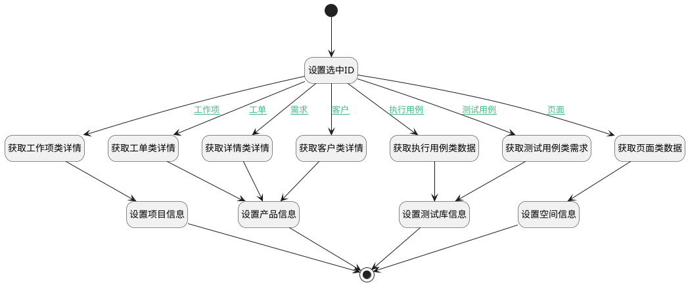

## 获取活动对象详情 <!-- {docsify-ignore-all} -->

   获取选中的活动对象详情

### 处理过程

### 处理步骤说明

#### 获取工作项类详情 :id=DEACTION1 [实体行为]

调用实体 [工作项(WORK_ITEM)](module/ProjMgmt/work_item.md) 行为 [Get](module/ProjMgmt/work_item#行为) ，行为参数为`detail_info(详情信息)`

将执行结果返回给参数`detail_info(详情信息)`

#### 设置项目信息 :id=PREPAREPARAM2 [准备参数]

1. 将`detail_info(详情信息).project_id` 设置给  `option_info(操作数据信息).parent_id`
2. 将`detail_info(详情信息).id(标识)` 设置给  `option_info(操作数据信息).self_id`

#### 获取详情类详情 :id=DEACTION2 [实体行为]

调用实体 [需求(IDEA)](module/ProdMgmt/idea.md) 行为 [Get](module/ProdMgmt/idea#行为) ，行为参数为`detail_info(详情信息)`

将执行结果返回给参数`detail_info(详情信息)`

#### 开始 :id=Begin [开始]

*- N/A*
#### 设置选中ID :id=PREPAREPARAM1 [准备参数]

1. 将`Default(传入变量).object_id` 设置给  `detail_info(详情信息).id(标识)`

#### 获取工单类详情 :id=DEACTION3 [实体行为]

调用实体 [工单(TICKET)](module/ProdMgmt/ticket.md) 行为 [Get](module/ProdMgmt/ticket#行为) ，行为参数为`detail_info(详情信息)`

将执行结果返回给参数`detail_info(详情信息)`

#### 设置产品信息 :id=PREPAREPARAM3 [准备参数]

1. 将`detail_info(详情信息).product_id` 设置给  `option_info(操作数据信息).parent_id`
2. 将`detail_info(详情信息).id(标识)` 设置给  `option_info(操作数据信息).self_id`

#### 结束 :id=END1 [结束]

返回 `option_info(操作数据信息)`

#### 获取客户类详情 :id=DEACTION4 [实体行为]

调用实体 [客户(CUSTOMER)](module/ProdMgmt/customer.md) 行为 [Get](module/ProdMgmt/customer#行为) ，行为参数为`detail_info(详情信息)`

将执行结果返回给参数`detail_info(详情信息)`

#### 获取测试用例类需求 :id=DEACTION5 [实体行为]

调用实体 [用例(TEST_CASE)](module/TestMgmt/test_case.md) 行为 [Get](module/TestMgmt/test_case#行为) ，行为参数为`detail_info(详情信息)`

将执行结果返回给参数`detail_info(详情信息)`

#### 设置测试库信息 :id=PREPAREPARAM4 [准备参数]

1. 将`detail_info(详情信息).test_library_id` 设置给  `option_info(操作数据信息).parent_id`
2. 将`detail_info(详情信息).id(标识)` 设置给  `option_info(操作数据信息).self_id`

#### 获取执行用例类数据 :id=DEACTION6 [实体行为]

调用实体 [执行用例(RUN)](module/TestMgmt/run.md) 行为 [Get](module/TestMgmt/run#行为) ，行为参数为`detail_info(详情信息)`

将执行结果返回给参数`detail_info(详情信息)`

#### 获取页面类数据 :id=DEACTION7 [实体行为]

调用实体 [页面(PAGE)](module/Wiki/article_page.md) 行为 [Get](module/Wiki/article_page#行为) ，行为参数为`detail_info(详情信息)`

将执行结果返回给参数`detail_info(详情信息)`

#### 设置空间信息 :id=PREPAREPARAM5 [准备参数]

1. 将`detail_info(详情信息).space_id` 设置给  `option_info(操作数据信息).parent_id`
2. 将`detail_info(详情信息).id(标识)` 设置给  `option_info(操作数据信息).self_id`

### 连接条件说明
#### 工作项 :id=PREPAREPARAM1-DEACTION1

`Default(传入变量).object_type` EQ `WORK_ITEM`
#### 需求 :id=PREPAREPARAM1-DEACTION2

`Default(传入变量).object_type` EQ `IDEA`
#### 工单 :id=PREPAREPARAM1-DEACTION3

`Default(传入变量).object_type` EQ `TICKET`
#### 客户 :id=PREPAREPARAM1-DEACTION4

`Default(传入变量).object_type` EQ `CUSTOMER`
#### 测试用例 :id=PREPAREPARAM1-DEACTION5

`Default(传入变量).object_type` EQ `TEST_CASE`
#### 执行用例 :id=PREPAREPARAM1-DEACTION6

`Default(传入变量).object_type` EQ `RUN`
#### 页面 :id=PREPAREPARAM1-DEACTION7

`Default(传入变量).object_type` EQ `PAGE`

### 实体逻辑参数

|    中文名   |    代码名    |  数据类型    |  实体   |备注 |
| --------| --------| -------- | -------- | --------   |
|传入变量(<i class="fa fa-check"/></i>)|Default|数据对象|[活动(ACTIVITY)](module/Base/activity.md)||
|选择数据的ID|OBJECT_ID|简单数据|||
|详情信息|detail_info|数据对象|[活动(ACTIVITY)](module/Base/activity.md)||
|操作数据信息|option_info|数据对象|||
