## 跳转视图 <!-- {docsify-ignore-all} -->

   跳转视图

### 处理过程

```plantuml
@startuml
hide footbox
<style>
root {
  HyperlinkColor #42b983
}
</style>

hide empty description
state "开始" as Begin <<start>> [[$./jump_view#begin {开始}]]
state "实体行为" as DEACTION1  [[$./jump_view#deaction1 {实体行为}]]
state "结束" as END1 <<end>> [[$./jump_view#end1 {结束}]]


Begin --> DEACTION1
DEACTION1 --> END1


@enduml
```

### 处理步骤说明

#### 开始 :id=Begin [开始]

#### 结束 :id=END1 [结束]

#### 实体行为 :id=DEACTION1 [实体行为]

调用实体 [活动(ACTIVITIY)](module/Base/activity.md) 行为 [获取活动对象详情(get_activity_obj_detail)](module/Base/activity#行为) ，行为参数为`Default(传入变量)`

将执行结果返回给参数`obj_info(活动对象详情信息)`

### 实体逻辑参数

|    中文名   |    代码名    |  数据类型      |备注 |
| --------| --------| --------  | --------   |
|活动对象详情信息|obj_info|数据对象||
|列表部件|list|部件对象||
|传入变量(<i class="fa fa-check"/></i>)|Default|数据对象||
|当前视图|view|当前视图对象||
