## 组件权限计数器 <!-- {docsify-ignore-all} -->

   获取组件权限计数器是数值

### 处理过程

```plantuml
@startuml
hide empty description
<style>
root {
  HyperlinkColor #42b983
}
</style>

hide empty description
state "开始" as Begin <<start>> [[$./addon_authority#begin {"开始"}]]
state "结束" as END1 <<end>> [[$./addon_authority#end1 {"结束"}]]
state "获取组件列表" as DEDATASET1  [[$./addon_authority#dedataset1 {"获取组件列表"}]]
state "构建计数器结果" as RAWSFCODE1  [[$./addon_authority#rawsfcode1 {"构建计数器结果"}]]


Begin --> DEDATASET1
DEDATASET1 --> RAWSFCODE1
RAWSFCODE1 --> END1


@enduml
```




### 处理步骤说明

#### 开始 :id=Begin<sup class="footnote-symbol"> <font color=gray size=1>[开始]</font></sup>


*- N/A*
#### 结束 :id=END1<sup class="footnote-symbol"> <font color=gray size=1>[结束]</font></sup>


返回 `result(计数结果)`

#### 获取组件列表 :id=DEDATASET1<sup class="footnote-symbol"> <font color=gray size=1>[实体数据集]</font></sup>


调用实体 [组件(ADDON)](module/Base/addon.md) 数据集合 [数据集(DEFAULT)](module/Base/addon#数据集合) ，查询参数为`filter(过滤器)`

将执行结果返回给参数`addons(组件集合)`

#### 构建计数器结果 :id=RAWSFCODE1<sup class="footnote-symbol"> <font color=gray size=1>[直接后台代码]</font></sup>


<p class="panel-title"><b>执行代码[JavaScript]</b></p>

```javascript
var addons = logic.getParam('addons');
var result = logic.getParam('result');
for(var i=0 ;i<addons.size;i++){
    var addon = addons.get(i);
    result.set(addon.get('ddon_type'),addon.get('is_enabled'));
}
```


### 实体逻辑参数

|    中文名   |    代码名    |  数据类型    |  实体   |备注 |
| --------| --------| -------- | -------- | --------   |
|传入变量(<i class="fa fa-check"/></i>)|Default|数据对象|[组件(ADDON)](module/Base/addon.md)||
|组件集合|addons|分页查询|||
|过滤器|filter|过滤器|||
|计数结果|result|数据对象|||
