## 检验资源是否已删除 <!-- {docsify-ignore-all} -->

   判断资源是否已删除，用于视图切换逻辑

### 处理过程

```plantuml
@startuml
hide empty description
<style>
root {
  HyperlinkColor #42b983
}
</style>

hide empty description
state "开始" as Begin <<start>> [[$./check_resource_is_deleted#begin {"开始"}]]
state "验证主键是否存在" as DEACTION1  [[$./check_resource_is_deleted#deaction1 {"验证主键是否存在"}]]
state "准备参数" as PREPAREPARAM1  [[$./check_resource_is_deleted#prepareparam1 {"准备参数"}]]
state "结束" as END1 <<end>> [[$./check_resource_is_deleted#end1 {"结束"}]]


Begin --> DEACTION1
DEACTION1 --> PREPAREPARAM1
PREPAREPARAM1 --> END1


@enduml
```

### 处理步骤说明

#### 开始 :id=Begin [开始]

*- N/A*
#### 验证主键是否存在 :id=DEACTION1 [实体行为]

调用实体 [资源组件(ADDON_RESOURCE)](module/Base/addon_resource.md) 行为 [CheckKey](module/Base/addon_resource#行为) ，行为参数为`Default(传入变量)`

将执行结果返回给参数`checkKey`

#### 准备参数 :id=PREPAREPARAM1 [准备参数]

1. 将`checkKey` 设置给  `Default(传入变量).checkKey`

#### 结束 :id=END1 [结束]

返回 `Default(传入变量)`

### 实体逻辑参数

|    中文名   |    代码名    |  数据类型    |  实体   |备注 |
| --------| --------| -------- | -------- | --------   |
|传入变量(<i class="fa fa-check"/></i>)|Default|数据对象|[资源组件(ADDON_RESOURCE)](module/Base/addon_resource.md)||
|checkKey|checkKey|简单数据|||
