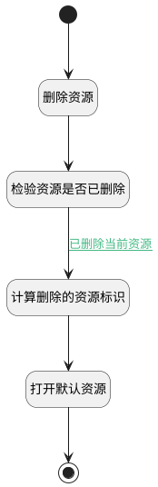

## 资源删除逻辑 <!-- {docsify-ignore-all} -->

   资源删除逻辑：是否当前资源正在预览；删除后需切换至默认资源下

### 处理过程




### 处理步骤说明

#### 开始 :id=Begin<sup class="footnote-symbol"> <font color=gray size=1>[开始]</font></sup>


#### 删除资源 :id=DEUIACTION1<sup class="footnote-symbol"> <font color=gray size=1>[实体界面行为调用]</font></sup>


调用实体 [资源组件(ADDON_RESOURCE)](module/Base/addon_resource.md) 界面行为 [表格界面_删除操作](module/Base/addon_resource#界面行为) ，行为参数为`Default(传入变量)`

#### 检验资源是否已删除 :id=DEACTION1<sup class="footnote-symbol"> <font color=gray size=1>[实体行为]</font></sup>


调用实体 [资源组件(ADDON_RESOURCE)](module/Base/addon_resource.md) 行为 [检验资源是否已删除(check_resource_is_deleted)](module/Base/addon_resource#行为) ，行为参数为`Default(传入变量)`

将执行结果返回给参数`Default(传入变量)`

#### 计算删除的资源标识 :id=RAWJSCODE1<sup class="footnote-symbol"> <font color=gray size=1>[直接前台代码]</font></sup>


<p class="panel-title"><b>执行代码</b></p>

```javascript
if (uiLogic.default.id === context.cur_resource) {
    context.srfdefaulttoroutedepth = 2;
    context.addon_resource = 'all_resource';
}
```

#### 打开默认资源 :id=DEUIACTION2<sup class="footnote-symbol"> <font color=gray size=1>[实体界面行为调用]</font></sup>


调用实体 [资源组件(ADDON_RESOURCE)](module/Base/addon_resource.md) 界面行为 [打开默认资源](module/Base/addon_resource#界面行为) ，行为参数为`Default(传入变量)`

#### 结束 :id=END1<sup class="footnote-symbol"> <font color=gray size=1>[结束]</font></sup>


### 连接条件说明
#### 已删除当前资源 :id=DEACTION1-RAWJSCODE1

```Default(传入变量).checkkey``` EQ ```0``` AND 


### 实体逻辑参数

|    中文名   |    代码名    |  数据类型      |备注 |
| --------| --------| --------  | --------   |
|传入变量(<i class="fa fa-check"/></i>)|Default|数据对象||
|上下文变量|context|导航视图参数绑定参数||
