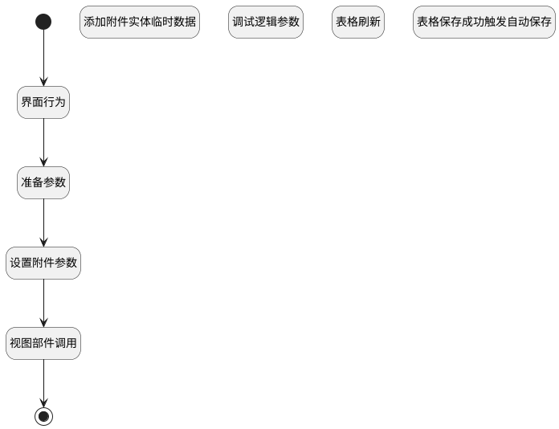

## 添加附件数据 <!-- {docsify-ignore-all} -->

   调用附件上传行为，添加附件数据

### 处理过程




### 处理步骤说明

#### 添加附件实体临时数据 :id=RAWJSCODE2<sup class="footnote-symbol"> <font color=gray size=1>[直接前台代码]</font></sup>


<p class="panel-title"><b>执行代码</b></p>

```javascript
ibiz.hub.getApp(context.srfappid).deService.exec(
    'plmweb.attachment',
    'create',
    context,
    uiLogic.attach[0],
);
```

#### 开始 :id=Begin<sup class="footnote-symbol"> <font color=gray size=1>[开始]</font></sup>


#### 结束 :id=END1<sup class="footnote-symbol"> <font color=gray size=1>[结束]</font></sup>


#### 界面行为 :id=DEUIACTION1<sup class="footnote-symbol"> <font color=gray size=1>[实体界面行为调用]</font></sup>


调用实体 [附件(ATTACHMENT)](module/Base/attachment.md) 界面行为 [上传附件](module/Base/attachment#界面行为) ，行为参数为`files(上传文件)`

#### 准备参数 :id=PREPAREJSPARAM1<sup class="footnote-symbol"> <font color=gray size=1>[准备参数]</font></sup>


1. 将`form(表单).details.attachments.mdController` 设置给  `grid(重复器表格)`

#### 设置附件参数 :id=RAWJSCODE4<sup class="footnote-symbol"> <font color=gray size=1>[直接前台代码]</font></sup>


<p class="panel-title"><b>执行代码</b></p>

```javascript
// 计算新建默认值
const defaultData = uiLogic.grid.calcDefaultValue({}, true);
uiLogic.attach = uiLogic.files.map(item => 
    {
        return {
            name: item.name,
            file_id: item.id,
            id: item.uuid,
            ...defaultData,
        }
    }
)
```

#### 视图部件调用 :id=VIEWCTRLINVOKE2<sup class="footnote-symbol"> <font color=gray size=1>[视图部件调用]</font></sup>


调用`grid(重复器表格)`的方法`addAttachMent`，参数为`attach(附件)`
#### 调试逻辑参数 :id=DEBUGPARAM1<sup class="footnote-symbol"> <font color=gray size=1>[调试逻辑参数]</font></sup>


> [!NOTE|label:调试信息|icon:fa fa-bug]
> 调试输出参数`上传文件`的详细信息

#### 表格保存成功触发自动保存 :id=VIEWCTRLFIREEVENT1<sup class="footnote-symbol"> <font color=gray size=1>[VIEWCTRLFIREEVENT]</font></sup>


触发`grid(重复器表格)`的事件`onSaveSuccess`，参数为`attach(附件)`
#### 表格刷新 :id=VIEWCTRLINVOKE1<sup class="footnote-symbol"> <font color=gray size=1>[视图部件调用]</font></sup>


调用`grid(重复器表格)`的方法`refresh`，参数为`attach(附件)`


### 实体逻辑参数

|    中文名   |    代码名    |  数据类型      |备注 |
| --------| --------| --------  | --------   |
|上传文件|files|数据对象列表||
|重复器表格|grid|部件对象||
|传入变量(<i class="fa fa-check"/></i>)|Default|数据对象||
|附件|attach|数据对象列表||
|当前视图对象|view|当前视图对象||
|表单|form|部件对象||
