## 添加附件数据(表格) <!-- {docsify-ignore-all} -->

   调用附件上传行为，添加附件数据

### 处理过程

```plantuml
@startuml
hide footbox
<style>
root {
  HyperlinkColor #42b983
}
</style>

hide empty description
state "开始" as Begin <<start>> [[$./add_attachment_grid#begin {开始}]]
state "设置附件参数" as RAWJSCODE4  [[$./add_attachment_grid#rawjscode4 {设置附件参数}]]
state "上传附件" as DEUIACTION1  [[$./add_attachment_grid#deuiaction1 {上传附件}]]
state "结束" as END1 <<end>> [[$./add_attachment_grid#end1 {结束}]]
state "视图部件调用" as VIEWCTRLINVOKE1  [[$./add_attachment_grid#viewctrlinvoke1 {视图部件调用}]]


Begin --> DEUIACTION1
DEUIACTION1 --> RAWJSCODE4
RAWJSCODE4 --> VIEWCTRLINVOKE1
VIEWCTRLINVOKE1 --> END1


@enduml
```




### 处理步骤说明

#### 开始 :id=Begin<sup class="footnote-symbol"> <font color=gray size=1>[开始]</font></sup>


#### 结束 :id=END1<sup class="footnote-symbol"> <font color=gray size=1>[结束]</font></sup>


#### 上传附件 :id=DEUIACTION1<sup class="footnote-symbol"> <font color=gray size=1>[实体界面行为调用]</font></sup>


调用实体 [附件(ATTACHMENT)](module/Base/attachment.md) 界面行为 [上传附件](module/Base/attachment#界面行为) ，行为参数为`files(上传文件)`

#### 设置附件参数 :id=RAWJSCODE4<sup class="footnote-symbol"> <font color=gray size=1>[直接前台代码]</font></sup>


<p class="panel-title"><b>执行代码</b></p>

```javascript
// 计算新建默认值
const defaultData = uiLogic.grid.calcDefaultValue({}, true);
uiLogic.attach = uiLogic.files.map(item => 
    {
        return {
            name: item.name,
            file_id: item.id,
            id: item.uuid,
            ...defaultData,
        }
    }
)
```

#### 视图部件调用 :id=VIEWCTRLINVOKE1<sup class="footnote-symbol"> <font color=gray size=1>[视图部件调用]</font></sup>


调用`grid(重复器表格)`的方法`addAttachMent`，参数为`attach(附件)`


### 实体逻辑参数

|    中文名   |    代码名    |  数据类型      |备注 |
| --------| --------| --------  | --------   |
|重复器表格|grid|部件对象||
|上传文件|files|数据对象列表||
|传入变量(<i class="fa fa-check"/></i>)|Default|数据对象||
|附件|attach|数据对象列表||
|当前视图对象|view|当前视图对象||
