## 附件预览 <!-- {docsify-ignore-all} -->

   

### 处理过程

```plantuml
@startuml
hide footbox
<style>
root {
  HyperlinkColor #42b983
}
</style>

hide empty description
state "开始" as Begin <<start>> [[$./attachment_preview#begin {开始}]]
state "结束" as END1 <<end>> [[$./attachment_preview#end1 {结束}]]
state "注入脚本代码" as RAWJSCODE1  [[$./attachment_preview#rawjscode1 {注入脚本代码}]]


Begin --> RAWJSCODE1
RAWJSCODE1 --> END1


@enduml
```




### 处理步骤说明

#### 开始 :id=Begin<sup class="footnote-symbol"> <font color=gray size=1>[开始]</font></sup>


#### 结束 :id=END1<sup class="footnote-symbol"> <font color=gray size=1>[结束]</font></sup>


#### 注入脚本代码 :id=RAWJSCODE1<sup class="footnote-symbol"> <font color=gray size=1>[直接前台代码]</font></sup>

const url = window.location;
var file_name = uiLogic.default.name;
var file_id = uiLogic.default.id;
var file_preview_address = ibiz.env.customParams.file_preview_address;

const windowInfo = getCurrentWindowInfo(url);

let uploadUrl = `${ibiz.env.baseUrl}/${ibiz.env.appId}${ibiz.env.downloadFileUrl}`;
const app = ibiz.hub.getApp(context.srfappid);
const OSSCat = app.model.userParam?.DefaultOSSCat;
uploadUrl = uploadUrl.replace('/{cat}', OSSCat ? `/${OSSCat}` : '');

var filedownloadurl = windowInfo + uploadUrl + '/'+file_id+'?fullfilename='+file_name;

console.log("下载url："+filedownloadurl);

var script = document.createElement('script');
script.src = 'https://cdn.jsdelivr.net/npm/js-base64@3.7.2/base64.min.js';
script.onload = function() {
    var b64Encoded = Base64.encode(filedownloadurl);
    var url = file_preview_address + '/onlinePreview?url='+encodeURIComponent(b64Encoded);
    console.log("预览url："+url);
    window.open(url);
};
document.head.appendChild(script);

function getCurrentWindowInfo(url) {
    const protocol = url.protocol;
    const host = url.hostname; 
    const port = url.port || (protocol === "https:" ? "443" : "80"); 
    const isIPAddress = /^(25[0-5]|2[0-4][0-9]|[01]?[0-9][0-9]?)\.(25[0-5]|2[0-4][0-9]|[01]?[0-9][0-9]?)\.(25[0-5]|2[0-4][0-9]|[01]?[0-9][0-9]?)\.(25[0-5]|2[0-4][0-9]|[01]?[0-9][0-9]?)$/.test(host);
    if (isIPAddress) {
        return  protocol +"//" + host + ":" + port ;
    } else {
        return  protocol +"//" + host + ":" + port ;
    }
}

<p class="panel-title"><b>执行代码</b></p>

```javascript
const url = window.location;
var file_name = uiLogic.default.name;
var file_id = uiLogic.default.id;
var file_preview_address = ibiz.env.customParams.file_preview_address;

const windowInfo = getCurrentWindowInfo(url);

let uploadUrl = `${ibiz.env.baseUrl}/${ibiz.env.appId}${ibiz.env.downloadFileUrl}`;
const app = ibiz.hub.getApp(context.srfappid);
const OSSCat = app.model.userParam?.DefaultOSSCat;
uploadUrl = uploadUrl.replace('/{cat}', OSSCat ? `/${OSSCat}` : '');

var filedownloadurl = windowInfo + uploadUrl + '/'+file_id+'?fullfilename='+file_name;

var b64Encoded = ibiz.util.base64.encode(filedownloadurl);
var previewUrl = file_preview_address + '/onlinePreview?url='+encodeURIComponent(b64Encoded);

window.open(previewUrl);


function getCurrentWindowInfo(url) {
    const protocol = url.protocol;
    const host = url.hostname; 
    const port = url.port || (protocol === "https:" ? "443" : "80"); 
    const isIPAddress = /^(25[0-5]|2[0-4][0-9]|[01]?[0-9][0-9]?)\.(25[0-5]|2[0-4][0-9]|[01]?[0-9][0-9]?)\.(25[0-5]|2[0-4][0-9]|[01]?[0-9][0-9]?)\.(25[0-5]|2[0-4][0-9]|[01]?[0-9][0-9]?)$/.test(host);
    if (isIPAddress) {
        return  protocol +"//" + host + ":" + port ;
    } else {
        return  protocol +"//" + host + ":" + port ;
    }
}
```


### 实体逻辑参数

|    中文名   |    代码名    |  数据类型      |备注 |
| --------| --------| --------  | --------   |
|传入变量(<i class="fa fa-check"/></i>)|Default|数据对象||
