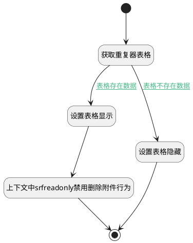

## 计算附件是否隐藏逻辑 <!-- {docsify-ignore-all} -->

   根据表格数据判断附件表格的显示或隐藏

### 处理过程




### 处理步骤说明

#### 开始 :id=Begin<sup class="footnote-symbol"> <font color=gray size=1>[开始]</font></sup>


#### 获取重复器表格 :id=PREPAREJSPARAM1<sup class="footnote-symbol"> <font color=gray size=1>[准备参数]</font></sup>


1. 将`form(表单).details.attachments` 设置给  `grid(重复器表格)`

#### 设置表格隐藏 :id=RAWJSCODE2<sup class="footnote-symbol"> <font color=gray size=1>[直接前台代码]</font></sup>


<p class="panel-title"><b>执行代码</b></p>

```javascript
uiLogic.grid.state.keepAlive = true;
uiLogic.grid.state.visible = false;
```

#### 设置表格显示 :id=RAWJSCODE3<sup class="footnote-symbol"> <font color=gray size=1>[直接前台代码]</font></sup>


<p class="panel-title"><b>执行代码</b></p>

```javascript
uiLogic.grid.state.keepAlive = true;
uiLogic.grid.state.visible = true;
```

#### 上下文中srfreadonly禁用删除附件行为 :id=RAWJSCODE1<sup class="footnote-symbol"> <font color=gray size=1>[直接前台代码]</font></sup>


<p class="panel-title"><b>执行代码</b></p>

```javascript
const rows = uiLogic.grid.mdController.state.rows;
const srfreadonly = context.srfreadonly;
if (rows && rows.length > 0) {
	rows.forEach(row => {
        // 删除附件行为禁用
		const uiActionId = row.uaColStates.uagridcolumn1.u44d00e2;
        if(srfreadonly == true && uiActionId.hasOwnProperty('disabled')){
            uiActionId.disabled = true;
        }    
	})
}	

```

#### 结束 :id=END1<sup class="footnote-symbol"> <font color=gray size=1>[结束]</font></sup>


### 连接条件说明
#### 表格存在数据 :id=PREPAREJSPARAM1-RAWJSCODE3

```grid(重复器表格).mdController.state.items``` ISNOTNULL
#### 表格不存在数据 :id=PREPAREJSPARAM1-RAWJSCODE2

```grid(重复器表格).mdController.state.items``` ISNULL


### 实体逻辑参数

|    中文名   |    代码名    |  数据类型      |备注 |
| --------| --------| --------  | --------   |
|表单|form|部件对象||
|重复器表格|grid|数据对象||
|传入变量(<i class="fa fa-check"/></i>)|Default|数据对象||
