## 添加附件数据（移动端） <!-- {docsify-ignore-all} -->

   调用附件上传行为，添加附件数据

### 处理过程

```plantuml
@startuml
hide footbox
<style>
root {
  HyperlinkColor #42b983
}
</style>

hide empty description
state "开始" as Begin <<start>> [[$./mob_add_attachment#begin {开始}]]
state "显示" as RAWJSCODE2  [[$./mob_add_attachment#rawjscode2 {显示}]]
state "设置附件列表" as RAWJSCODE1  [[$./mob_add_attachment#rawjscode1 {设置附件列表}]]
state "上传附件" as DEUIACTION1  [[$./mob_add_attachment#deuiaction1 {上传附件}]]
state "添加附件数据" as VIEWCTRLINVOKE1  [[$./mob_add_attachment#viewctrlinvoke1 {添加附件数据}]]
state "结束" as END1 <<end>> [[$./mob_add_attachment#end1 {结束}]]


Begin --> DEUIACTION1
DEUIACTION1 --> RAWJSCODE1
RAWJSCODE1 --> VIEWCTRLINVOKE1
VIEWCTRLINVOKE1 --> RAWJSCODE2
RAWJSCODE2 --> END1


@enduml
```




### 处理步骤说明

#### 开始 :id=Begin<sup class="footnote-symbol"> <font color=gray size=1>[开始]</font></sup>


#### 结束 :id=END1<sup class="footnote-symbol"> <font color=gray size=1>[结束]</font></sup>


#### 上传附件 :id=DEUIACTION1<sup class="footnote-symbol"> <font color=gray size=1>[实体界面行为调用]</font></sup>


调用实体 [附件(ATTACHMENT)](module/Base/attachment.md) 界面行为 [上传附件](module/Base/attachment#界面行为) ，行为参数为`files(文件列表)`

#### 设置附件列表 :id=RAWJSCODE1<sup class="footnote-symbol"> <font color=gray size=1>[直接前台代码]</font></sup>


<p class="panel-title"><b>执行代码</b></p>

```javascript
uiLogic.attach = uiLogic.files.map(item =>{
	return {
	  name: item.name,
	  file_id: item.id,
	  id: item.uuid,
	}
})
```

#### 添加附件数据 :id=VIEWCTRLINVOKE1<sup class="footnote-symbol"> <font color=gray size=1>[视图部件调用]</font></sup>


调用`mdctrl(多数据部件)`的方法`addAttachMent`，参数为`attach(附件列表)`
#### 显示 :id=RAWJSCODE2<sup class="footnote-symbol"> <font color=gray size=1>[直接前台代码]</font></sup>


<p class="panel-title"><b>执行代码</b></p>

```javascript
view.layoutPanel.panelItems.mdctrl.state.visible = true
```


### 实体逻辑参数

|    中文名   |    代码名    |  数据类型      |备注 |
| --------| --------| --------  | --------   |
|多数据部件|mdctrl|部件对象||
|传入变量(<i class="fa fa-check"/></i>)|Default|数据对象||
|附件列表|attach|数据对象列表||
|文件列表|files|数据对象列表||
