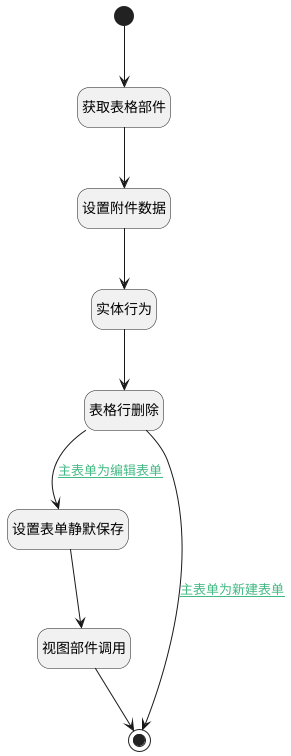

## 附件删除 <!-- {docsify-ignore-all} -->

   自动判断为表格或表单附件，按类别删除

### 处理过程




### 处理步骤说明

#### 开始 :id=Begin<sup class="footnote-symbol"> <font color=gray size=1>[开始]</font></sup>


#### 结束 :id=END1<sup class="footnote-symbol"> <font color=gray size=1>[结束]</font></sup>


#### 获取表格部件 :id=PREPAREJSPARAM1<sup class="footnote-symbol"> <font color=gray size=1>[准备参数]</font></sup>


1. 将`view(当前视图对象).getController('form').details.attachments.mdController` 设置给  `grid(表格)`
2. 将`Default(传入变量).id` 设置给  `params(视图参数).id`
3. 将`view(当前视图对象).layoutPanel.panelItems.form.control` 设置给  `form(主表单对象)`

#### 设置附件数据 :id=RAWJSCODE1<sup class="footnote-symbol"> <font color=gray size=1>[直接前台代码]</font></sup>


<p class="panel-title"><b>执行代码</b></p>

```javascript
uiLogic.attach = { data: uiLogic.default, silent: true };
```

#### 表格行删除 :id=VIEWCTRLINVOKE1<sup class="footnote-symbol"> <font color=gray size=1>[视图部件调用]</font></sup>


调用`grid(表格)`的方法`remove`，参数为`attach(附件数据)`
#### 实体行为 :id=DEACTION1<sup class="footnote-symbol"> <font color=gray size=1>[实体行为]</font></sup>


调用实体 [附件(ATTACHMENT)](module/Base/attachment.md) 行为 [Remove](module/Base/attachment#行为) ，行为参数为`attach(附件数据)`

#### 设置表单静默保存 :id=PREPAREJSPARAM2<sup class="footnote-symbol"> <font color=gray size=1>[准备参数]</font></sup>


1. 将`true` 设置给  `Default(传入变量).silent`

#### 视图部件调用 :id=VIEWCTRLINVOKE2<sup class="footnote-symbol"> <font color=gray size=1>[视图部件调用]</font></sup>


调用`form(主表单对象)`的方法`save`，参数为`Default(传入变量)`
### 连接条件说明
#### 主表单为编辑表单 :id=VIEWCTRLINVOKE1-PREPAREJSPARAM2

```form(主表单对象).state.data``` EQ ```1```
#### 主表单为新建表单 :id=VIEWCTRLINVOKE1-END1

```form(主表单对象).state.data``` EQ ```0```


### 实体逻辑参数

|    中文名   |    代码名    |  数据类型      |备注 |
| --------| --------| --------  | --------   |
|视图参数|params|||
|传入变量(<i class="fa fa-check"/></i>)|Default|数据对象||
|表格|grid|部件对象||
|当前视图对象|view|当前视图对象||
|主表单对象|form|部件对象||
|附件数据|attach|数据对象||
