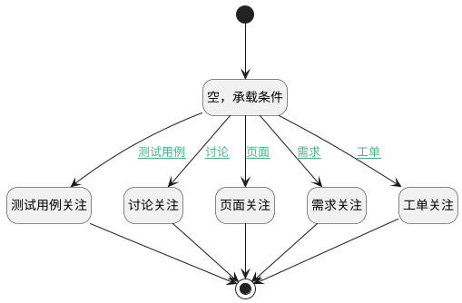

## 添加关注(测试用例) <!-- {docsify-ignore-all} -->

   

### 处理过程

### 处理步骤说明

#### 开始 :id=Begin [开始]

*- N/A*
#### 测试用例关注 :id=DEACTION1 [实体行为]

调用实体 [用例(TEST_CASE)](module/TestMgmt/test_case.md) 行为 [完成关注(finish_add_attention)](module/TestMgmt/test_case#行为) ，行为参数为`Default(传入变量)`

#### 讨论关注 :id=DEACTION2 [实体行为]

调用实体 [讨论(DISCUSS_POST)](module/Team/discuss_post.md) 行为 [讨论关注（移动端）(mob_discuss_post_attention)](module/Team/discuss_post#行为) ，行为参数为`Default(传入变量)`

#### 结束 :id=END1 [结束]

*- N/A*

#### 空，承载条件 :id=PREPAREPARAM1 [准备参数]

    无

#### 页面关注 :id=DEACTION3 [实体行为]

调用实体 [页面(PAGE)](module/Wiki/article_page.md) 行为 [完成关注(finish_add_attention)](module/Wiki/article_page#行为) ，行为参数为`Default(传入变量)`

#### 需求关注 :id=DEACTION4 [实体行为]

调用实体 [需求(IDEA)](module/ProdMgmt/idea.md) 行为 [需求关注（移动端）(mob_idea_attention)](module/ProdMgmt/idea#行为) ，行为参数为`Default(传入变量)`

#### 工单关注 :id=DEACTION5 [实体行为]

调用实体 [工单(TICKET)](module/ProdMgmt/ticket.md) 行为 [工单关注（移动端）(mob_ticket_attention)](module/ProdMgmt/ticket#行为) ，行为参数为`Default(传入变量)`

### 连接条件说明
#### 测试用例 :id=PREPAREPARAM1-DEACTION1

`ctx(导航上下文).principal_type` EQ `test_case`
#### 讨论 :id=PREPAREPARAM1-DEACTION2

`ctx(导航上下文).principal_type` EQ `discuss_post`
#### 页面 :id=PREPAREPARAM1-DEACTION3

`ctx(导航上下文).principal_type` EQ `page`
#### 需求 :id=PREPAREPARAM1-DEACTION4

`ctx(导航上下文).principal_type` EQ `idea`
#### 工单 :id=PREPAREPARAM1-DEACTION5

`ctx(导航上下文).principal_type` EQ `ticket`

### 实体逻辑参数

|    中文名   |    代码名    |  数据类型    |  实体   |备注 |
| --------| --------| -------- | -------- | --------   |
|传入变量(<i class="fa fa-check"/></i>)|Default|数据对象|[关注(ATTENTION)](module/Base/attention.md)||
|导航上下文|ctx||||
