## 添加关注后发送通知 <!-- {docsify-ignore-all} -->

   添加关注人员后，触发提醒关注通知消息给关注人员

### 处理过程

```plantuml
@startuml
hide empty description
<style>
root {
  HyperlinkColor #42b983
}
</style>

hide empty description
state "开始" as Begin <<start>> [[$./after_create_notify#begin {"开始"}]]
state "提醒关注通知" as DENOTIFY1  [[$./after_create_notify#denotify1 {"提醒关注通知"}]]
state "提醒关注页面通知" as DENOTIFY2  [[$./after_create_notify#denotify2 {"提醒关注页面通知"}]]


Begin --> DENOTIFY1 : [[$./after_create_notify#begin-denotify1{发送提醒关注通知} 发送提醒关注通知]]
Begin --> DENOTIFY2 : [[$./after_create_notify#begin-denotify2{发送提醒关注页面通知} 发送提醒关注页面通知]]


@enduml
```

### 处理步骤说明

#### 开始 :id=Begin [开始]

*- N/A*
#### 提醒关注通知 :id=DENOTIFY1 [实体通知]

调用实体 [关注(ATTENTION)](module/Base/attention.md) 通知 [提醒关注通知(notice_attention_notify)](module/Base/attention/notify/notice_attention_notify) ，参数为`Default(传入变量)`
#### 提醒关注页面通知 :id=DENOTIFY2 [实体通知]

调用实体 [关注(ATTENTION)](module/Base/attention.md) 通知 [提醒关注页面通知(attention_page_notify)](module/Base/attention/notify/attention_page_notify) ，参数为`Default(传入变量)`

### 连接条件说明
#### 发送提醒关注通知 :id=Begin-DENOTIFY1

`Default(传入变量).OWNER_TYPE(所属数据对象)` NOTEQ `PAGE` AND 
#### 发送提醒关注页面通知 :id=Begin-DENOTIFY2

`Default(传入变量).OWNER_TYPE(所属数据对象)` EQ `PAGE` AND 

### 实体逻辑参数

|    中文名   |    代码名    |  数据类型    |  实体   |备注 |
| --------| --------| -------- | -------- | --------   |
|传入变量(<i class="fa fa-check"/></i>)|Default|数据对象|[关注(ATTENTION)](module/Base/attention.md)||
