## 添加关注后发送通知 <!-- {docsify-ignore-all} -->

   添加关注人员后，触发提醒关注通知消息给关注人员

### 处理过程

```plantuml
@startuml
hide empty description
<style>
root {
  HyperlinkColor #42b983
}
</style>

hide empty description
state "开始" as Begin <<start>> [[$./after_create_notify#begin {"开始"}]]
state "提醒关注工作项通知" as DENOTIFY1  [[$./after_create_notify#denotify1 {"提醒关注工作项通知"}]]
state "提醒关注页面通知" as DENOTIFY2  [[$./after_create_notify#denotify2 {"提醒关注页面通知"}]]
state "提醒关注产品需求通知" as DENOTIFY3  [[$./after_create_notify#denotify3 {"提醒关注产品需求通知"}]]
state "提醒关注工单通知" as DENOTIFY4  [[$./after_create_notify#denotify4 {"提醒关注工单通知"}]]
state "提醒关注客户通知" as DENOTIFY5  [[$./after_create_notify#denotify5 {"提醒关注客户通知"}]]
state "提醒关注测试用例通知" as DENOTIFY6  [[$./after_create_notify#denotify6 {"提醒关注测试用例通知"}]]
state "提醒关注执行用例通知" as DENOTIFY7  [[$./after_create_notify#denotify7 {"提醒关注执行用例通知"}]]


Begin --> DENOTIFY1 : [[$./after_create_notify#begin-denotify1{工作项} 工作项]]
Begin --> DENOTIFY2 : [[$./after_create_notify#begin-denotify2{页面} 页面]]
Begin --> DENOTIFY3 : [[$./after_create_notify#begin-denotify3{产品需求} 产品需求]]
Begin --> DENOTIFY4 : [[$./after_create_notify#begin-denotify4{工单} 工单]]
Begin --> DENOTIFY5 : [[$./after_create_notify#begin-denotify5{客户} 客户]]
Begin --> DENOTIFY6 : [[$./after_create_notify#begin-denotify6{测试用例} 测试用例]]
Begin --> DENOTIFY7 : [[$./after_create_notify#begin-denotify7{执行用例} 执行用例]]


@enduml
```

### 处理步骤说明

#### 开始 :id=Begin [开始]

*- N/A*
#### 提醒关注页面通知 :id=DENOTIFY2 [实体通知]

调用实体 [关注(ATTENTION)](module/Base/attention.md) 通知 [页面提醒关注通知(attention_page_notify)](module/Base/attention/notify/attention_page_notify) ，参数为`Default(传入变量)`
#### 提醒关注工作项通知 :id=DENOTIFY1 [实体通知]

调用实体 [关注(ATTENTION)](module/Base/attention.md) 通知 [工作项提醒关注通知(attention_work_item_notify)](module/Base/attention/notify/attention_work_item_notify) ，参数为`Default(传入变量)`
#### 提醒关注产品需求通知 :id=DENOTIFY3 [实体通知]

调用实体 [关注(ATTENTION)](module/Base/attention.md) 通知 [产品需求提醒关注通知(attention_idea_notify)](module/Base/attention/notify/attention_idea_notify) ，参数为`Default(传入变量)`
#### 提醒关注工单通知 :id=DENOTIFY4 [实体通知]

调用实体 [关注(ATTENTION)](module/Base/attention.md) 通知 [工单提醒关注通知(attention_ticket_notify)](module/Base/attention/notify/attention_ticket_notify) ，参数为`Default(传入变量)`
#### 提醒关注客户通知 :id=DENOTIFY5 [实体通知]

调用实体 [关注(ATTENTION)](module/Base/attention.md) 通知 [客户提醒关注通知(attention_customer_notify)](module/Base/attention/notify/attention_customer_notify) ，参数为`Default(传入变量)`
#### 提醒关注测试用例通知 :id=DENOTIFY6 [实体通知]

调用实体 [关注(ATTENTION)](module/Base/attention.md) 通知 [测试用例提醒关注通知(attention_test_case_notify)](module/Base/attention/notify/attention_test_case_notify) ，参数为`Default(传入变量)`
#### 提醒关注执行用例通知 :id=DENOTIFY7 [实体通知]

调用实体 [关注(ATTENTION)](module/Base/attention.md) 通知 [执行用例提醒关注通知(attention_run_notify)](module/Base/attention/notify/attention_run_notify) ，参数为`Default(传入变量)`

### 连接条件说明
#### 工作项 :id=Begin-DENOTIFY1

`Default(传入变量).OWNER_TYPE(所属数据对象)` EQ `WORK_ITEM` AND 
#### 页面 :id=Begin-DENOTIFY2

`Default(传入变量).OWNER_TYPE(所属数据对象)` EQ `PAGE` AND 
#### 产品需求 :id=Begin-DENOTIFY3

`Default(传入变量).OWNER_TYPE(所属数据对象)` EQ `IDEA` AND 
#### 工单 :id=Begin-DENOTIFY4

`Default(传入变量).OWNER_TYPE(所属数据对象)` EQ `TICKET` AND 
#### 客户 :id=Begin-DENOTIFY5

`Default(传入变量).OWNER_TYPE(所属数据对象)` EQ `CUSTOMER` AND 
#### 测试用例 :id=Begin-DENOTIFY6

`Default(传入变量).OWNER_TYPE(所属数据对象)` EQ `TEST_CASE` AND 
#### 执行用例 :id=Begin-DENOTIFY7

`Default(传入变量).OWNER_TYPE(所属数据对象)` EQ `RUN` AND 

### 实体逻辑参数

|    中文名   |    代码名    |  数据类型    |  实体   |备注 |
| --------| --------| -------- | -------- | --------   |
|传入变量(<i class="fa fa-check"/></i>)|Default|数据对象|[关注(ATTENTION)](module/Base/attention.md)||
