## 添加关注（工单-移动端） <!-- {docsify-ignore-all} -->

   

### 处理过程

```plantuml
@startuml
hide empty description
<style>
root {
  HyperlinkColor #42b983
}
</style>

hide empty description
state "开始" as Begin <<start>> [[$./mob_add_attention_ticket#begin {"开始"}]]
state "结束" as END1 <<end>> [[$./mob_add_attention_ticket#end1 {"结束"}]]
state "实体行为" as DEACTION1  [[$./mob_add_attention_ticket#deaction1 {"实体行为"}]]


Begin --> DEACTION1
DEACTION1 --> END1


@enduml
```

### 处理步骤说明

#### 开始 :id=Begin [开始]

*- N/A*
#### 结束 :id=END1 [结束]

*- N/A*

#### 实体行为 :id=DEACTION1 [实体行为]

调用实体 [工单(TICKET)](module/ProdMgmt/ticket.md) 行为 [工单关注（移动端）(mob_ticket_attention)](module/ProdMgmt/ticket#行为) ，行为参数为`Default(传入变量)`

### 实体逻辑参数

|    中文名   |    代码名    |  数据类型    |  实体   |备注 |
| --------| --------| -------- | -------- | --------   |
|传入变量(<i class="fa fa-check"/></i>)|Default|数据对象|[关注(ATTENTION)](module/Base/attention.md)||
