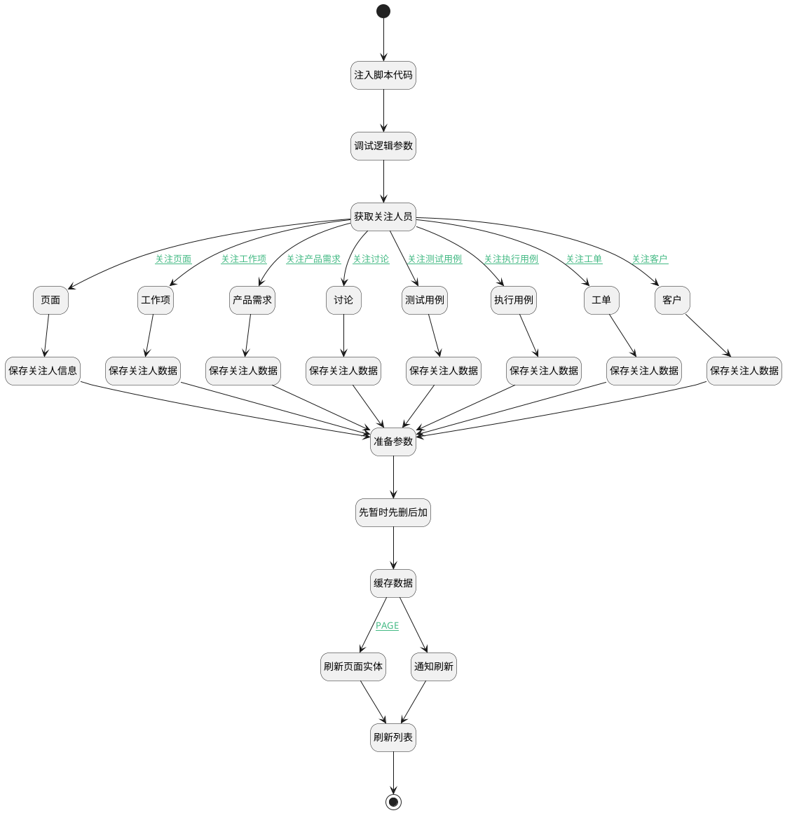

## 关注人员更新（移动端） <!-- {docsify-ignore-all} -->

   先暂时这样，后面优化逻辑

### 处理过程




### 处理步骤说明

#### 开始 :id=Begin<sup class="footnote-symbol"> <font color=gray size=1>[开始]</font></sup>


#### 注入脚本代码 :id=RAWJSCODE1<sup class="footnote-symbol"> <font color=gray size=1>[直接前台代码]</font></sup>


<p class="panel-title"><b>执行代码</b></p>

```javascript
const default_data =uiLogic.default;
let select_data =uiLogic.select_data;
for (let i = 0; i < default_data.length; i++){
  select_data.push(default_data[i]);
  select_data[i].owner_id = uiLogic.ctx.principal_id;
  if(default_data[i].user_id){
    select_data[i].user_id = default_data[i].user_id;
  }else{
    select_data[i].user_id = default_data[i].srfkey;
  }
  
}

```

#### 调试逻辑参数 :id=DEBUGPARAM2<sup class="footnote-symbol"> <font color=gray size=1>[调试逻辑参数]</font></sup>


> [!NOTE|label:调试信息|icon:fa fa-bug]
> 调试输出参数`选中数据`的详细信息

#### 获取关注人员 :id=PREPAREJSPARAM2<sup class="footnote-symbol"> <font color=gray size=1>[准备参数]</font></sup>


1. 将`select_data(选中数据)` 设置给  `commit_object(提交对象).attentions`

#### 页面 :id=PREPAREJSPARAM8<sup class="footnote-symbol"> <font color=gray size=1>[准备参数]</font></sup>


1. 将`ctx(应用上下文).article_page` 设置给  `commit_object(提交对象).id`

#### 工作项 :id=PREPAREJSPARAM1<sup class="footnote-symbol"> <font color=gray size=1>[准备参数]</font></sup>


1. 将`ctx(应用上下文).work_item` 设置给  `commit_object(提交对象).id`

#### 产品需求 :id=PREPAREJSPARAM3<sup class="footnote-symbol"> <font color=gray size=1>[准备参数]</font></sup>


1. 将`ctx(应用上下文).idea` 设置给  `commit_object(提交对象).id`

#### 工单 :id=PREPAREJSPARAM4<sup class="footnote-symbol"> <font color=gray size=1>[准备参数]</font></sup>


1. 将`ctx(应用上下文).ticket` 设置给  `commit_object(提交对象).id`

#### 客户 :id=PREPAREJSPARAM5<sup class="footnote-symbol"> <font color=gray size=1>[准备参数]</font></sup>


1. 将`ctx(应用上下文).customer` 设置给  `commit_object(提交对象).id`

#### 测试用例 :id=PREPAREJSPARAM7<sup class="footnote-symbol"> <font color=gray size=1>[准备参数]</font></sup>


1. 将`ctx(应用上下文).test_case` 设置给  `commit_object(提交对象).id`

#### 执行用例 :id=PREPAREJSPARAM6<sup class="footnote-symbol"> <font color=gray size=1>[准备参数]</font></sup>


1. 将`ctx(应用上下文).run` 设置给  `commit_object(提交对象).id`

#### 讨论 :id=PREPAREJSPARAM9<sup class="footnote-symbol"> <font color=gray size=1>[准备参数]</font></sup>


1. 将`ctx(应用上下文).discuss_post` 设置给  `commit_object(提交对象).id`

#### 保存关注人信息 :id=DEACTION7<sup class="footnote-symbol"> <font color=gray size=1>[实体行为]</font></sup>


调用实体 [页面(PAGE)](module/Wiki/article_page.md) 行为 [Update](module/Wiki/article_page#行为) ，行为参数为`commit_object(提交对象)`

#### 保存关注人数据 :id=DEACTION1<sup class="footnote-symbol"> <font color=gray size=1>[实体行为]</font></sup>


调用实体 [工作项(WORK_ITEM)](module/ProjMgmt/work_item.md) 行为 [Update](module/ProjMgmt/work_item#行为) ，行为参数为`commit_object(提交对象)`

#### 保存关注人数据 :id=DEACTION2<sup class="footnote-symbol"> <font color=gray size=1>[实体行为]</font></sup>


调用实体 [需求(IDEA)](module/ProdMgmt/idea.md) 行为 [Update](module/ProdMgmt/idea#行为) ，行为参数为`commit_object(提交对象)`

#### 保存关注人数据 :id=DEACTION3<sup class="footnote-symbol"> <font color=gray size=1>[实体行为]</font></sup>


调用实体 [工单(TICKET)](module/ProdMgmt/ticket.md) 行为 [Update](module/ProdMgmt/ticket#行为) ，行为参数为`commit_object(提交对象)`

#### 保存关注人数据 :id=DEACTION4<sup class="footnote-symbol"> <font color=gray size=1>[实体行为]</font></sup>


调用实体 [客户(CUSTOMER)](module/ProdMgmt/customer.md) 行为 [Update](module/ProdMgmt/customer#行为) ，行为参数为`commit_object(提交对象)`

#### 保存关注人数据 :id=DEACTION5<sup class="footnote-symbol"> <font color=gray size=1>[实体行为]</font></sup>


调用实体 [用例(TEST_CASE)](module/TestMgmt/test_case.md) 行为 [Update](module/TestMgmt/test_case#行为) ，行为参数为`commit_object(提交对象)`

#### 保存关注人数据 :id=DEACTION6<sup class="footnote-symbol"> <font color=gray size=1>[实体行为]</font></sup>


调用实体 [执行用例(RUN)](module/TestMgmt/run.md) 行为 [Update](module/TestMgmt/run#行为) ，行为参数为`commit_object(提交对象)`

#### 保存关注人数据 :id=DEACTION8<sup class="footnote-symbol"> <font color=gray size=1>[实体行为]</font></sup>


调用实体 [讨论(DISCUSS_POST)](module/Team/discuss_post.md) 行为 [Update](module/Team/discuss_post#行为) ，行为参数为`commit_object(提交对象)`

#### 准备参数 :id=PREPAREJSPARAM10<sup class="footnote-symbol"> <font color=gray size=1>[准备参数]</font></sup>


    无

#### 先暂时先删后加 :id=RAWJSCODE4<sup class="footnote-symbol"> <font color=gray size=1>[直接前台代码]</font></sup>


<p class="panel-title"><b>执行代码</b></p>

```javascript
return (async function() { 
    console.log('临时数据删除')
    // 获取所有临时数据
    const serviceUtil = ibiz.hub.getApp(context.srfappid).deService;
    const service = await serviceUtil.getService(context, 'plmmob.attention');
    const list = service.local.getList();
    // 临时数据删除
    list.forEach(item => {
        service.local.delete(context, item.id);
        
    })
    } 
)();

```

#### 缓存数据 :id=RAWJSCODE3<sup class="footnote-symbol"> <font color=gray size=1>[直接前台代码]</font></sup>


<p class="panel-title"><b>执行代码</b></p>

```javascript
var attentions = uiLogic.commit_object.attentions;
for (var i = 0; i < attentions.length; i++) {
    ibiz.hub.getApp(context.srfappid).deService.exec(
        'plmmob.attention',
        'Create',
        context,
        uiLogic.commit_object.attentions[i],
    );
}

```

#### 通知刷新 :id=RAWJSCODE2<sup class="footnote-symbol"> <font color=gray size=1>[直接前台代码]</font></sup>


<p class="panel-title"><b>执行代码</b></p>

```javascript
ibiz.mc.command.update.send({ srfdecodename: context.principal_type,srfkey:context.principal_id})
```

#### 刷新页面实体 :id=RAWJSCODE5<sup class="footnote-symbol"> <font color=gray size=1>[直接前台代码]</font></sup>


<p class="panel-title"><b>执行代码</b></p>

```javascript
ibiz.mc.command.update.send({ srfdecodename: "article_page",srfkey:context.principal_id})
```

#### 刷新列表 :id=VIEWCTRLINVOKE1<sup class="footnote-symbol"> <font color=gray size=1>[视图部件调用]</font></sup>


调用`mdctrl(多数据部件)`的方法`refresh`，参数为`mdctrl(多数据部件)`
#### 结束 :id=END1<sup class="footnote-symbol"> <font color=gray size=1>[结束]</font></sup>


### 连接条件说明
#### 关注工作项 :id=PREPAREJSPARAM2-PREPAREJSPARAM1

```ctx(应用上下文).work_item``` ISNOTNULL
#### PAGE :id=RAWJSCODE3-RAWJSCODE5

```ctx(应用上下文).principal_type``` EQ ```PAGE```
#### 关注产品需求 :id=PREPAREJSPARAM2-PREPAREJSPARAM3

```ctx(应用上下文).idea``` ISNOTNULL
#### 关注工单 :id=PREPAREJSPARAM2-PREPAREJSPARAM4

```ctx(应用上下文).ticket``` ISNOTNULL
#### 关注客户 :id=PREPAREJSPARAM2-PREPAREJSPARAM5

```ctx(应用上下文).customer``` ISNOTNULL
#### 关注测试用例 :id=PREPAREJSPARAM2-PREPAREJSPARAM7

```ctx(应用上下文).test_case``` ISNOTNULL AND ```ctx(应用上下文).run``` ISNULL
#### 关注执行用例 :id=PREPAREJSPARAM2-PREPAREJSPARAM6

```ctx(应用上下文).run``` ISNOTNULL
#### 关注页面 :id=PREPAREJSPARAM2-PREPAREJSPARAM8

```ctx(应用上下文).article_page``` ISNOTNULL
#### 关注讨论 :id=PREPAREJSPARAM2-PREPAREJSPARAM9

```ctx(应用上下文).discuss_post``` ISNOTNULL


### 实体逻辑参数

|    中文名   |    代码名    |  数据类型      |备注 |
| --------| --------| --------  | --------   |
|多数据部件|mdctrl|部件对象||
|选中数据|select_data|数据对象列表||
|提交对象|commit_object|数据对象||
|应用上下文|ctx|导航视图参数绑定参数||
|关注人容器对象|attention_container|数据对象||
|传入变量(<i class="fa fa-check"/></i>)|Default|数据对象列表||
|当前视图对象|view|当前视图对象||
