## 基线操作标识业务计算逻辑 <!-- {docsify-ignore-all} -->

   基线操作标识业务计算逻辑

### 处理过程

```plantuml
@startuml
hide empty description
<style>
root {
  HyperlinkColor #42b983
}
</style>

hide empty description
state "开始" as Begin <<start>> [[$./oppriv_logic#begin {"开始"}]]
state "结束" as END1 <<end>> [[$./oppriv_logic#end1 {"结束"}]]
state "不允许修改" as PREPAREPARAM1  [[$./oppriv_logic#prepareparam1 {"不允许修改"}]]


Begin --> PREPAREPARAM1 : [[$./oppriv_logic#begin-prepareparam1{状态为已完成} 状态为已完成]]
PREPAREPARAM1 --> END1
Begin --> END1 : [[$./oppriv_logic#begin-end1{其他状态} 其他状态]]


@enduml
```

### 处理步骤说明

#### 开始 :id=Begin [开始]

*- N/A*
#### 结束 :id=END1 [结束]

返回 `oppriv(权限承载对象)`

#### 不允许修改 :id=PREPAREPARAM1 [准备参数]

1. 将`false` 设置给  `oppriv(权限承载对象).update`

### 连接条件说明
#### 状态为已完成 :id=Begin-PREPAREPARAM1

`Default(传入变量).STATUS(状态)` EQ `2`
#### 其他状态 :id=Begin-END1

`Default(传入变量).STATUS(状态)` NOTEQ `2`

### 实体逻辑参数

|    中文名   |    代码名    |  数据类型    |  实体   |备注 |
| --------| --------| -------- | -------- | --------   |
|传入变量(<i class="fa fa-check"/></i>)|Default|数据对象|[基线(BASELINE)](module/Base/baseline.md)||
|权限承载对象|oppriv|数据对象|[基线(BASELINE)](module/Base/baseline.md)||
