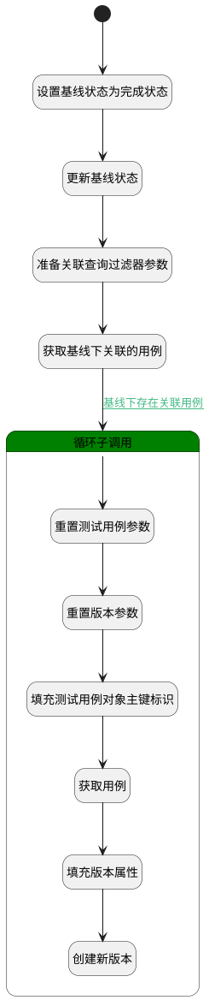

## 设立完成（测试库） <!-- {docsify-ignore-all} -->

   测试库基线设立完成

### 处理过程




### 处理步骤说明

#### 开始 :id=Begin<sup class="footnote-symbol"> <font color=gray size=1>[开始]</font></sup>


*- N/A*
#### 设置基线状态为完成状态 :id=PREPAREPARAM1<sup class="footnote-symbol"> <font color=gray size=1>[准备参数]</font></sup>


1. 将`2` 设置给  `Default(传入变量).STATUS(状态)`

#### 更新基线状态 :id=DEACTION1<sup class="footnote-symbol"> <font color=gray size=1>[实体行为]</font></sup>


调用实体 [基线(BASELINE)](module/Base/baseline.md) 行为 [Update](module/Base/baseline#行为) ，行为参数为`Default(传入变量)`

将执行结果返回给参数`Default(传入变量)`

#### 准备关联查询过滤器参数 :id=PREPAREPARAM2<sup class="footnote-symbol"> <font color=gray size=1>[准备参数]</font></sup>


1. 将`Default(传入变量).ID(标识)` 设置给  `relation_filter(关联数据过滤器).n_principal_id_eq`
2. 将`10000` 设置给  `relation_filter(关联数据过滤器).size`
3. 将`baseline` 设置给  `relation_filter(关联数据过滤器).n_principal_type_eq`
4. 将`test_case` 设置给  `relation_filter(关联数据过滤器).n_target_type_eq`

#### 获取基线下关联的用例 :id=DEDATASET1<sup class="footnote-symbol"> <font color=gray size=1>[实体数据集]</font></sup>


调用实体 [关联(RELATION)](module/Base/relation.md) 数据集合 [数据集(DEFAULT)](module/Base/relation#数据集合) ，查询参数为`relation_filter(关联数据过滤器)`

将执行结果返回给参数`relation_page(分页查询结果变量)`

#### 循环子调用 :id=LOOPSUBCALL1<sup class="footnote-symbol"> <font color=gray size=1>[循环子调用]</font></sup>


循环参数`relation_page(分页查询结果变量)`，子循环参数使用`for_temp_obj(循环临时变量)`
#### 重置测试用例参数 :id=RESETPARAM1<sup class="footnote-symbol"> <font color=gray size=1>[重置参数]</font></sup>


重置参数```test_case(用例)```
#### 重置版本参数 :id=RESETPARAM2<sup class="footnote-symbol"> <font color=gray size=1>[重置参数]</font></sup>


重置参数```version(版本)```
#### 填充测试用例对象主键标识 :id=PREPAREPARAM3<sup class="footnote-symbol"> <font color=gray size=1>[准备参数]</font></sup>


1. 将`for_temp_obj(循环临时变量).TARGET_ID(关联目标标识)` 设置给  `test_case(用例).ID(标识)`

#### 获取用例 :id=DEACTION2<sup class="footnote-symbol"> <font color=gray size=1>[实体行为]</font></sup>


调用实体 [用例(TEST_CASE)](module/TestMgmt/test_case.md) 行为 [Get](module/TestMgmt/test_case#行为) ，行为参数为`test_case(用例)`

将执行结果返回给参数`test_case(用例)`

#### 填充版本属性 :id=PREPAREPARAM4<sup class="footnote-symbol"> <font color=gray size=1>[准备参数]</font></sup>


1. 将`for_temp_obj(循环临时变量).TARGET_ID(关联目标标识)` 设置给  `version(版本).OWNER_ID(所属数据标识)`
2. 将`TEST_CASE` 设置给  `version(版本).OWNER_TYPE(所属数据对象)`
3. 将`设立基线创建版本` 设置给  `version(版本).NAME(名称)`

#### 创建新版本 :id=DEACTION3<sup class="footnote-symbol"> <font color=gray size=1>[实体行为]</font></sup>


调用实体 [版本(VERSION)](module/Base/version.md) 行为 [提交版本(COMMIT)](module/Base/version#行为) ，行为参数为`version(版本)`


### 连接条件说明
#### 基线下存在关联用例 :id=DEDATASET1-LOOPSUBCALL1

`relation_page(分页查询结果变量).size` GT `0`
#### 用例的最新版本为基线中关联的版本 


### 实体逻辑参数

|    中文名   |    代码名    |  数据类型    |  实体   |备注 |
| --------| --------| -------- | -------- | --------   |
|传入变量(<i class="fa fa-check"/></i>)|Default|数据对象|[基线(BASELINE)](module/Base/baseline.md)||
|循环临时变量|for_temp_obj|数据对象|[关联(RELATION)](module/Base/relation.md)||
|关联数据过滤器|relation_filter|过滤器|||
|分页查询结果变量|relation_page|分页查询|||
|用例|test_case|数据对象|[用例(TEST_CASE)](module/TestMgmt/test_case.md)||
|版本|version|数据对象|[版本(VERSION)](module/Base/version.md)||
