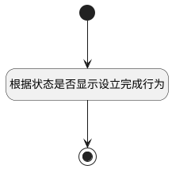

## 计算表格列行为状态 <!-- {docsify-ignore-all} -->

   用于动态启用列绑定的界面行为

### 处理过程




### 处理步骤说明

#### 开始 :id=Begin<sup class="footnote-symbol"> <font color=gray size=1>[开始]</font></sup>


#### 根据状态是否显示设立完成行为 :id=RAWJSCODE1<sup class="footnote-symbol"> <font color=gray size=1>[直接前台代码]</font></sup>


<p class="panel-title"><b>执行代码</b></p>

```javascript
const rows = uiLogic.grid.state.rows;
const srfreadonly = context.srfreadonly;
if (rows && rows.length > 0) {
	rows.forEach(row => {
		const titleColumn = row.uiActionGroupStates.name;
		const status = row.data.status;
		if (titleColumn && Object.values(titleColumn).length > 0) {
			Object.values(titleColumn).forEach(action => {
				// 设立完成
				if (action.uiActionId === 'set_complete_library@baseline') {
					action.visible = status == '1';
				}
                if (action.uiActionId === 'set_complete_project@baseline') {
					action.visible = status == '1';
				}
                if (action.uiActionId === 'set_complete_product@baseline') {
					action.visible = status == '1';
				}
                if (action.uiActionId === 'set_complete_space@baseline') {
					action.visible = status == '1';
				}
			})
		}
	})
}	

```

#### 结束 :id=END1<sup class="footnote-symbol"> <font color=gray size=1>[结束]</font></sup>


### 实体逻辑参数

|    中文名   |    代码名    |  数据类型      |备注 |
| --------| --------| --------  | --------   |
|表格|Grid|当前部件对象||
|传入变量(<i class="fa fa-check"/></i>)|Default|数据对象||
