## 查看规划快照 <!-- {docsify-ignore-all} -->

   查看规划快照

### 处理过程

```plantuml
@startuml
hide footbox
<style>
root {
  HyperlinkColor #42b983
}
</style>

hide empty description
state "开始" as Begin <<start>> [[$./check_plan_snapshot#begin {开始}]]
state "打开规划快照甘特图" as DEUIACTION1  [[$./check_plan_snapshot#deuiaction1 {打开规划快照甘特图}]]


Begin --> DEUIACTION1


@enduml
```

### 处理步骤说明

#### 开始 :id=Begin [开始]

#### 打开规划快照甘特图 :id=DEUIACTION1 [实体界面行为调用]

调用实体 [基线(BASELINE)](module/Base/baseline.md) 界面行为 [打开规划快照甘特图](module/Base/baseline#界面行为) ，行为参数为`Default(传入变量)`

### 实体逻辑参数

|    中文名   |    代码名    |  数据类型      |备注 |
| --------| --------| --------  | --------   |
|传入变量(<i class="fa fa-check"/></i>)|Default|数据对象||
|当前视图对象|view|当前视图对象||
