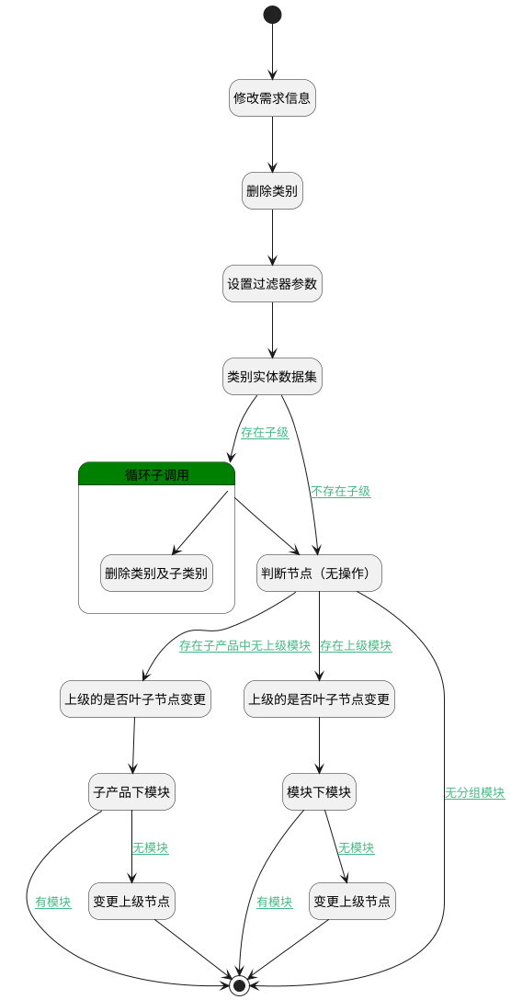

## 删除类别及子类别 <!-- {docsify-ignore-all} -->

   删除类别及其下子类别（测试）

### 处理过程




### 处理步骤说明

#### 开始 :id=Begin<sup class="footnote-symbol"> <font color=gray size=1>[开始]</font></sup>


*- N/A*
#### 修改需求信息 :id=RAWSQLCALL1<sup class="footnote-symbol"> <font color=gray size=1>[直接SQL调用]</font></sup>


<p class="panel-title"><b>执行sql语句</b></p>

```sql
UPDATE idea t 
INNER JOIN category t21 ON t.category_id = t21.ID 
SET t.category_id = NULL
WHERE (t.category_id = ? OR t21.categories LIKE CONCAT('%',?,'%'))
```

<p class="panel-title"><b>执行sql参数</b></p>

1. `Default(传入变量).ID(标识)`
2. `Default(传入变量).ID(标识)`


#### 删除类别 :id=DEACTION2<sup class="footnote-symbol"> <font color=gray size=1>[实体行为]</font></sup>


调用实体 [类别(CATEGORY)](module/Base/category.md) 行为 [Remove](module/Base/category#行为) ，行为参数为`Default(传入变量)`

#### 设置过滤器参数 :id=PREPAREPARAM1<sup class="footnote-symbol"> <font color=gray size=1>[准备参数]</font></sup>


1. 将`Default(传入变量).ID(标识)` 设置给  `filter(过滤器).N_PID_EQ`

#### 类别实体数据集 :id=DEDATASET1<sup class="footnote-symbol"> <font color=gray size=1>[实体数据集]</font></sup>


调用实体 [类别(CATEGORY)](module/Base/category.md) 数据集合 [数据集(DEFAULT)](module/Base/category#数据集合) ，查询参数为`filter(过滤器)`

将执行结果返回给参数`category_page(类别分页查询结果)`

#### 循环子调用 :id=LOOPSUBCALL1<sup class="footnote-symbol"> <font color=gray size=1>[循环子调用]</font></sup>


循环参数`category_page(类别分页查询结果)`，子循环参数使用`for_temp_obj(循环临时变量)`
#### 删除类别及子类别 :id=DELOGIC1<sup class="footnote-symbol"> <font color=gray size=1>[实体逻辑]</font></sup>


调用实体 [类别(CATEGORY)](module/Base/category.md) 处理逻辑 [删除类别及子类别]((module/Base/category/logic/delete_child_category.md)) ，行为参数为`for_temp_obj(循环临时变量)`

#### 判断节点（无操作） :id=PREPAREPARAM4<sup class="footnote-symbol"> <font color=gray size=1>[准备参数]</font></sup>


    无

#### 上级的是否叶子节点变更 :id=PREPAREPARAM3<sup class="footnote-symbol"> <font color=gray size=1>[准备参数]</font></sup>


1. 将`Default(传入变量).SECTION_ID(分组标识)` 设置给  `parent_section(上级子产品).ID(标识)`
2. 将` ==> filter` 重新建立为  `filter(过滤器)`
3. 将`Default(传入变量).SECTION_ID(分组标识)` 设置给  `filter(过滤器).N_SECTION_ID_EQ`
4. 将` ==> category_page` 重新建立为  `category_page(类别分页查询结果)`
5. 将`1` 设置给  `parent_section(上级子产品).IS_LEAF(是否叶子节点)`

#### 上级的是否叶子节点变更 :id=PREPAREPARAM2<sup class="footnote-symbol"> <font color=gray size=1>[准备参数]</font></sup>


1. 将`Default(传入变量).PID(父标识)` 设置给  `parent_category(上级节点).ID`
2. 将` ==> filter` 重新建立为  `filter(过滤器)`
3. 将` ==> category_page` 重新建立为  `category_page(类别分页查询结果)`
4. 将`Default(传入变量).SECTION_ID(分组标识)` 设置给  `filter(过滤器).N_SECTION_ID_EQ`
5. 将`1` 设置给  `parent_category(上级节点).IS_LEAF`

#### 模块下模块 :id=DEDATASET3<sup class="footnote-symbol"> <font color=gray size=1>[实体数据集]</font></sup>


调用实体 [类别(CATEGORY)](module/Base/category.md) 数据集合 [数据集(DEFAULT)](module/Base/category#数据集合) ，查询参数为`filter(过滤器)`

将执行结果返回给参数`category_page(类别分页查询结果)`

#### 子产品下模块 :id=DEDATASET2<sup class="footnote-symbol"> <font color=gray size=1>[实体数据集]</font></sup>


调用实体 [类别(CATEGORY)](module/Base/category.md) 数据集合 [数据集(DEFAULT)](module/Base/category#数据集合) ，查询参数为`filter(过滤器)`

将执行结果返回给参数`category_page(类别分页查询结果)`

#### 结束 :id=END2<sup class="footnote-symbol"> <font color=gray size=1>[结束]</font></sup>


*- N/A*

#### 变更上级节点 :id=DEACTION3<sup class="footnote-symbol"> <font color=gray size=1>[实体行为]</font></sup>


调用实体 [类别(CATEGORY)](module/Base/category.md) 行为 [Update](module/Base/category#行为) ，行为参数为`parent_category(上级节点)`

#### 变更上级节点 :id=DEACTION4<sup class="footnote-symbol"> <font color=gray size=1>[实体行为]</font></sup>


调用实体 [分组(SECTION)](module/Base/section.md) 行为 [Update](module/Base/section#行为) ，行为参数为`parent_section(上级子产品)`


### 连接条件说明
#### 不存在子级 :id=DEDATASET1-PREPAREPARAM4

`category_page(类别分页查询结果).size` EQ `0`
#### 存在上级模块 :id=PREPAREPARAM4-PREPAREPARAM2

`Default(传入变量).PID(父标识)` ISNOTNULL
#### 无模块 :id=DEDATASET3-DEACTION3

`category_page(类别分页查询结果).size` EQ `0`
#### 有模块 :id=DEDATASET3-END2

`category_page(类别分页查询结果).size` GT `0`
#### 存在子产品中无上级模块 :id=PREPAREPARAM4-PREPAREPARAM3

`Default(传入变量).SECTION_ID(分组标识)` ISNOTNULL AND `Default(传入变量).PID(父标识)` ISNULL
#### 有模块 :id=DEDATASET2-END2

`category_page(类别分页查询结果).size` GT `0`
#### 无模块 :id=DEDATASET2-DEACTION4

`category_page(类别分页查询结果).size` EQ `0`
#### 无分组模块 :id=PREPAREPARAM4-END2

`Default(传入变量).PID(父标识)` ISNULL AND `Default(传入变量).section_id(分组标识)` ISNULL
#### 存在子级 :id=DEDATASET1-LOOPSUBCALL1

`category_page(类别分页查询结果).size` GT `0`


### 实体逻辑参数

|    中文名   |    代码名    |  数据类型    |  实体   |备注 |
| --------| --------| -------- | -------- | --------   |
|传入变量(<i class="fa fa-check"/></i>)|Default|数据对象|[类别(CATEGORY)](module/Base/category.md)||
|类别分页查询结果|category_page|分页查询|||
|过滤器|filter|过滤器|||
|循环临时变量|for_temp_obj|数据对象|[类别(CATEGORY)](module/Base/category.md)||
|上级节点|parent_category|数据对象|||
|上级子产品|parent_section|数据对象|[分组(SECTION)](module/Base/section.md)||
