## 识别内容格式 <!-- {docsify-ignore-all} -->

   识别评论内容格式

### 处理过程

```plantuml
@startuml
hide empty description
<style>
root {
  HyperlinkColor #42b983
}
</style>

hide empty description
state "开始" as Begin <<start>> [[$./format_type#begin {"开始"}]]
state "判断内容格式" as RAWSFCODE_01  [[$./format_type#rawsfcode_01 {"判断内容格式"}]]


Begin --> RAWSFCODE_01


@enduml
```




### 处理步骤说明

#### 开始 :id=Begin<sup class="footnote-symbol"> <font color=gray size=1>[开始]</font></sup>


*- N/A*
#### 判断内容格式 :id=RAWSFCODE_01<sup class="footnote-symbol"> <font color=gray size=1>[直接后台代码]</font></sup>


<p class="panel-title"><b>执行代码[Groovy]</b></p>

```groovy
def _default = logic.param('default').getReal()
def _content = _default.get('content').trim()


if(_content != null){

     // 检查 HTML（使用更简单的匹配）
    boolean isHtml = false
    boolean isMarkdown = false
    
    // 检查 HTML 标签
    if (_content.contains("</") && _content.contains(">")) {
        // 检查成对的标签
        def tags = ["html", "body", "head", "div", "p", "span", "table", "ul", "ol"]
        tags.each { tag ->
            if (_content.contains("<${tag}") && _content.contains("</${tag}>")) {
                isHtml = true
            }
        }
        
        // 检查自闭合标签
        def selfClosing = ["br", "hr", "img", "input", "meta", "link"]
        selfClosing.each { tag ->
            if (_content.contains("<${tag}") && _content.contains("/>")) {
                isHtml = true
            }
        }
    }
    
    // 检查 HTML 文档声明
    if (_content.toLowerCase().contains("<!doctype html")) {
        isHtml = true
    }
    

    // 链接 [_content](url)
    if (_content.contains("[") && _content.contains("](") && _content.contains(")")) {
        isMarkdown = true
    }
    
    // 列表
    if (_content.contains("- ") || _content.contains("* ") || _content.contains("1. ")) {
        isMarkdown = true
    }
    
    // 代码块
    if (_content.contains("```") || _content.contains("~~~")) {
        isMarkdown = true
    }
    
    println "评论1#######:$_default"
    
    // 返回结果
    if (isHtml && isMarkdown) {
        _default.set('format_type', "HTML")
    } else if (isMarkdown) {
          _default.set('format_type', "MD")
    } else {
         _default.set('format_type', "HTML")
    }
    println "评论2#######:$_default"
}
```


### 实体逻辑参数

|    中文名   |    代码名    |  数据类型    |  实体   |备注 |
| --------| --------| -------- | -------- | --------   |
|传入变量(<i class="fa fa-check"/></i>)|Default|数据对象|[评论(COMMENT)](module/Base/comment.md)||
