## 取消置顶 <!-- {docsify-ignore-all} -->

   

### 处理过程

```plantuml
@startuml
hide empty description
<style>
root {
  HyperlinkColor #42b983
}
</style>

hide empty description
state "开始" as Begin <<start>> [[$./no_top#begin {"开始"}]]
state "设置置顶参数" as PREPAREPARAM1  [[$./no_top#prepareparam1 {"设置置顶参数"}]]
state "取消置顶" as DEACTION1  [[$./no_top#deaction1 {"取消置顶"}]]
state "结束" as END1 <<end>> [[$./no_top#end1 {"结束"}]]


Begin --> PREPAREPARAM1
PREPAREPARAM1 --> DEACTION1
DEACTION1 --> END1


@enduml
```

### 处理步骤说明

#### 开始 :id=Begin [开始]

*- N/A*
#### 设置置顶参数 :id=PREPAREPARAM1 [准备参数]

1. 将`0` 设置给  `Default(传入变量).IS_TOP(是否置顶)`

#### 取消置顶 :id=DEACTION1 [实体行为]

调用实体 [评论(COMMENT)](module/Base/comment.md) 行为 [Update](module/Base/comment#行为) ，行为参数为`Default(传入变量)`

#### 结束 :id=END1 [结束]

*- N/A*

### 实体逻辑参数

|    中文名   |    代码名    |  数据类型    |  实体   |备注 |
| --------| --------| -------- | -------- | --------   |
|传入变量(<i class="fa fa-check"/></i>)|Default|数据对象|[评论(COMMENT)](module/Base/comment.md)||
