## 添加回复 <!-- {docsify-ignore-all} -->

   添加回复按钮触发，显示评论区域

### 处理过程

```plantuml
@startuml
hide footbox
<style>
root {
  HyperlinkColor #42b983
}
</style>

hide empty description
state "开始" as Begin <<start>> [[$./add_comment#begin {开始}]]
state "结束" as END1 <<end>> [[$./add_comment#end1 {结束}]]
state "准备参数" as PREPAREJSPARAM1  [[$./add_comment#preparejsparam1 {准备参数}]]


Begin --> PREPAREJSPARAM1
PREPAREJSPARAM1 --> END1


@enduml
```

### 处理步骤说明

#### 开始 :id=Begin [开始]

#### 结束 :id=END1 [结束]

#### 准备参数 :id=PREPAREJSPARAM1 [准备参数]

1. 将`view.layoutPanel.panelItems` 设置给  `panelItems`
2. 将`true` 设置给  `panelItems.container_comment.state.visible`

### 实体逻辑参数

|    中文名   |    代码名    |  数据类型      |备注 |
| --------| --------| --------  | --------   |
|panelItems|panelItems|数据对象||
|view|view|当前视图对象||
|传入变量(<i class="fa fa-check"/></i>)|Default|数据对象||
|STATE|STATE|数据对象||
|list|list|部件对象||
