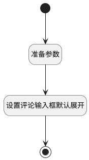

## 添加回复(客户沟通) <!-- {docsify-ignore-all} -->

   获取指定评论数据，并展开评论输入框

### 处理过程




### 处理步骤说明

#### 开始 :id=Begin<sup class="footnote-symbol"> <font color=gray size=1>[开始]</font></sup>


#### 结束 :id=END1<sup class="footnote-symbol"> <font color=gray size=1>[结束]</font></sup>


#### 准备参数 :id=PREPAREJSPARAM1<sup class="footnote-symbol"> <font color=gray size=1>[准备参数]</font></sup>


1. 将`view.parentView` 设置给  `parentView(父视图)`
2. 将`parentView(父视图).layoutPanel.panelItems.client_field_textbox.editor` 设置给  `comment(评论)`
3. 将`parentView(父视图).layoutPanel.panelItems` 设置给  `panelItems`
4. 将`true` 设置给  `panelItems.client_panel_container.state.visible`
5. 将`true` 设置给  `panelItems.client_panel_container.dynaLogicResult.visible`

#### 设置评论输入框默认展开 :id=RAWJSCODE1<sup class="footnote-symbol"> <font color=gray size=1>[直接前台代码]</font></sup>

需要提前清除回复

<p class="panel-title"><b>执行代码</b></p>

```javascript
uiLogic.comment.clear();
uiLogic.view.edit_comment_id=null;
uiLogic.view.reply_comment_id=null;
uiLogic.comment.toggleCollapse(true);
uiLogic.comment.focus();
```


### 实体逻辑参数

|    中文名   |    代码名    |  数据类型      |备注 |
| --------| --------| --------  | --------   |
|view|view|当前视图对象||
|panelItems|panelItems|数据对象||
|传入变量(<i class="fa fa-check"/></i>)|Default|数据对象||
|评论|comment|数据对象||
|父视图|parentView|数据对象||
