## 清空评论 <!-- {docsify-ignore-all} -->

   清空当前输入框内已输入内容

### 处理过程

```plantuml
@startuml
hide footbox
<style>
root {
  HyperlinkColor #42b983
}
</style>

hide empty description
state "开始" as Begin <<start>> [[$./clear_comment#begin {开始}]]
state "清空评论" as RAWJSCODE1  [[$./clear_comment#rawjscode1 {清空评论}]]


Begin --> RAWJSCODE1


@enduml
```




### 处理步骤说明

#### 开始 :id=Begin<sup class="footnote-symbol"> <font color=gray size=1>[开始]</font></sup>


#### 清空评论 :id=RAWJSCODE1<sup class="footnote-symbol"> <font color=gray size=1>[直接前台代码]</font></sup>


<p class="panel-title"><b>执行代码</b></p>

```javascript
uiLogic.view.layoutPanel.panelItems.field_textbox.editor.clear();
uiLogic.view.edit_comment_id = null;
uiLogic.view.reply_comment_id = null;
```


### 实体逻辑参数

|    中文名   |    代码名    |  数据类型      |备注 |
| --------| --------| --------  | --------   |
|传入变量(<i class="fa fa-check"/></i>)|Default|数据对象||
|当前视图对象|view|当前视图对象||
