## 清空评论(客户沟通) <!-- {docsify-ignore-all} -->

   清空评论输入框内容，并隐藏输入框

### 处理过程

```plantuml
@startuml
hide footbox
<style>
root {
  HyperlinkColor #42b983
}
</style>

hide empty description
state "开始" as Begin <<start>> [[$./clear_comment_client#begin {开始}]]
state "清空评论(客户沟通)" as RAWJSCODE1  [[$./clear_comment_client#rawjscode1 {清空评论(客户沟通)}]]
state "获取评论编辑器" as PREPAREJSPARAM1  [[$./clear_comment_client#preparejsparam1 {获取评论编辑器}]]


Begin --> PREPAREJSPARAM1
PREPAREJSPARAM1 --> RAWJSCODE1


@enduml
```




### 处理步骤说明

#### 开始 :id=Begin<sup class="footnote-symbol"> <font color=gray size=1>[开始]</font></sup>


#### 获取评论编辑器 :id=PREPAREJSPARAM1<sup class="footnote-symbol"> <font color=gray size=1>[准备参数]</font></sup>


1. 将`view(当前视图对象).layoutPanel.panelItems.client_field_textbox.editor` 设置给  `editor(评论框编辑器)`

#### 清空评论(客户沟通) :id=RAWJSCODE1<sup class="footnote-symbol"> <font color=gray size=1>[直接前台代码]</font></sup>


<p class="panel-title"><b>执行代码</b></p>

```javascript
uiLogic.view.layoutPanel.panelItems.client_field_textbox.value = '';
uiLogic.view.layoutPanel.panelItems.client_field_textbox.data.client_field_textbox = '';
uiLogic.commentcustomer_connect_list_view.edit_comment_id = null;
uiLogic.commentcustomer_connect_list_view.reply_comment_id = null;
uiLogic.editor.reply.value = null;
const panelItems = view.layoutPanel.panelItems;
panelItems.client_panel_container.state.visible = false;
```


### 实体逻辑参数

|    中文名   |    代码名    |  数据类型      |备注 |
| --------| --------| --------  | --------   |
|评论框编辑器|editor|数据对象||
|嵌入视图|commentcustomer_connect_list_view|部件对象||
|传入变量(<i class="fa fa-check"/></i>)|Default|数据对象||
|当前视图对象|view|当前视图对象||
